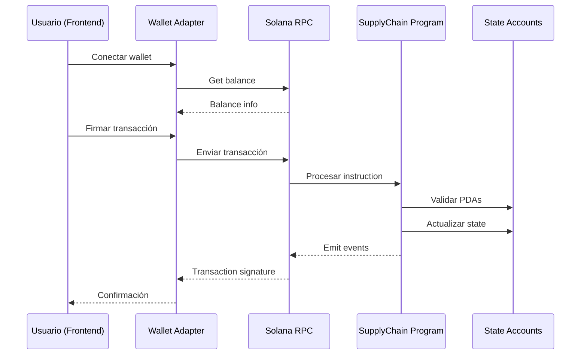
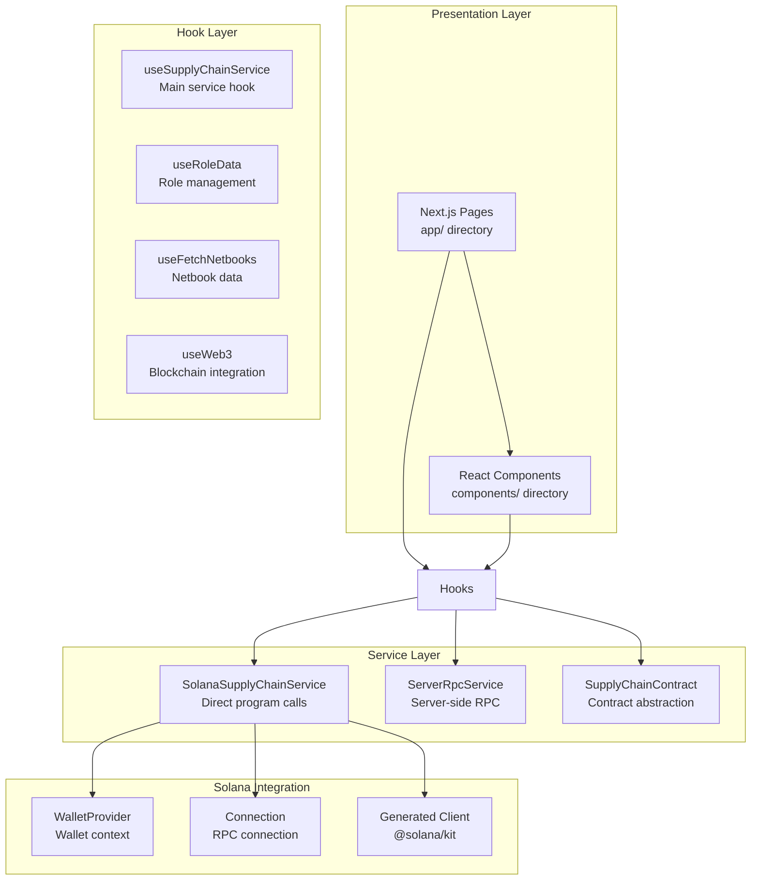
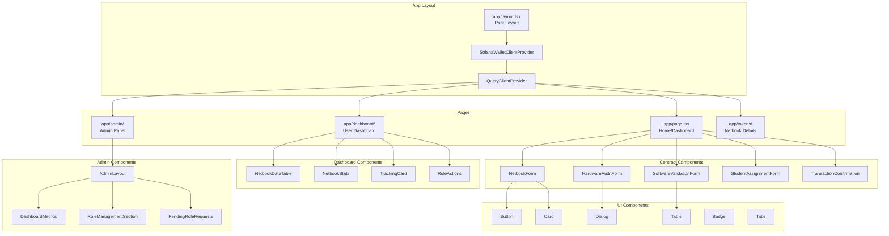
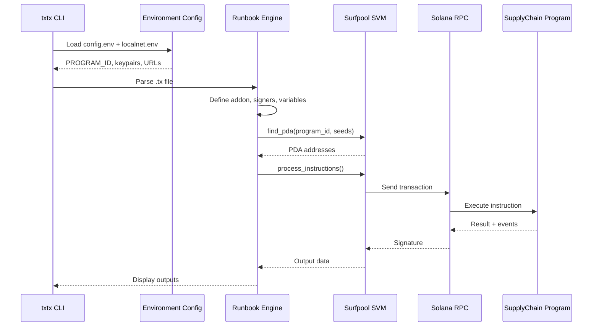
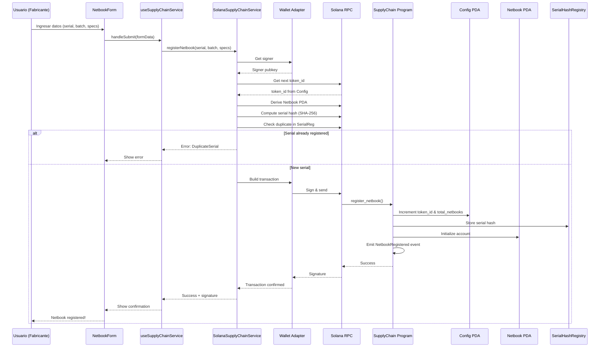
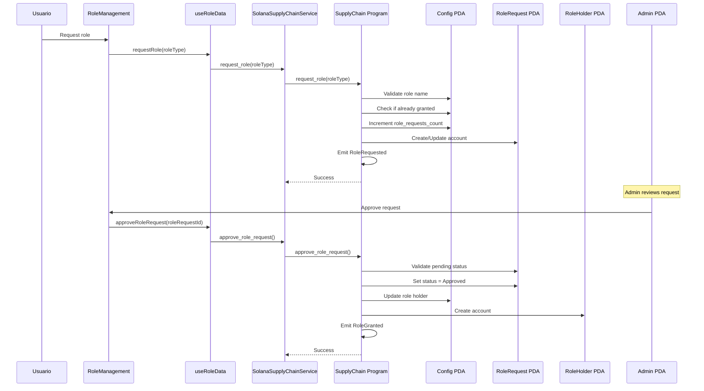
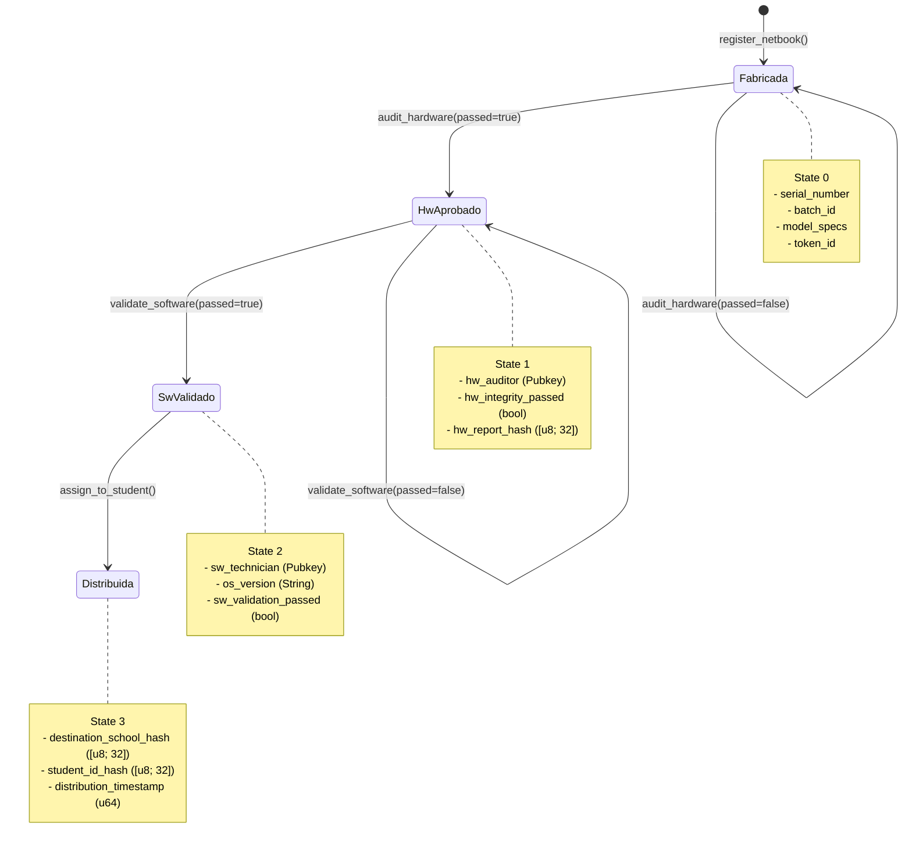

# 01 - Arquitectura del Sistema

> Documentación completa de la arquitectura general del sistema SupplyChainTracker.

---

## 📋 Tabla de Contenidos

1. [Visión General](#visión-general)
2. [Arquitectura de Alto Nivel](#arquitectura-de-alto-nivel)
3. [Arquitectura del Programa Solana](#arquitectura-del-programa-solana)
4. [Arquitectura del Frontend](#arquitectura-del-frontend)
5. [Arquitectura de Runbooks](#arquitectura-de-runbooks)
6. [Estructura de Directorios](#estructura-de-directorios)
7. [Flujo de Datos](#flujo-de-datos)
8. [Patrones de Diseño](#patrones-de-diseño)
9. [Diagrama de Estructura de Directorios](#diagrama-de-estructura-de-directorios)

---

## Visión General

SupplyChainTracker es un sistema de trazabilidad descentralizado (dApp) construido sobre la blockchain de Solana. El sistema rastrea el ciclo de vida completo de netbooks educativas desde su fabricación hasta su distribución final a estudiantes.

### Componentes Principales

```mermaid
graph TB
    subgraph "Frontend Layer"
        UI[React UI Components]
        Hooks[Custom React Hooks]
        Services[Business Logic Services]
        Wallet[Wallet Integration]
    end

    subgraph "Blockchain Layer - Solana"
        Program[SupplyChain Program<br/>(Anchor/Rust)]
        Accounts[State Accounts]
        Events[On-Chain Events]
    end

    subgraph "Runbook Layer - txtx/surfpool"
        Runbooks[txtx Runbooks]
        Surfpool[Surfpool SVM]
    end

    subgraph "Storage Layer"
        PDA[PDA Accounts]
        Registry[Serial Hash Registry]
    end

    UI --> Hooks
    Hooks --> Services
    Services --> Wallet
    Services --> Program
    Wallet --> Program
    Program --> Accounts
    Program --> Events
    Program --> PDA
    PDA --> Registry
    Runbooks --> Surfpool
    Surfpool --> Program
```

---

## Arquitectura de Alto Nivel

### Capas del Sistema

```mermaid
graph LR
    subgraph "User Layer"
        Browser[Web Browser]
        CLI[Terminal/CLI]
    end

    subgraph "Application Layer"
        NextJS[Next.js App<br/>(Port 3000)]
        Runbooks[txtx Runbooks]
    end

    subgraph "Integration Layer"
        Wallet[Wallet Adapter<br/>(Phantom/Solflare)]
        Surfpool[Surfpool SVM<br/>(Port 8899)]
    end

    subgraph "Blockchain Layer"
        Solana[Solana Validator<br/>(Localnet)]
        Program[SupplyChain Program]
    end

    Browser --> NextJS
    CLI --> Runbooks
    NextJS --> Wallet
    Runbooks --> Surfpool
    Wallet --> Solana
    Surfpool --> Solana
    Solana --> Program
```

### Flujo de Transacción



---

## Arquitectura del Programa Solana

### Estructura del Programa Anchor

```mermaid
graph TB
    subgraph "Program Entry Point"
        lib[lib.rs<br/>declare_id! + #[program]]
    end

    subgraph "State Module"
        Config[SupplyChainConfig<br/>Config PDA]
        Netbook[Netbook<br/>Netbook PDA]
        RoleHolder[RoleHolder<br/>RoleHolder PDA]
        RoleRequest[RoleRequest<br/>RoleRequest PDA]
        SerialReg[SerialHashRegistry<br/>Serial Hash PDA]
        Deployer[DeployerState<br/>Deployer PDA]
    end

    subgraph "Instructions Module"
        subgraph "Deployment"
            Deploy[fund_deployer<br/>close_deployer]
            Init[initialize]
        end

        subgraph "Netbook Lifecycle"
            Reg[register_netbook<br/>register_netbooks_batch]
            Audit[audit_hardware]
            Validate[validate_software]
            Assign[assign_to_student]
        end

        subgraph "Role Management"
            Grant[grant_role<br/>revoke_role]
            Request[request_role<br/>approve/reject<br/>reset_role_request]
            HolderMgmt[add/remove<br/>close_role_holder]
            Transfer[transfer_admin]
        end

        subgraph "Query"
            QueryNetbook[query_netbook_state]
            QueryConfig[query_config]
            QueryRole[query_role]
        end
    end

    subgraph "Events Module"
        NetbookEvents[NetbookRegistered<br/>HardwareAudited<br/>SoftwareValidated<br/>NetbookAssigned]
        RoleEvents[RoleRequested<br/>RoleGranted<br/>RoleRevoked<br/>AdminTransferred]
        QueryEvents[NetbookStateQuery<br/>ConfigQuery<br/>RoleQuery]
    end

    subgraph "Errors Module"
        Errors[SupplyChainError<br/>6000-6014]
    end

    lib --> Config
    lib --> Netbook
    lib --> RoleHolder
    lib --> RoleRequest
    lib --> SerialReg
    lib --> Deployer

    lib --> Deploy
    lib --> Init
    lib --> Reg
    lib --> Audit
    lib --> Validate
    lib --> Assign
    lib --> Grant
    lib --> Request
    lib --> HolderMgmt
    lib --> Transfer
    lib --> QueryNetbook
    lib --> QueryConfig
    lib --> QueryRole

    Reg --> NetbookEvents
    Audit --> NetbookEvents
    Validate --> NetbookEvents
    Assign --> NetbookEvents
    Grant --> RoleEvents
    Request --> RoleEvents
    HolderMgmt --> RoleEvents
    Transfer --> RoleEvents

    QueryNetbook --> QueryEvents
    QueryConfig --> QueryEvents
    QueryRole --> QueryEvents
```

### State Accounts Architecture

```mermaid
graph TB
    subgraph "Core Configuration"
        Config[SupplyChainConfig<br/>258 bytes<br/>seeds: [b"config"]]
    end

    subgraph "Derived from Config"
        Admin[Admin PDA<br/>seeds: [b"admin", config.key()]]
        SerialReg[SerialHashRegistry<br/>3224 bytes<br/>seeds: [b"serial_hashes", config.key()]]
    end

    subgraph "Netbook Accounts"
        NB1[Netbook #1<br/>seeds: [b"netbook", token_id]]
        NB2[Netbook #2<br/>seeds: [b"netbook", token_id]]
        NBn[Netbook #n<br/>seeds: [b"netbook", token_id]]
    end

    subgraph "Role Accounts"
        RH1[RoleHolder #1<br/>seeds: [b"role_holder", account]]
        RH2[RoleHolder #2<br/>seeds: [b"role_holder", account]]
        RR1[RoleRequest #1<br/>seeds: [b"role_request", user]]
    end

    subgraph "Deployer"
        Deployer[DeployerState<br/>seeds: [b"deployer"]]
    end

    Config --> Admin
    Config --> SerialReg
    Config -.->|token_id| NB1
    Config -.->|token_id| NB2
    Config -.->|token_id| NBn
    Admin --> RH1
    Admin --> RH2
    User --> RR1
    Deployer -.->|funds| Config
```

---

## Arquitectura del Frontend

### Estructura de Capas del Frontend



### Component Hierarchy



---

## Arquitectura de Runbooks

### Runbook Architecture

```mermaid
graph TB
    subgraph "Runbook Engine"
        Txtx[txtx CLI<br/>Runbook Runner]
        Surfpool[Surfpool SVM<br/>Local Validator]
    end

    subgraph "Runbook Structure"
        Addon[addon "svm"<br/>SVM Configuration]
        Signer[signer<br/>Wallet Signers]
        Variable[variable<br/>Program/PDA Variables]
        Action[action<br/>Transaction Actions]
        Output[output<br/>Result Outputs]
    end

    subgraph "Runbook Categories"
        subgraph "Deployment"
            Deploy[deploy-program.tx]
            InitConfig[initialize-config.tx]
            GrantRoles[grant-roles.tx]
            FullInit[full-init.tx]
        end

        subgraph "Operations"
            RegNetbook[register-netbook.tx]
            AuditHW[audit-hardware.tx]
            ValidateSW[validate-software.tx]
            AssignStudent[assign-student.tx]
        end

        subgraph "Role Management"
            AddHolder[add-role-holder.tx]
            RemoveHolder[remove-role-holder.tx]
            RequestRole[request-role.tx]
            TransferAdmin[transfer-admin.tx]
        end

        subgraph "Testing"
            FullLC[full-lifecycle.tx]
            EdgeCases[edge-cases.tx]
            RoleWF[role-workflow.tx]
            FakeData[generate-fake-data.tx]
        end
    end

    subgraph "Environment"
        ConfigEnv[config/config.env<br/>Central Config]
        LocalEnv[environments/localnet.env<br/>Local Settings]
    end

    Txtx --> Surfpool
    Txtx --> Addon
    Addon --> Signer
    Signer --> Variable
    Variable --> Action
    Action --> Output

    Deploy --> ConfigEnv
    InitConfig --> ConfigEnv
    GrantRoles --> ConfigEnv
    FullInit --> ConfigEnv

    ConfigEnv --> LocalEnv
```

### Runbook Flow Pattern



---

## Estructura de Directorios

### Raíz del Proyecto

```
SupplyChainTracker-solana-/
├── .github/                    # GitHub configurations
│   └── WIKI/                   # Wiki documentation
├── .roo/                       # Roo/Coding agent configs
├── .surfpool/                  # Surfpool configs
├── config/                     # Central configuration
│   ├── keypairs/               # Wallet keypairs
│   │   ├── admin_new.json
│   │   ├── auditor_hw.json
│   │   ├── escuela.json
│   │   ├── fabricante.json
│   │   └── tecnico_sw.json
├── docker/                     # Docker configurations
│   ├── docker-compose.yml
│   ├── Dockerfile.playwright
│   └── Dockerfile.web
├── get-admin-address/          # Admin address utility
├── reports/                    # Project reports
├── scripts/                    # Utility scripts
│   ├── start-local-validator.sh
│   └── stop-local-validator.sh
├── sc-solana/                  # Anchor program
│   ├── programs/sc-solana/     # Rust source
│   ├── runbooks/               # txtx runbooks
│   ├── src/generated/          # Generated client
│   ├── tests/                  # Integration tests
│   ├── Anchor.toml             # Anchor config
│   ├── Cargo.toml              # Rust deps
│   └── txtx.yml                # Txtx config
├── web/                        # Next.js frontend
│   ├── app/                    # App Router pages
│   ├── components/             # React components
│   ├── contracts/              # Program IDL
│   ├── e2e/                    # Playwright tests
│   ├── generated/              # Generated client
│   ├── hooks/                  # Custom hooks
│   ├── lib/                    # Utilities
│   ├── services/               # Business services
│   └── types/                  # TypeScript types
├── AGENTS.md                   # Agent instructions
├── README.md                   # Project README
├── ROADMAP.md                  # Project roadmap
└── LICENSE                     # MIT License
```

---

## Flujo de Datos

### Flujo de Registro de Netbook



### Flujo de Role Management



---

## Patrones de Diseño

### PDA-First Architecture

El proyecto utiliza un patrón **PDA-First** donde todas las cuentas del programa son derivables desde PDAs (Program Derived Addresses). Esto permite que los runbooks txtx/surfpool puedan derivar todas las direcciones sin necesidad de signers externos.

```mermaid
graph TB
    subgraph "PDA Derivation Hierarchy"
        subgraph "Level 0 - Program"
            Program[Program ID<br/>BTSWNY...]
        end

        subgraph "Level 1 - Top-level PDAs"
            Deployer[Deployer<br/>seeds: [b"deployer"]]
            Config[Config<br/>seeds: [b"config"]]
        end

        subgraph "Level 2 - Config-derived"
            Admin[Admin<br/>seeds: [b"admin", config.key()]]
            SerialReg[SerialHashRegistry<br/>seeds: [b"serial_hashes", config.key()]]
        end

        subgraph "Level 3 - Dynamic PDAs"
            Netbook[Netbook<br/>seeds: [b"netbook", token_id]]
            RoleHolder[RoleHolder<br/>seeds: [b"role_holder", account.key()]]
            RoleRequest[RoleRequest<br/>seeds: [b"role_request", user.key()]]
        end
    end

    Program --> Deployer
    Program --> Config
    Config --> Admin
    Config --> SerialReg
    Config -.->|token_id| Netbook
    Admin -.->|account| RoleHolder
    User -.->|user| RoleRequest
```

### State Machine Pattern

El ciclo de vida de las netbooks sigue una máquina de estados finita:



### RBAC Pattern (Role-Based Access Control)

```mermaid
graph TB
    subgraph "Admin Authority"
        AdminPDA[Admin PDA<br/>seeds: [b"admin", config.key()]]
    end

    subgraph "Role Granting Methods"
        subgraph "Direct Grant"
            GrantRole[grant_role()<br/>Admin + Recipient sign]
        end

        subgraph "Request-Approval Flow"
            RequestRole[request_role()<br/>User signs]
            ApproveRequest[approve_role_request()<br/>Admin signs]
            RejectRequest[reject_role_request()<br/>Admin signs]
        end

        subgraph "Multi-Holder Management"
            AddHolder[add_role_holder()<br/>Admin + Payer sign]
            RemoveHolder[remove_role_holder()<br/>Admin signs]
            CloseHolder[close_role_holder()<br/>Admin signs]
        end
    end

    subgraph "Role Holders"
        Fabricante[FABRICANTE<br/>Can: register_netbook]
        Auditor[AUDITOR_HW<br/>Can: audit_hardware]
        Tecnico[TECNICO_SW<br/>Can: validate_software]
        Escuela[ESCUELA<br/>Can: assign_to_student]
    end

    AdminPDA --> GrantRole
    AdminPDA --> ApproveRequest
    AdminPDA --> RejectRequest
    AdminPDA --> AddHolder
    AdminPDA --> RemoveHolder
    AdminPDA --> CloseHolder

    User --> RequestRole
    RequestRole --> ApproveRequest

    GrantRole --> Fabricante
    GrantRole --> Auditor
    GrantRole --> Tecnico
    GrantRole --> Escuela

    AddHolder --> Fabricante
    AddHolder --> Auditor
    AddHolder --> Tecnico
    AddHolder --> Escuela
```

### PII Protection Pattern

Los datos sensibles (IDs de estudiantes y escuelas) se almacenan como hashes SHA-256:

```mermaid
graph LR
    subgraph "Off-Chain Data"
        StudentID[Student ID<br/>Plain text]
        SchoolName[School Name<br/>Plain text]
    end

    subgraph "On-Chain Storage"
        StudentHash[student_id_hash<br/>[u8; 32))
        SchoolHash[destination_school_hash<br/>[u8; 32]]
    end

    StudentID -->|SHA-256| StudentHash
    SchoolName -->|SHA-256| SchoolHash

    classDef sensitive fill:#ef4444,color:#fff
    classDef protected fill:#22c55e,color:#fff
    class StudentID,SchoolName sensitive
    class StudentHash,SchoolHash protected
```

---

## Diagrama de Estructura de Directorios

### Visual Directory Tree

```mermaid
graph TD
    Root[SupplyChainTracker-solana-/]

    Root --> Github[.github/]
    Root --> Config[config/]
    Root --> Docker[docker/]
    Root --> Reports[reports/]
    Root --> Scripts[scripts/]
    Root --> SC[sc-solana/]
    Root --> Web[web/]

    Github --> Wiki[.github/WIKI/<br/>Documentation]

    Config --> Keypairs[config/keypairs/<br/>5 wallet files]

    SC --> Programs[programs/sc-solana/<br/>Rust source]
    SC --> Runbooks[runbooks/<br/>txtx runbooks]
    SC --> Generated[src/generated/<br/>Client code]
    SC --> Tests[tests/<br/>Integration tests]
    SC --> AnchorConf[Anchor.toml]
    SC --> CargoConf[Cargo.toml]

    Programs --> Src[src/]
    Programs --> LibRs[lib.rs]

    Src --> State[state/<br/>5 account structs]
    Src --> Instructions[instructions/<br/>18 handlers]
    Src --> Events[events/<br/>14 event structs]
    Src --> Errors[errors/<br/>15 error codes]

    Runbooks --> Deploy[01-deployment/<br/>5 runbooks]
    Runbooks --> Ops[02-operations/<br/>8 runbooks]
    Runbooks --> Role[03-role-management/<br/>8 runbooks]
    Runbooks --> Testing[04-testing/<br/>5 runbooks]
    Runbooks --> Envs[environments/<br/>3 env files]

    Web --> App[app/<br/>Next.js pages]
    Web --> Components[components/<br/>40+ React components]
    Web --> Hooks[hooks/<br/>15 custom hooks]
    Web --> Lib[lib/<br/>Utilities & services]
    Web --> E2E[e2e/<br/>Playwright tests]
    Web --> GeneratedWeb[generated/<br/>Client code]
    Web --> PackageConf[package.json]

    App --> Admin[admin/<br/>Admin panel]
    App --> Dashboard[dashboard/<br/>User dashboard]
    App --> Tokens[tokens/<br/>Netbook details]

    Components --> Contract[contracts/<br/>Form components]
    Components --> DashboardComp[dashboard/<br/>Table components]
    Components --> UI[ui/<br/>Shadcn components]
    Components --> RealTime[real-time/<br/>Live updates]

    Lib --> Solana[lib/solana/<br/>Solana integration]
    Lib --> Contracts[lib/contracts/<br/>Program abstraction]
    Lib --> Services[lib/services/<br/>Business logic]
```



---

## Resumen de Componentes

| Componente | Cantidad | Descripción |
|------------|----------|-------------|
| State Accounts | 6 | Config, Netbook, RoleHolder, RoleRequest, SerialHashRegistry, DeployerState |
| Instruction Handlers | 18 | 6 deployment/role + 4 netbook lifecycle + 3 query + 5 role management |
| Event Structs | 14 | 5 netbook + 7 role + 3 query |
| Error Codes | 15 | 6000-6014 range |
| Runbooks | 26+ | 5 deployment + 8 operations + 8 role + 5 testing |
| React Components | 40+ | Forms, tables, dialogs, UI primitives |
| Custom Hooks | 15 | Data fetching, role management, blockchain integration |

---

## Referencias

- [Anchor Documentation](https://www.anchor-lang.com/)
- [Solana Documentation](https://docs.solana.com/)
- [Txtx Documentation](https://txtx.sh/)
- [Surfpool Documentation](https://surfpool.run/)
