# 02 - Framework Anchor

> Guía detallada del framework Anchor para desarrollo de programas en Solana.

---

## 📋 Tabla de Contenidos

1. [Introducción a Anchor](#introducción-a-anchor)
2. [Estructura de un Programa Anchor](#estructura-de-un-programa-anchor)
3. [`declare_id!()` Macro](#declare_id-macro)
4. `#[program]` Module
5. [`#[derive(Accounts)]` Structs](#deriveaccounts-structs)
6. [Instruction Handlers](#instruction-handlers)
7. [Events](#events)
8. [Error Codes](#error-codes)
9. [PDA Derivation y Uso](#pda-derivation-y-uso)
10. [System Accounts](#system-accounts)
11. [Mejores Prácticas](#mejores-prácticas)

---

## Introducción a Anchor

Anchor es el framework principal para desarrollo de programas en Solana. Proporciona:

- **Macros de derivación** para account validation y deserialización
- **IDL (Interface Description Language)** generation automática
- **Client code generation** para interacción con el programa
- **Testing framework** integrado
- **Type safety** en todas las interacciones

### Configuración del Proyecto

[`Anchor.toml`](../../sc-solana/Anchor.toml)

```toml
[toolchain]
package_manager = "npm"

[features]
resolution = true
skip-lint = false

[programs.localnet]
sc_solana = "BTSWNY97FaxeJrUNSq399tRbfMz68iaaY3csJwT9hQQW"

[provider]
cluster = "localnet"
wallet = "~/.config/solana/id.json"

[scripts]
test = "npx ts-mocha -p ./tsconfig.json -t 1000000 --file tests/shared-init.ts \"tests/**/*.ts\""

[test]
startup_wait = 60000
shutdown_wait = 2000
upgradeable = false

[test.validator]
bind_address = "127.0.0.1"
ledger = ".anchor/test-ledger"
rpc_port = 8899
slots_per_epoch = "64"
```

---

## Estructura de un Programa Anchor

```mermaid
graph TB
    subgraph "Program Entry Point"
        LibRs[src/lib.rs]
    end

    subgraph "Module Declarations"
        State[pub mod state]
        Instructions[pub mod instructions]
        Events[pub mod events]
        Errors[pub mod errors]
    end

    subgraph "State Module"
        Config[state/config.rs]
        Netbook[state/netbook.rs]
        RoleHolder[state/role_holder.rs]
        RoleRequest[state/role_request.rs]
        SerialReg[state/serial_hash_registry.rs]
    end

    subgraph "Instructions Module"
        Deploy[instructions/deployer.rs]
        Init[instructions/initialize.rs]
        NetbookReg[instructions/netbook/register.rs]
        NetbookAudit[instructions/netbook/audit.rs]
        NetbookValidate[instructions/netbook/validate.rs]
        NetbookAssign[instructions/netbook/assign.rs]
        RoleGrant[instructions/role/grant.rs]
        RoleRevoke[instructions/role/revoke.rs]
        RoleRequest[instructions/role/request.rs]
        RoleHolderAdd[instructions/role/holder_add.rs]
        RoleHolderRemove[instructions/role/holder_remove.rs]
        RoleTransfer[instructions/role/transfer_admin.rs]
        QueryNetbook[instructions/query/netbook_state.rs]
        QueryConfig[instructions/query/config.rs]
        QueryRole[instructions/query/role.rs]
    end

    subgraph "Events Module"
        NetbookEvents[events/netbook_events.rs]
        RoleEvents[events/role_events.rs]
        QueryEvents[events/query_events.rs]
    end

    subgraph "Errors Module"
        ErrorsMod[errors/mod.rs]
    end

    LibRs --> State
    LibRs --> Instructions
    LibRs --> Events
    LibRs --> Errors

    State --> Config
    State --> Netbook
    State --> RoleHolder
    State --> RoleRequest
    State --> SerialReg

    Instructions --> Deploy
    Instructions --> Init
    Instructions --> NetbookReg
    Instructions --> NetbookAudit
    Instructions --> NetbookValidate
    Instructions --> NetbookAssign
    Instructions --> RoleGrant
    Instructions --> RoleRevoke
    Instructions --> RoleRequest
    Instructions --> RoleHolderAdd
    Instructions --> RoleHolderRemove
    Instructions --> RoleTransfer
    Instructions --> QueryNetbook
    Instructions --> QueryConfig
    Instructions --> QueryRole

    Events --> NetbookEvents
    Events --> RoleEvents
    Events --> QueryEvents
```



### Archivo Principal: [`lib.rs`](../../sc-solana/programs/sc-solana/src/lib.rs)

```rust
//! SupplyChainTracker - Solana/Anchor Implementation
//!
//! Migration from Ethereum (Solidity) to Solana (Anchor/Rust)
//! Program ID: BTSWNY97FaxeJrUNSq399tRbfMz68iaaY3csJwT9hQQW

#![allow(ambiguous_glob_reexports)]
#![allow(clippy::diverging_sub_expression)]

use anchor_lang::prelude::*;

// 1. Declare program ID
declare_id!("BTSWNY97FaxeJrUNSq399tRbfMz68iaaY3csJwT9hQQW");

// 2. Module declarations
pub mod errors;
pub mod events;
pub mod instructions;
pub mod state;

// 3. Re-exports (required for Anchor codegen)
pub use errors::*;
pub use events::*;
pub use instructions::*;
pub use state::*;

// 4. Program module with all instructions
#[program]
pub mod sc_solana {
    use super::*;

    // Deployment instructions
    pub fn fund_deployer(ctx: Context<FundDeployer>, amount: u64) -> Result<()> {
        instructions::deployer::fund_deployer(ctx, amount)
    }

    pub fn close_deployer(ctx: Context<CloseDeployer>) -> Result<()> {
        instructions::deployer::close_deployer(ctx)
    }

    pub fn initialize(ctx: Context<Initialize>) -> Result<()> {
        instructions::initialize::initialize(ctx)
    }

    // Role management instructions
    pub fn grant_role(ctx: Context<GrantRole>, role: String) -> Result<()> {
        instructions::role::grant::grant_role(ctx, role)
    }

    pub fn revoke_role(ctx: Context<RevokeRole>, role: String) -> Result<()> {
        instructions::role::revoke::revoke_role(ctx, role)
    }

    pub fn request_role(ctx: Context<RequestRole>, role: String) -> Result<()> {
        instructions::role::request::request_role(ctx, role)
    }

    pub fn approve_role_request(ctx: Context<ApproveRoleRequest>) -> Result<()> {
        instructions::role::request::approve_role_request(ctx)
    }

    pub fn reject_role_request(ctx: Context<RejectRoleRequest>) -> Result<()> {
        instructions::role::request::reject_role_request(ctx)
    }

    pub fn reset_role_request(ctx: Context<ResetRoleRequest>) -> Result<()> {
        instructions::role::request::reset_role_request(ctx)
    }

    pub fn add_role_holder(ctx: Context<AddRoleHolder>, role: String) -> Result<()> {
        instructions::role::holder_add::add_role_holder(ctx, role)
    }

    pub fn remove_role_holder(ctx: Context<RemoveRoleHolder>, role: String) -> Result<()> {
        instructions::role::holder_remove::remove_role_holder(ctx, role)
    }

    pub fn close_role_holder(ctx: Context<CloseRoleHolder>, role: String) -> Result<()> {
        instructions::role::revoke::close_role_holder(ctx, role)
    }

    pub fn transfer_admin(ctx: Context<TransferAdmin>) -> Result<()> {
        instructions::role::transfer_admin::transfer_admin(ctx)
    }

    // Netbook lifecycle instructions
    pub fn register_netbook(
        ctx: Context<RegisterNetbook>,
        serial_number: String,
        batch_id: String,
        initial_model_specs: String,
    ) -> Result<()> {
        instructions::netbook::register::register_netbook(ctx, serial_number, batch_id, initial_model_specs)
    }

    pub fn register_netbooks_batch(
        ctx: Context<RegisterNetbooksBatch>,
        serial_numbers: Vec<String>,
        batch_ids: Vec<String>,
        model_specs: Vec<String>,
    ) -> Result<()> {
        instructions::netbook::register_batch::register_netbooks_batch(ctx, serial_numbers, batch_ids, model_specs)
    }

    pub fn audit_hardware(
        ctx: Context<AuditHardware>,
        serial: String,
        passed: bool,
        report_hash: [u8; 32],
    ) -> Result<()> {
        instructions::netbook::audit::audit_hardware(ctx, serial, passed, report_hash)
    }

    pub fn validate_software(
        ctx: Context<ValidateSoftware>,
        serial: String,
        os_version: String,
        passed: bool,
    ) -> Result<()> {
        instructions::netbook::validate::validate_software(ctx, serial, os_version, passed)
    }

    pub fn assign_to_student(
        ctx: Context<AssignToStudent>,
        serial: String,
        school_hash: [u8; 32],
        student_hash: [u8; 32],
    ) -> Result<()> {
        instructions::netbook::assign::assign_to_student(ctx, serial, school_hash, student_hash)
    }

    // Query instructions
    pub fn query_netbook_state(ctx: Context<QueryNetbookState>, _serial: String) -> Result<()> {
        instructions::query::netbook_state::query_netbook_state(ctx, _serial)
    }

    pub fn query_config(ctx: Context<QueryConfig>) -> Result<()> {
        instructions::query::config::query_config(ctx)
    }

    pub fn query_role(ctx: Context<QueryRole>, role: String) -> Result<()> {
        instructions::query::role::query_role(ctx, role)
    }
}
```

---

## `declare_id!()` Macro

La macro `declare_id!()` define el Program ID único del programa Anchor.

### Sintaxis

```rust
declare_id!("BTSWNY97FaxeJrUNSq399tRbfMz68iaaY3csJwT9hQQW");
```

### Funcionalidad

- Genera la función `id()` que retorna el Program ID
- El ID se usa para:
  - Desplegar el programa en la blockchain
  - Derivar PDAs (Program Derived Addresses)
  - Validar que las transacciones van al programa correcto
  - Generar client code (IDL)

### Program IDs del Proyecto

| Entorno | Program ID |
|---------|------------|
| Localnet | `BTSWNY97FaxeJrUNSq399tRbfMz68iaaY3csJwT9hQQW` |

---

## `#[program]` Module

El módulo `#[program]` es el punto de entrada del programa Anchor. Define todas las instrucciones (methods) disponibles.

### Características

- Cada función dentro del módulo representa una instruction del programa
- Los nombres de las funciones se mapean a los nombres de instrucciones en el IDL
- Los parámetros de la función definen los argumentos de la instruction
- El `Context<T>` define las cuentas requeridas

### Mapeo de Nombres

```rust
// En lib.rs
pub fn register_netbook(ctx: Context<RegisterNetbook>, ...) -> Result<()> {
    // ...
}

// En el IDL generado
{
    "name": "register_netbook",
    "accounts": [...],
    "args": [
        {"name": "serial_number", "type": "string"},
        {"name": "batch_id", "type": "string"},
        {"name": "initial_model_specs", "type": "string"}
    ]
}
```

---

## `#[derive(Accounts)]` Structs

Los structs `#[derive(Accounts)]` definen las cuentas requeridas para cada instruction. Anchor genera automáticamente la validación de cuentas.

### Estructura Básica

```rust
#[derive(Accounts)]
pub struct InstructionName<'info> {
    #[account(mut)]
    pub account_that_must_be_writable: Account<'info, MyState>,

    #[account(
        seeds = [b"seed"],
        bump
    )]
    pub pda_account: Account<'info, OtherState>,

    #[account(mut)]
    pub signer: Signer<'info>,

    pub system_program: Program<'info, System>,
}
```

### Constraints Más Usados

| Constraint | Descripción | Ejemplo |
|------------|-------------|---------|
| `mut` | Cuenta debe ser writable | `#[account(mut)]` |
| `signer` | Cuenta debe haber firmado | `pub signer: Signer<'info>` |
| `init` | Crear nueva cuenta | `#[account(init, ...)]` |
| `close` | Cerrar cuenta y devolver SOL | `#[account(close = recipient)]` |
| `seeds` | PDA seeds | `#[account(seeds = [b"seed"], bump)]` |
| `bump` | Bump seed de PDA | `#[account(seeds = [...], bump)]` |
| `has_one` | Constraint de campo | `#[account(has_one = field)]` |
| `constraint` | Constraint personalizado | `#[account(constraint = condition @ Error)]` |
| `payer` | Wallet que paga rent | `#[account(init, payer = wallet)]` |
| `space` | Espacio de la cuenta | `#[account(init, space = N)]` |
| `program` | Cuenta debe ser un program | `pub sysvar: Program<'info, System>` |
| `account` | Referencia a cuenta existente | `#[account(seeds = [...], bump)]` |

### Ejemplo Completo: Initialize

[`initialize.rs`](../../sc-solana/programs/sc-solana/src/instructions/initialize.rs)

```rust
use crate::instructions::deployer::{DeployerState, DEPLOYER_SEED};
use crate::state::{SerialHashRegistry, SupplyChainConfig};
use anchor_lang::prelude::*;

#[derive(Accounts)]
pub struct Initialize<'info> {
    // Create Config PDA
    #[account(
        init,
        payer = funder,
        space = SupplyChainConfig::INIT_SPACE,
        seeds = [b"config"],
        bump
    )]
    pub config: Account<'info, SupplyChainConfig>,

    // Create SerialHashRegistry PDA
    #[account(
        init,
        payer = funder,
        space = SerialHashRegistry::INIT_SPACE,
        seeds = [b"serial_hashes", config.key().as_ref()],
        bump
    )]
    pub serial_hash_registry: AccountLoader<'info, SerialHashRegistry>,

    // Derive Admin PDA (no init needed)
    #[account(
        seeds = [b"admin", config.key().as_ref()],
        bump
    )]
    pub admin: UncheckedAccount<'info>,

    // Deployer PDA (must exist, funded separately)
    #[account(
        mut,
        seeds = [DEPLOYER_SEED],
        bump
    )]
    pub deployer: Account<'info, DeployerState>,

    // External wallet that pays for account creation
    #[account(mut)]
    pub funder: Signer<'info>,

    pub system_program: Program<'info, System>,
}
```

### Ejemplo Completo: RegisterNetbook

[`register.rs`](../../sc-solana/programs/sc-solana/src/instructions/netbook/register.rs)

```rust
use crate::events::NetbookRegistered;
use crate::state::{Netbook, NetbookState, SerialHashRegistry, SupplyChainConfig};
use anchor_lang::prelude::*;
use sha2::{Digest, Sha256};

#[derive(Accounts)]
pub struct RegisterNetbook<'info> {
    // Config must be mutable (increment counters)
    #[account(mut)]
    pub config: Account<'info, SupplyChainConfig>,

    // Serial hash registry must be mutable (add new hash)
    #[account(mut)]
    pub serial_hash_registry: AccountLoader<'info, SerialHashRegistry>,

    // Manufacturer must be signer AND match config.fabricante
    #[account(
        mut,
        constraint = config.fabricante == manufacturer.key() 
            @ crate::errors::SupplyChainError::Unauthorized
    )]
    pub manufacturer: Signer<'info>,

    // Create new Netbook PDA based on token_id
    #[account(
        init,
        payer = manufacturer,
        space = Netbook::INIT_SPACE,
        seeds = [b"netbook", config.next_token_id.to_le_bytes().as_ref()],
        bump
    )]
    pub netbook: Account<'info, Netbook>,

    pub system_program: Program<'info, System>,
}
```

### Ejemplo Completo: GrantRole

[`grant.rs`](../../sc-solana/programs/sc-solana/src/instructions/role/grant.rs)

```rust
use crate::events::RoleGranted;
use crate::state::SupplyChainConfig;
use anchor_lang::prelude::*;

#[derive(Accounts)]
pub struct GrantRole<'info> {
    // Config must be mutable (update role holder)
    #[account(mut)]
    pub config: Account<'info, SupplyChainConfig>,

    // Admin PDA - verified via seeds with bump from config
    #[account(
        seeds = [b"admin", config.key().as_ref()],
        bump = config.admin_pda_bump
    )]
    pub admin: UncheckedAccount<'info>,

    // Recipient must sign (consent-based granting)
    pub account_to_grant: Signer<'info>,

    pub system_program: Program<'info, System>,
}
```

---

## Instruction Handlers

Los instruction handlers son funciones Rust que implementan la lógica de cada instruction.

### Patrón General

```rust
pub fn instruction_name(ctx: Context<InstructionStruct>, arg1: Type1, arg2: Type2) -> Result<()> {
    // 1. Access account references
    let account1 = &mut ctx.accounts.account1;
    let account2 = &ctx.accounts.account2;

    // 2. Validate constraints
    require!(condition, ErrorCode);

    // 3. Update state
    account1.field = value;

    // 4. Emit events
    emit!(MyEvent { ... });

    // 5. Return success
    Ok(())
}
```

### Ejemplo: audit_hardware

[`audit.rs`](../../sc-solana/programs/sc-solana/src/instructions/netbook/audit.rs)

```rust
use crate::events::HardwareAudited;
use crate::state::{Netbook, SupplyChainConfig};
use anchor_lang::prelude::*;

pub fn audit_hardware(
    ctx: Context<AuditHardware>,
    serial: String,
    passed: bool,
    report_hash: [u8; 32],
) -> Result<()> {
    let netbook = &mut ctx.accounts.netbook;

    // Verify serial matches
    if netbook.serial_number != serial {
        return Err(crate::SupplyChainError::InvalidInput.into());
    }

    // State machine validation: only from Fabricada state
    if netbook.state != crate::NetbookState::Fabricada as u8 {
        return Err(crate::SupplyChainError::InvalidStateTransition.into());
    }

    // Update netbook state
    netbook.hw_auditor = ctx.accounts.auditor.key();
    netbook.hw_integrity_passed = passed;
    netbook.hw_report_hash = report_hash;

    if passed {
        netbook.state = crate::NetbookState::HwAprobado as u8;
    }

    emit!(HardwareAudited {
        serial_number: netbook.serial_number.clone(),
        passed,
    });

    Ok(())
}
```

### Ejemplo: assign_to_student

[`assign.rs`](../../sc-solana/programs/sc-solana/src/instructions/netbook/assign.rs)

```rust
use crate::events::NetbookAssigned;
use crate::state::{Netbook, SupplyChainConfig};
use anchor_lang::prelude::*;

pub fn assign_to_student(
    ctx: Context<AssignToStudent>,
    serial: String,
    school_hash: [u8; 32],
    student_hash: [u8; 32],
) -> Result<()> {
    let netbook = &mut ctx.accounts.netbook;

    if netbook.serial_number != serial {
        return Err(crate::SupplyChainError::InvalidInput.into());
    }

    // State machine: only from SwValidado
    if netbook.state != crate::NetbookState::SwValidado as u8 {
        return Err(crate::SupplyChainError::InvalidStateTransition.into());
    }

    netbook.destination_school_hash = school_hash;
    netbook.student_id_hash = student_hash;
    netbook.distribution_timestamp = Clock::get()?.unix_timestamp as u64;
    netbook.state = crate::NetbookState::Distribuida as u8;

    emit!(NetbookAssigned {
        serial_number: netbook.serial_number.clone(),
    });

    Ok(())
}
```

---

## Events

Los events son logs emitidos por el programa que los clientes pueden escuchar.

### Definición de Events

[`netbook_events.rs`](../../sc-solana/programs/sc-solana/src/events/netbook_events.rs)

```rust
use anchor_lang::prelude::*;

#[event]
pub struct NetbookRegistered {
    pub serial_number: String,
    pub batch_id: String,
    pub token_id: u64,
}

#[event]
pub struct HardwareAudited {
    pub serial_number: String,
    pub passed: bool,
}

#[event]
pub struct SoftwareValidated {
    pub serial_number: String,
    pub os_version: String,
    pub passed: bool,
}

#[event]
pub struct NetbookAssigned {
    pub serial_number: String,
}

#[event]
pub struct NetbooksRegistered {
    pub count: u64,
    pub start_token_id: u64,
    pub timestamp: u64,
}
```

### Events de Roles

[`role_events.rs`](../../sc-solana/programs/sc-solana/src/events/role_events.rs)

```rust
use anchor_lang::prelude::*;

#[event]
pub struct RoleRequested {
    pub id: u64,
    pub user: Pubkey,
    pub role: String,
}

#[event]
pub struct RoleRequestUpdated {
    pub id: u64,
    pub status: u8,
}

#[event]
pub struct RoleGranted {
    pub role: String,
    pub account: Pubkey,
    pub admin: Pubkey,
    pub timestamp: u64,
}

#[event]
pub struct RoleRevoked {
    pub role: String,
    pub account: Pubkey,
}

#[event]
pub struct RoleHolderAdded {
    pub role: String,
    pub account: Pubkey,
    pub admin: Pubkey,
    pub timestamp: u64,
}

#[event]
pub struct RoleHolderRemoved {
    pub role: String,
    pub account: Pubkey,
    pub admin: Pubkey,
    pub timestamp: u64,
}

#[event]
pub struct AdminTransferred {
    pub previous_admin: Pubkey,
    pub new_admin: Pubkey,
    pub timestamp: u64,
}
```

### Emitir Events

```rust
emit!(NetbookRegistered {
    serial_number: serial_number.clone(),
    batch_id: batch_id.clone(),
    token_id,
});
```

---

## Error Codes

Los error codes definen los errores personalizados del programa.

### Definición

[`errors/mod.rs`](../../sc-solana/programs/sc-solana/src/errors/mod.rs)

```rust
use anchor_lang::prelude::*;

#[error_code]
pub enum SupplyChainError {
    #[msg("Caller is not authorized")]
    Unauthorized = 6000,
    #[msg("Invalid state transition")]
    InvalidStateTransition = 6001,
    #[msg("Netbook not found")]
    NetbookNotFound = 6002,
    #[msg("Invalid input")]
    InvalidInput = 6003,
    #[msg("Serial number already registered")]
    DuplicateSerial = 6004,
    #[msg("Array lengths do not match")]
    ArrayLengthMismatch = 6005,
    #[msg("Role already granted to this account")]
    RoleAlreadyGranted = 6006,
    #[msg("Role not found")]
    RoleNotFound = 6007,
    #[msg("Invalid signature")]
    InvalidSignature = 6008,
    #[msg("Serial number is empty")]
    EmptySerial = 6009,
    #[msg("String exceeds maximum length")]
    StringTooLong = 6010,
    #[msg("Maximum role holders reached for this role")]
    MaxRoleHoldersReached = 6011,
    #[msg("Account not found in role holders list")]
    RoleHolderNotFound = 6012,
    #[msg("Role request is not in pending state")]
    InvalidRequestState = 6013,
    #[msg("Role request rate limited - please wait before requesting again")]
    RateLimited = 6014,
}
```

### Usar Error Codes

```rust
// Return error with custom message
return Err(SupplyChainError::Unauthorized.into());

// Use require! macro
require!(condition, SupplyChainError::InvalidInput);

// Use constraint with error
#[account(
    constraint = config.fabricante == manufacturer.key() 
        @ SupplyChainError::Unauthorized
)]
```

---

## PDA Derivation y Uso

Las PDA (Program Derived Addresses) son direcciones de cuenta derivadas del programa, usadas para controlar fondos y establecer autoridad sin keypairs.

### PDA Derivation en Anchor

```rust
// Derivar PDA en Rust
let (pda_address, bump_seed) = Pubkey::find_program_address(
    &[b"seed", other_key.as_ref()],
    program_id,
);

// Usar en #[derive(Accounts)]
#[account(
    seeds = [b"seed", other_account.key().as_ref()],
    bump
)]
pub pda_account: Account<'info, MyState>,
```

### PDAs del Proyecto SupplyChainTracker

```mermaid
graph TB
    subgraph "Top-Level PDAs"
        Deployer[Deployer<br/>seeds: [b"deployer"]<br/>Space: 17 bytes]
        Config[Config<br/>seeds: [b"config"]<br/>Space: 258 bytes]
    end

    subgraph "Config-Derived PDAs"
        Admin[Admin<br/>seeds: [b"admin", config.key()]<br/>No account data]
        SerialReg[SerialHashRegistry<br/>seeds: [b"serial_hashes", config.key()]<br/>Space: 3224 bytes]
    end

    subgraph "Dynamic PDAs"
        Netbook[Netbook<br/>seeds: [b"netbook", token_id]<br/>Space: ~1200 bytes]
        RoleHolder[RoleHolder<br/>seeds: [b"role_holder", account.key()]<br/>Space: 160 bytes]
        RoleRequest[RoleRequest<br/>seeds: [b"role_request", user.key()]<br/>Space: 313 bytes]
    end

    Config --> Admin
    Config --> SerialReg
    Config -.->|token_id| Netbook
    Admin -.->|account| RoleHolder
    User -.->|user| RoleRequest
```

### PDA Seeds del Proyecto

| PDA | Seeds | Bump | Descripción |
|-----|-------|------|-------------|
| `DeployerState` | `[b"deployer"]` | `ctx.bumps.deployer` | Payer para account creation |
| `SupplyChainConfig` | `[b"config"]` | `ctx.bumps.config` | Configuración global |
| `Admin` | `[b"admin", config.key()]` | `config.admin_pda_bump` | Autoridad de roles |
| `SerialHashRegistry` | `[b"serial_hashes", config.key()]` | `ctx.bumps.serial_hash_registry` | Registro de seriales |
| `Netbook` | `[b"netbook", token_id.to_le_bytes()]` | `ctx.bumps.netbook` | Estado de netbook |
| `RoleHolder` | `[b"role_holder", account.key()]` | `ctx.bumps.role_holder` | Holder individual de rol |
| `RoleRequest` | `[b"role_request", user.key()]` | `ctx.bumps.role_request` | Solicitud de rol |

### Ejemplo: PDA en Instruction

```rust
#[derive(Accounts)]
pub struct RegisterNetbook<'info> {
    #[account(mut)]
    pub config: Account<'info, SupplyChainConfig>,

    #[account(
        init,
        payer = manufacturer,
        space = Netbook::INIT_SPACE,
        seeds = [b"netbook", config.next_token_id.to_le_bytes().as_ref()],
        bump
    )]
    pub netbook: Account<'info, Netbook>,

    #[account(mut)]
    pub manufacturer: Signer<'info>,

    pub system_program: Program<'info, System>,
}
```

---

## System Accounts

### SupplyChainConfig

[`config.rs`](../../sc-solana/programs/sc-solana/src/state/config.rs)

```rust
#[account]
#[derive(Debug)]
pub struct SupplyChainConfig {
    pub admin: Pubkey,
    pub deployer: Pubkey,
    pub fabricante: Pubkey,
    pub auditor_hw: Pubkey,
    pub tecnico_sw: Pubkey,
    pub escuela: Pubkey,
    pub admin_bump: u8,
    pub admin_pda_bump: u8,
    pub next_token_id: u64,
    pub total_netbooks: u64,
    pub role_requests_count: u64,
    pub fabricante_count: u64,
    pub auditor_hw_count: u64,
    pub tecnico_sw_count: u64,
    pub escuela_count: u64,
}

impl SupplyChainConfig {
    pub const INIT_SPACE: usize = 8 
        + 32*6  // pubkeys
        + 1*2   // bumps
        + 8*8;  // u64s
    // Total: 258 bytes
}
```

### Netbook

[`netbook.rs`](../../sc-solana/programs/sc-solana/src/state/netbook.rs)

```rust
#[account]
#[derive(Debug, Default)]
pub struct Netbook {
    pub serial_number: String,       // max 200 chars
    pub batch_id: String,            // max 100 chars
    pub initial_model_specs: String, // max 500 chars
    pub hw_auditor: Pubkey,
    pub hw_integrity_passed: bool,
    pub hw_report_hash: [u8; 32],
    pub sw_technician: Pubkey,
    pub os_version: String,          // max 100 chars
    pub sw_validation_passed: bool,
    pub destination_school_hash: [u8; 32],
    pub student_id_hash: [u8; 32],
    pub distribution_timestamp: u64,
    pub state: u8,
    pub exists: bool,
    pub token_id: u64,
}

impl Netbook {
    pub const INIT_SPACE: usize = 8 
        + 4+200 + 4+100 + 4+500  // bounded strings
        + 32*2 + 1 + 32          // hw fields
        + 32 + 4+100 + 1         // sw fields
        + 32 + 32 + 8            // distribution
        + 1 + 1 + 8;             // state + token
    // Total: ~1200 bytes
}
```

### RoleHolder

[`role_holder.rs`](../../sc-solana/programs/sc-solana/src/state/role_holder.rs)

```rust
#[account]
#[derive(Debug)]
pub struct RoleHolder {
    pub id: u64,
    pub account: Pubkey,
    pub role: String,    // max 64 chars
    pub granted_by: Pubkey,
    pub timestamp: u64,
}

impl RoleHolder {
    pub const INIT_SPACE: usize = 8 + 32 + 4+64 + 32 + 8;
    // Total: 160 bytes
}
```

### RoleRequest

[`role_request.rs`](../../sc-solana/programs/sc-solana/src/state/role_request.rs)

```rust
#[account]
#[derive(Debug)]
pub struct RoleRequest {
    pub id: u64,
    pub user: Pubkey,
    pub role: String,    // max 256 chars
    pub status: u8,
    pub timestamp: u64,
}
```

### SerialHashRegistry

[`serial_hash_registry.rs`](../../sc-solana/programs/sc-solana/src/state/serial_hash_registry.rs)

```rust
#[account(zero_copy)]
#[repr(C)]
pub struct SerialHashRegistry {
    pub serial_hash_count: u64,
    pub config_bump: u8,
    pub _padding: [u8; 7],
    pub registered_serial_hashes: [u8; 32 * MAX_SERIAL_HASHES],
}

impl SerialHashRegistry {
    pub const INIT_SPACE: usize = 8 + 8 + 1 + 7 + 32*100;
    // Total: 3224 bytes
}
```

### DeployerState

[`deployer.rs`](../../sc-solana/programs/sc-solana/src/instructions/deployer.rs)

```rust
#[account]
#[derive(Debug)]
pub struct DeployerState {
    pub bump: u8,
    pub total_funded: u64,
}

impl DeployerState {
    pub const INIT_SPACE: usize = 8 + 1 + 8;
    // Total: 17 bytes
}
```

---

## Mejores Prácticas

### 1. Validación de Estado Máquina

```rust
// Siempre validar el estado actual antes de transicionar
if netbook.state != NetbookState::Fabricada as u8 {
    return Err(SupplyChainError::InvalidStateTransition.into());
}
```

### 2. Validación de Inputs

```rust
// Validar longitudes de strings
if serial_number.is_empty() {
    return Err(SupplyChainError::EmptySerial.into());
}
if serial_number.len() > 200 {
    return Err(SupplyChainError::StringTooLong.into());
}
```

### 3. Uso de `require!` Macro

```rust
// Validar condiciones con require!
require!(
    role_request.status == RequestStatus::Pending as u8,
    SupplyChainError::InvalidRequestState
);
```

### 4. Overflow Protection

```rust
// Usar checked arithmetic
config.next_token_id = config
    .next_token_id
    .checked_add(1)
    .ok_or(SupplyChainError::InvalidInput)?;

// Usar saturating arithmetic para contadores
config.fabricante_count = config.fabricante_count.saturating_sub(1);
```

### 5. PDA Bump Seeds

```rust
// Guardar bump seeds en el config para verificación posterior
config.admin_pda_bump = admin_pda_bump;

// Verificar bump en instrucciones posteriores
#[account(
    seeds = [b"admin", config.key().as_ref()],
    bump = config.admin_pda_bump
)]
pub admin: UncheckedAccount<'info>,
```

### 6. Event Emission

```rust
// Emitir events para cada acción importante
emit!(NetbookRegistered {
    serial_number: serial_number.clone(),
    batch_id: batch_id.clone(),
    token_id,
});
```

### 7. Space Calculation

```rust
// Calcular espacio exacto para accounts
impl MyState {
    pub const INIT_SPACE: usize = 8  // discriminator
        + 32                          // Pubkey
        + 4 + 100                     // bounded string
        + 8;                          // u64
}
```

---

## Resumen de Archivos del Programa

| Archivo | Descripción | Líneas |
|---------|-------------|--------|
| [`lib.rs`](../../sc-solana/programs/sc-solana/src/lib.rs) | Entry point, declare_id!, #[program] | 272 |
| [`state/config.rs`](../../sc-solana/programs/sc-solana/src/state/config.rs) | SupplyChainConfig struct | 75 |
| [`state/netbook.rs`](../../sc-solana/programs/sc-solana/src/state/netbook.rs) | Netbook struct | 48 |
| [`state/role_holder.rs`](../../sc-solana/programs/sc-solana/src/state/role_holder.rs) | RoleHolder struct | 25 |
| [`state/role_request.rs`](../../sc-solana/programs/sc-solana/src/state/role_request.rs) | RoleRequest struct | 15 |
| [`state/serial_hash_registry.rs`](../../sc-solana/programs/sc-solana/src/state/serial_hash_registry.rs) | SerialHashRegistry struct | 90 |
| [`errors/mod.rs`](../../sc-solana/programs/sc-solana/src/errors/mod.rs) | Error codes | 38 |
| [`events/netbook_events.rs`](../../sc-solana/programs/sc-solana/src/events/netbook_events.rs) | Netbook events | 36 |
| [`events/role_events.rs`](../../sc-solana/programs/sc-solana/src/events/role_events.rs) | Role events | 54 |
| [`events/query_events.rs`](../../sc-solana/programs/sc-solana/src/events/query_events.rs) | Query events | 36 |

---

## Referencias

- [Anchor Book](https://book.anchor-lang.com/)
- [Solana Docs](https://docs.solana.com/)
- [Anchor GitHub](https://github.com/coral-xyz/anchor)
