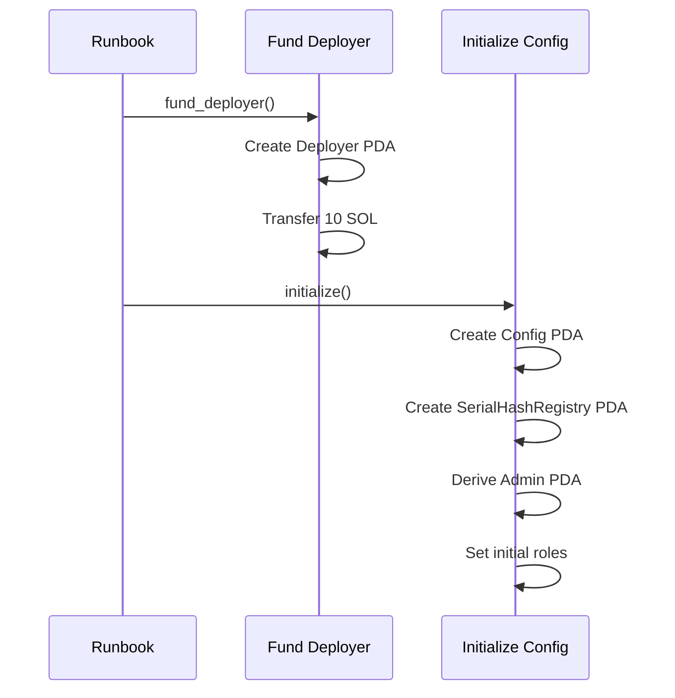
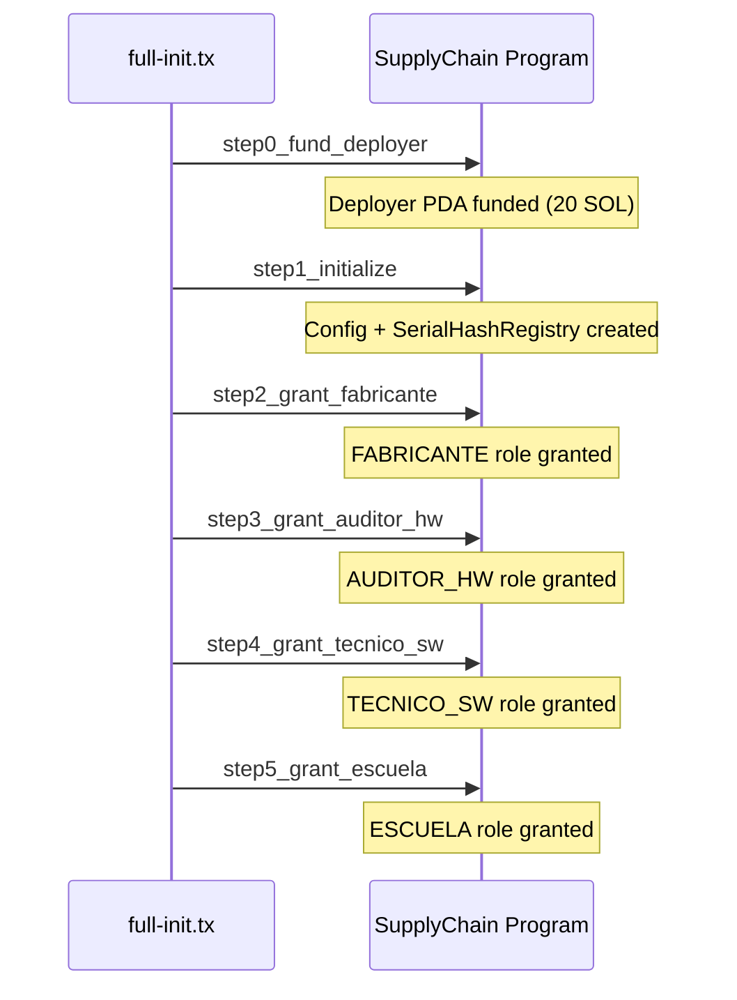
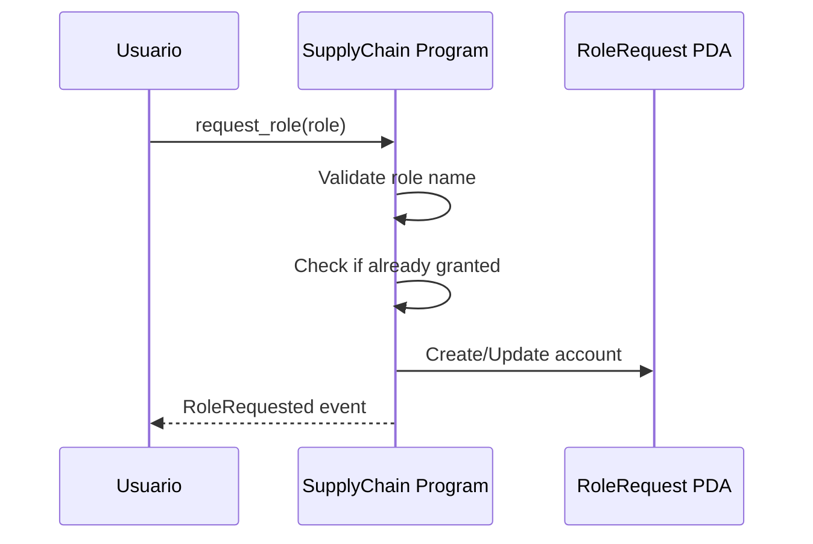

# 03 - Runbooks txtx

> Documentación completa de los runbooks txtx/surfpool para interacción con el programa SupplyChainTracker.

---

## 📋 Tabla de Contenidos

1. [¿Qué son los Runbooks txtx?](#qué-son-los-runbooks-txtx)
2. [Estructura de un Runbook](#estructura-de-un-runbook)
3. [Sintaxis HCL](#sintaxis-hcl)
4. [Funciones Disponibles](#funciones-disponibles)
5. [Runbooks de Deployment](#runbooks-de-deployment)
6. [Runbooks de Operaciones](#runbooks-de-operaciones)
7. [Runbooks de Role Management](#runbooks-de-role-management)
8. [Runbooks de Testing](#runbooks-de-testing)
9. [Configuración de Entornos](#configuración-de-entornos)

---

## ¿Qué son los Runbooks txtx?

Los **runbooks txtx** son scripts declarativos que automatizan interacciones con programas de Solana. Utilizan el framework **txtx** (Text-based Transaction Executor) para definir transacciones de manera legible y reutilizable.

### Características Principales

- **Declarativo**: Definición clara de signers, variables y acciones
- **PDA-First**: Todas las cuentas son PDA-derivable desde el IDL
- **Reutilizable**: Variables y funciones compartidas entre runbooks
- **Browser UI**: Interfaz web para ejecución visual con `--browser`
- **Environment-driven**: Configuración externa vía archivos `.env`

### Herramientas

| Herramienta | Descripción | Comando |
|-------------|-------------|---------|
| `txtx` | Runbook execution engine | `txtx run <runbook>` |
| `surfpool` | Local SVM validator | `surfpool start` |
| `surfpool run` | Ejecutar runbooks con SVM addon | `surfpool run <runbook> --env <env>` |

### ⚠️ Importante

```bash
# ✅ CORRECTO: surfpool run con addon svm
surfpool run deploy-program --env localnet --browser -f

# ❌ INCORRECTO: txtx run con addon svm
txtx run deploy-program --env localnet
```

---

## Estructura de un Runbook

Un runbook txtx tiene la siguiente estructura:

```mermaid
graph TB
    subgraph "Runbook Structure"
        Addon[addon "svm"<br/>SVM Configuration]
        Signer[signer<br/>Wallet Signers]
        Variable[variable<br/>Program/PDA Variables]
        Action[action<br/>Transaction Actions]
        Output[output<br/>Result Outputs]
    end

    Addon --> Signer
    Signer --> Variable
    Variable --> Action
    Action --> Output
```

### Componentes

#### 1. Addon Configuration

Define la configuración del addon SVM (Solana Virtual Machine):

```txtx
addon "svm" {
  network_id = "localnet"
  rpc_api_url = "http://localhost:8899"
}
```

| Campo | Descripción | Valores |
|-------|-------------|---------|
| `network_id` | ID de la red | `localnet`, `devnet`, `mainnet` |
| `rpc_api_url` | URL del endpoint RPC | `http://localhost:8899` |

#### 2. Signers

Define las wallets que firmarán las transacciones:

```txtx
signer "fabricante" "svm::web_wallet" {
  description = "Manufacturer account (must have FABRICANTE role)"
  keypair_path = env.FABRICANTE_KEYPAIR
}
```

| Campo | Descripción |
|-------|-------------|
| `name` | Nombre del signer (referenciado en actions) |
| `type` | Tipo de signer (`svm::web_wallet`) |
| `description` | Descripción del signer |
| `keypair_path` | Ruta al keypair (puede ser variable de entorno) |

#### 3. Variables

Define variables reutilizables en el runbook:

```txtx
// Program variables
variable "program" {
  description = "Program artifacts from Anchor project"
  value = svm::get_program_from_anchor_project("sc_solana")
}

variable "program_id" {
  description = "Deployed program ID"
  value = variable.program.program_id
}

// PDA derivation
variable "config_pda" {
  description = "Config account PDA"
  value = svm::find_pda(variable.program_id, ["config"])
}

// Input variables
variable "serial_number" {
  description = "Serial number of the netbook"
  value = env.NETBOOK_SERIAL
}
```

#### 4. Actions

Define las acciones/transacciones a ejecutar:

```txtx
action "register" "svm::process_instructions" {
  description = "Register netbook in supply chain"
  instruction {
    program_idl = variable.program.idl
    instruction_name = "register_netbook"
    instruction_args = [
      variable.serial_number,
      variable.batch_id,
      variable.model_specs
    ]
    accounts = [
      {
        public_key = variable.netbook_pda.pda
        writable = true
        signer = false
      },
      {
        public_key = variable.config_pda.pda
        writable = true
        signer = false
      },
      {
        public_key = signer.fabricante.public_key
        writable = true
        signer = true
      },
      {
        public_key = svm::system_program_id()
        writable = false
        signer = false
      }
    ]
  }
  signers = [signer.fabricante]
}
```

| Campo | Descripción |
|-------|-------------|
| `name` | Nombre de la acción |
| `type` | Tipo de acción (`svm::process_instructions`) |
| `description` | Descripción de la acción |
| `depends_on` | Acciones dependientes (opcional) |
| `instruction` | Definición de la instruction |
| `signers` | Lista de signers requeridos |

#### 5. Outputs

Define los valores de salida del runbook:

```txtx
output "serial_number" {
  description = "Registered serial number"
  value = variable.serial_number
}

output "registration_signature" {
  description = "Transaction signature"
  value = action.register.signatures | first()
}

output "netbook_pda" {
  description = "Derived netbook PDA address"
  value = variable.netbook_pda.pda
}
```

---

## Sintaxis HCL

### Tipos de Datos

| Tipo | Sintaxis | Ejemplo |
|------|----------|---------|
| String | `"text"` | `"localnet"` |
| Number | `123` | `8899` |
| Boolean | `true` / `false` | `true` |
| Array | `[item1, item2]` | `[1, 2, 3]` |
| Object | `{ key = value }` | `{ writable = true }` |
| Environment | `env.VAR_NAME` | `env.NETBOOK_SERIAL` |
| Variable | `variable.name` | `variable.program_id` |
| Function | `func(args)` | `svm::find_pda(...)` |

### Referencias

```txtx
// Referencia a variable
variable "program_id" {
  value = variable.program.program_id
}

// Referencia a signer
signer.fabricante.public_key

// Referencia a action
action.register.signatures

// Referencia a environment
env.NETBOOK_SERIAL

// Función con referencia
svm::find_pda(variable.program_id, ["config"])
```

### Pipe Operator

El pipe operator `|` se usa para transformar valores:

```txtx
// Obtener primer signature
value = action.register.signatures | first()
```

---

## Funciones Disponibles

### svm::find_pda

Deriva una PDA (Program Derived Address):

```txtx
variable "config_pda" {
  value = svm::find_pda(program_id, ["seed1", "seed2"])
}
```

**Retorna**: `{ pda: Pubkey, bump_seed: u8 }`

| Parámetro | Tipo | Descripción |
|-----------|------|-------------|
| `program_id` | String | Program ID |
| `seeds` | Array | Seeds para derivación |

### svm::process_instructions

Procesa instrucciones del programa:

```txtx
action "my_action" "svm::process_instructions" {
  instruction {
    program_idl = variable.program.idl
    instruction_name = "my_instruction"
    instruction_args = [arg1, arg2]
    accounts = [
      { public_key = pubkey, writable = true, signer = false }
    ]
  }
  signers = [signer.my_signer]
}
```

| Campo | Descripción |
|-------|-------------|
| `program_idl` | IDL del programa (para encoding automático) |
| `program_id` | Program ID (para data manual) |
| `instruction_name` | Nombre de la instruction |
| `instruction_args` | Argumentos de la instruction |
| `instruction_data` | Data manual (discriminator + args) |
| `accounts` | Lista de accounts requeridos |

### svm::get_program_from_anchor_project

Obtiene artifacts del programa desde proyecto Anchor:

```txtx
variable "program" {
  value = svm::get_program_from_anchor_project("sc_solana")
}
```

**Retorna**: `{ idl, binary, keypair, program_id }`

| Parámetro | Tipo | Descripción |
|-----------|------|-------------|
| `project_name` | String | Nombre del proyecto Anchor |

### svm::system_program_id

Retorna el ID del System Program:

```txtx
{
  public_key = svm::system_program_id()
  writable = false
  signer = false
}
```

### svm::u64

Convierte valor a u64 para seeds:

```txtx
variable "netbook_pda" {
  value = svm::find_pda(program_id, ["netbook", svm::u64(token_id)])
}
```

### program_idl + instruction_name

Encoding manual de instruction data:

```txtx
instruction {
  program_id = variable.program_id
  instruction_data = program_idl + instruction_name("fund_deployer")
  instruction_args = [10000000000]
}
```

---

## Runbooks de Deployment

### deploy-program.tx

**Ubicación**: [`sc-solana/runbooks/01-deployment/deploy-program.tx`](../../sc-solana/runbooks/01-deployment/deploy-program.tx)

**Descripción**: Despliega el programa SupplyChainTracker en la red.

```bash
surfpool run deploy-program --env localnet --browser -f
```

**Estructura**:

| Componente | Descripción |
|------------|-------------|
| `signer "deployer"` | Wallet del deployer |
| `variable "program"` | Artifacts desde Anchor project |
| `action "deploy"` | svm::deploy_program |

**Outputs**:
- `program_id`: ID del programa desplegado
- `program_idl`: IDL del programa
- `signatures`: Signatures de la transacción
- `slot`: Slot de despliegue

### initialize-config.tx

**Ubicación**: [`sc-solana/runbooks/01-deployment/initialize-config.tx`](../../sc-solana/runbooks/01-deployment/initialize-config.tx)

**Descripción**: Inicializa la configuración del sistema (Config PDA, SerialHashRegistry, Admin PDA).

```bash
surfpool run initialize-config --env localnet --browser -f
```

**Flujo**:



**Acciones**:

| Acción | Descripción | Dependencias |
|--------|-------------|--------------|
| `fund_deployer` | Crea y financia Deployer PDA | Ninguna |
| `initialize` | Inicializa Config y SerialHashRegistry | fund_deployer |

**PDAs Creadas**:

| PDA | Seeds | Space |
|-----|-------|-------|
| `DeployerState` | `[b"deployer"]` | 17 bytes |
| `SupplyChainConfig` | `[b"config"]` | 258 bytes |
| `SerialHashRegistry` | `[b"serial_hashes", config.key()]` | 3224 bytes |

**Instruction Data Manual**:

```txtx
// fund_deployer discriminator: sha256("global:fund_deployer")[:8]
variable "fund_deployer_data" {
  value = [223, 191, 31, 96, 237, 187, 189, 54, 0, 228, 11, 84, 2, 0, 0, 0]
}

// initialize discriminator: sha256("global:initialize")[:8]
variable "initialize_data" {
  value = [175, 175, 109, 31, 13, 152, 155, 237]
}
```

### grant-roles.tx

**Ubicación**: [`sc-solana/runbooks/01-deployment/grant-roles.tx`](../../sc-solana/runbooks/01-deployment/grant-roles.tx)

**Descripción**: Otorga roles iniciales a keypairs separados.

```bash
surfpool run grant-roles --env localnet --browser -f
```

**Roles Otorgados**:

| Role | Recipiente |
|------|------------|
| `FABRICANTE` | fabricante keypair |
| `AUDITOR_HW` | auditor_hw keypair |
| `TECNICO_SW` | tecnico_sw keypair |
| `ESCUELA` | escuela keypair |

### grant-all-to-deployer.tx

**Ubicación**: [`sc-solana/runbooks/01-deployment/grant-all-to-deployer.tx`](../../sc-solana/runbooks/01-deployment/grant-all-to-deployer.tx)

**Descripción**: Otorga todos los roles a un solo wallet (deployer).

```bash
surfpool run grant-all-to-deployer --env localnet --browser -f
```

### full-init.tx

**Ubicación**: [`sc-solana/runbooks/01-deployment/full-init.tx`](../../sc-solana/runbooks/01-deployment/full-init.tx)

**Descripción**: Inicialización completa en un solo runbook (fund + init + grant all).

```bash
surfpool run full-init --env localnet --browser -f
```

**Flujo Completo**:



---

## Runbooks de Operaciones

### register-netbook.tx

**Ubicación**: [`sc-solana/runbooks/02-operations/netbook/register-netbook.tx`](../../sc-solana/runbooks/02-operations/netbook/register-netbook.tx)

**Descripción**: Registra una netbook individual en la cadena de suministro.

```bash
surfpool run register-netbook --env localnet --browser -f
```

**Estado Resultante**: `Fabricada (0)`

**Inputs**:

| Variable | Default | Descripción |
|----------|---------|-------------|
| `serial_number` | `env.NETBOOK_SERIAL` | Número de serial |
| `batch_id` | `env.NETBOOK_BATCH` | ID del batch |
| `model_specs` | `env.NETBOOK_MODEL` | Especificaciones del modelo |
| `token_id` | `env.NETBOOK_TOKEN_ID` | Token ID (debe coincidir con config.next_token_id) |

**PDAs Derivadas**:

| PDA | Seeds |
|-----|-------|
| `Config` | `[b"config"]` |
| `SerialHashRegistry` | `[b"serial_hashes", config.key()]` |
| `Netbook` | `[b"netbook", token_id]` |

**Account Order**:

```txtx
accounts = [
  { public_key = netbook_pda.pda, writable = true, signer = false },
  { public_key = config_pda.pda, writable = true, signer = false },
  { public_key = serial_hashes_pda.pda, writable = true, signer = false },
  { public_key = signer.fabricante.public_key, writable = true, signer = true },
  { public_key = svm::system_program_id(), writable = false, signer = false }
]
```

### register-netbooks-batch.tx

**Descripción**: Registra múltiples netbooks en una sola transacción.

```bash
surfpool run register-netbooks-batch --env localnet --browser -f
```

**Límite**: Máximo 10 netbooks por batch (`MAX_BATCH_SIZE`)

### audit-hardware.tx

**Ubicación**: [`sc-solana/runbooks/02-operations/netbook/audit-hardware.tx`](../../sc-solana/runbooks/02-operations/netbook/audit-hardware.tx)

**Descripción**: Realiza auditoría de hardware en una netbook.

```bash
surfpool run audit-hardware --env localnet --browser -f
```

**Transición de Estado**: `Fabricada (0)` → `HwAprobado (1)`

**Inputs**:

| Variable | Default | Descripción |
|----------|---------|-------------|
| `serial_number` | `env.NETBOOK_SERIAL` | Serial de la netbook |
| `passed` | `true` | ¿Pasó la auditoría? |
| `report_hash` | `[0...0, 1]` | Hash del reporte (32 bytes) |
| `token_id` | `env.NETBOOK_TOKEN_ID` | Token ID |

### validate-software.tx

**Ubicación**: [`sc-solana/runbooks/02-operations/netbook/validate-software.tx`](../../sc-solana/runbooks/02-operations/netbook/validate-software.tx)

**Descripción**: Valida el software instalado en una netbook.

```bash
surfpool run validate-software --env localnet --browser -f
```

**Transición de Estado**: `HwAprobado (1)` → `SwValidado (2)`

**Inputs**:

| Variable | Default | Descripción |
|----------|---------|-------------|
| `serial_number` | `env.NETBOOK_SERIAL` | Serial de la netbook |
| `os_version` | `env.NETBOOK_OS_VERSION` | Versión del OS |
| `passed` | `true` | ¿Pasó la validación? |
| `token_id` | `env.NETBOOK_TOKEN_ID` | Token ID |

### assign-student.tx

**Ubicación**: [`sc-solana/runbooks/02-operations/netbook/assign-student.tx`](../../sc-solana/runbooks/02-operations/netbook/assign-student.tx)

**Descripción**: Asigna una netbook a un estudiante (paso final del lifecycle).

```bash
surfpool run assign-student --env localnet --browser -f
```

**Transición de Estado**: `SwValidado (2)` → `Distribuida (3)`

**Inputs**:

| Variable | Default | Descripción |
|----------|---------|-------------|
| `serial_number` | `env.NETBOOK_SERIAL` | Serial de la netbook |
| `school_hash` | `[0...0, 1]` | Hash de la escuela (32 bytes) |
| `student_hash` | `[0...0, 2]` | Hash del estudiante (32 bytes) |
| `token_id` | `env.NETBOOK_TOKEN_ID` | Token ID |

### query-netbook.tx

**Descripción**: Consulta el estado de una netbook.

```bash
surfpool run query-netbook --env localnet --browser -f
```

### query-config.tx

**Ubicación**: [`sc-solana/runbooks/02-operations/query/query-config.tx`](../../sc-solana/runbooks/02-operations/query/query-config.tx)

**Descripción**: Consulta la configuración actual del sistema.

```bash
surfpool run query-config --env localnet --browser -f
```

**Sin signers requeridos** (solo lectura).

### query-role.tx / query-roles.tx

**Descripción**: Consulta los holders de un rol o todos los roles.

```bash
surfpool run query-role --env localnet --browser -f
surfpool run query-roles --env localnet --browser -f
```

---

## Runbooks de Role Management

### request-role.tx

**Descripción**: Solicita un rol (flujo request-approval).

```bash
surfpool run request-role --env localnet --browser -f
```

**Flujo**:



### approve-role-request.tx

**Descripción**: Admin aprueba una solicitud de rol.

```bash
surfpool run approve-role-request --env localnet --browser -f
```

**Resultado**: Crea RoleHolder PDA automáticamente.

### reject-role-request.tx

**Descripción**: Admin rechaza una solicitud de rol.

```bash
surfpool run reject-role-request --env localnet --browser -f
```

### add-role-holder.tx

**Ubicación**: [`sc-solana/runbooks/03-role-management/add-role-holder.tx`](../../sc-solana/runbooks/03-role-management/add-role-holder.tx)

**Descripción**: Agrega un nuevo holder a un rol (multi-holder support).

```bash
surfpool run add-role-holder --env localnet --browser -f
```

**PDAs**:

| PDA | Seeds |
|-----|-------|
| `Config` | `[b"config"]` |
| `Admin` | `[b"admin", config.key()]` |
| `RoleHolder` | `[b"role_holder", new_holder.key()]` |

### remove-role-holder.tx

**Descripción**: Remueve un holder de un rol.

```bash
surfpool run remove-role-holder --env localnet --browser -f
```

**Cierra la RoleHolder PDA y devuelve SOL**.

### revoke-role.tx

**Descripción**: Revoca un rol (clears config fields).

```bash
surfpool run revoke-role --env localnet --browser -f
```

### close-role-holder.tx

**Descripción**: Cierra una RoleHolder PDA y devuelve SOL al admin.

```bash
surfpool run close-role-holder --env localnet --browser -f
```

### transfer-admin.tx

**Descripción**: Transfiere la autoridad admin a otra wallet.

```bash
surfpool run transfer-admin --env localnet --browser -f
```

---

## Runbooks de Testing

### full-lifecycle.tx

**Ubicación**: [`sc-solana/runbooks/04-testing/full-lifecycle.tx`](../../sc-solana/runbooks/04-testing/full-lifecycle.tx)

**Descripción**: Test completo del lifecycle de una netbook.

```bash
surfpool run full-lifecycle --env localnet --browser -f
```

**Pasos**:

| Paso | Acción | Estado |
|------|--------|--------|
| 0 | `step0_fund_deployer` | Deployer funded |
| 1 | `step1_initialize` | Config initialized |
| 2 | `step2_grant_fabricante` | FABRICANTE role granted |
| 3 | `step3_register` | Fabricada (0) |
| 4 | `step4_audit` | HwAprobado (1) |
| 5 | `step5_validate` | SwValidado (2) |
| 6 | `step6_assign` | Distribuida (3) |

### edge-cases.tx

**Descripción**: Tests de casos borde (errores, validaciones).

```bash
surfpool run edge-cases --env localnet --browser -f
```

### role-workflow.tx

**Descripción**: Test del flujo completo de roles.

```bash
surfpool run role-workflow --env localnet --browser -f
```

### generate-fake-data.tx

**Descripción**: Genera datos fake para testing.

```bash
surfpool run generate-fake-data --env localnet --browser -f
```

### setup-test-env.tx

**Descripción**: Configura el ambiente de testing.

```bash
surfpool run setup-test-env --env localnet --browser -f
```

### verify-deployment.tx

**Descripción**: Verifica la consistencia del deployment.

```bash
surfpool run verify-deployment --env localnet --browser -f
```

---

## Configuración de Entornos

### Archivos de Entorno

| Archivo | Descripción |
|---------|-------------|
| [`config/config.env`](../../sc-solana/config/config.env) | Configuración centralizada |
| [`runbooks/environments/localnet.env`](../../sc-solana/runbooks/environments/localnet.env) | Configuración localnet |
| `runbooks/environments/devnet.env` | Configuración devnet |
| `runbooks/environments/mainnet.env` | Configuración mainnet |

### Variables de Entorno

```bash
# Network
network_id=localnet
rpc_api_url=http://localhost:8899
ws_url=ws://localhost:8900

# Program
PROGRAM_ID=BTSWNY97FaxeJrUNSq399tRbfMz68iaaY3csJwT9hQQW
ANCHOR_IDL_PATH=./sc-solana/target/idl/sc_solana.json

# Wallets
DEPLOYER_KEYPAIR=~/.config/solana/id.json
KEYPAIRS_DIR=./config/keypairs
FABRICANTE_KEYPAIR=${KEYPAIRS_DIR}/fabricante.json
AUDITOR_HW_KEYPAIR=${KEYPAIRS_DIR}/auditor_hw.json
TECNICO_SW_KEYPAIR=${KEYPAIRS_DIR}/tecnico_sw.json
ESCUELA_KEYPAIR=${KEYPAIRS_DIR}/escuela.json

# Netbook Data
NETBOOK_SERIAL=NB-2024-001
NETBOOK_BATCH=BATCH-001
NETBOOK_MODEL=Lenovo ThinkPad X1
NETBOOK_OS_VERSION=Ubuntu 22.04

# Role Management
ROLE_TO_REQUEST=FABRICANTE
ROLE_TO_REVOKE=FABRICANTE
ROLE_TO_GRANT=FABRICANTE
```

### Uso

```bash
# Cargar configuración
cd sc-solana
source config/config.env
source runbooks/environments/localnet.env

# Ejecutar runbook
surfpool run deploy-program --env localnet --browser -f
```

---

## Resumen de Runbooks

### Deployment (5 runbooks)

| Runbook | Archivo | Descripción |
|---------|---------|-------------|
| `deploy-program` | `01-deployment/deploy-program.tx` | Despliega el programa |
| `initialize-config` | `01-deployment/initialize-config.tx` | Inicializa config |
| `grant-roles` | `01-deployment/grant-roles.tx` | Otorga roles a keypairs separados |
| `grant-all-to-deployer` | `01-deployment/grant-all-to-deployer.tx` | Otorga todos roles a deployer |
| `full-init` | `01-deployment/full-init.tx` | Inicialización completa |

### Operations (8 runbooks)

| Runbook | Archivo | Estado Resultante |
|---------|---------|-------------------|
| `register-netbook` | `02-operations/netbook/register-netbook.tx` | Fabricada (0) |
| `register-netbooks-batch` | `02-operations/netbook/register-netbooks-batch.tx` | Fabricada (0) |
| `audit-hardware` | `02-operations/netbook/audit-hardware.tx` | HwAprobado (1) |
| `validate-software` | `02-operations/netbook/validate-software.tx` | SwValidado (2) |
| `assign-student` | `02-operations/netbook/assign-student.tx` | Distribuida (3) |
| `query-netbook` | `02-operations/netbook/query-netbook.tx` | Query |
| `query-config` | `02-operations/query/query-config.tx` | Query |
| `query-role` / `query-roles` | `02-operations/query/` | Query |

### Role Management (8 runbooks)

| Runbook | Archivo | Descripción |
|---------|---------|-------------|
| `request-role` | `03-role-management/request-role.tx` | Solicita un rol |
| `approve-role-request` | `03-role-management/approve-role-request.tx` | Aprueba solicitud |
| `reject-role-request` | `03-role-management/reject-role-request.tx` | Rechaza solicitud |
| `add-role-holder` | `03-role-management/add-role-holder.tx` | Agrega holder |
| `remove-role-holder` | `03-role-management/remove-role-holder.tx` | Remueve holder |
| `revoke-role` | `03-role-management/revoke-role.tx` | Revoca rol |
| `close-role-holder` | `03-role-management/close-role-holder.tx` | Cierra RoleHolder |
| `transfer-admin` | `03-role-management/transfer-admin.tx` | Transfiere admin |

### Testing (5+ runbooks)

| Runbook | Archivo | Descripción |
|---------|---------|-------------|
| `full-lifecycle` | `04-testing/full-lifecycle.tx` | Lifecycle completo |
| `edge-cases` | `04-testing/edge-cases.tx` | Casos borde |
| `role-workflow` | `04-testing/role-workflow.tx` | Flujo de roles |
| `generate-fake-data` | `04-testing/generate-fake-data.tx` | Datos fake |
| `setup-test-env` | `04-testing/setup-test-env.tx` | Setup testing |
| `verify-deployment` | `04-testing/verify-deployment.tx` | Verificar deployment |

---

## Referencias

- [Txtx Documentation](https://txtx.sh/)
- [Surfpool Documentation](https://surfpool.run/)
- [Txtx GitHub](https://github.com/txtx-sh/txtx)
