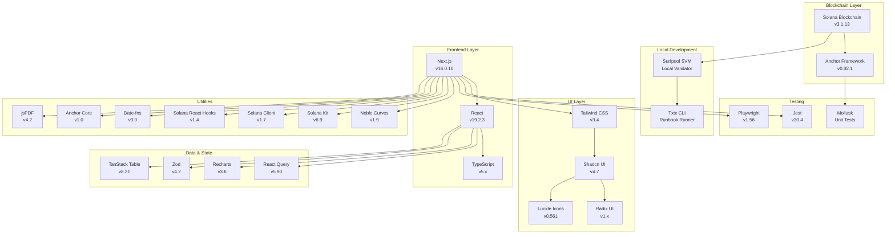

# 04 - Tecnologías Implementadas

> Descripción completa de todas las tecnologías utilizadas en el proyecto SupplyChainTracker.

---

## 📋 Tabla de Contenidos

1. [Resumen de Tecnologías](#resumen-de-tecnologías)
2. [Solana](#solana)
3. [Anchor Framework](#anchor-framework)
4. [Next.js](#nextjs)
5. [Playwright](#playwright)
6. [txtx / Surfpool](#txtx--surfpool)
7. [Jest](#jest)
8. [React](#react)
9. [TypeScript](#typescript)
10. [Tailwind CSS / Shadcn UI](#tailwind-css--shadcn-ui)
11. [Other Dependencies](#other-dependencies)

---

## Resumen de Tecnologías



---

## Solana

### Descripción

Solana es una blockchain de alto rendimiento diseñada para aplicaciones descentralizadas escalables. Utiliza un mecanismo de consenso Proof-of-History (PoH) combinado con Proof-of-Stake (PoS).

### Versión del Proyecto

```
Solana CLI: 3.1.13
```

### Características Utilizadas

| Característica | Descripción | Uso en el Proyecto |
|----------------|-------------|-------------------|
| **Accounts** | Storage de estado en blockchain | Config, Netbook, RoleHolder, etc. |
| **PDAs** | Program Derived Addresses | Authority sin keypair |
| **Instructions** | Transacciones al programa | 18 instructions del programa |
| **Events** | Logs on-chain | NetbookRegistered, RoleGranted, etc. |
| **Compute Units** | Limitación de cómputo | Optimización de transacciones |
| **Rent Exemption** | Exención de rent | Accounts con balance mínimo |

### Configuración de Red

| Red | RPC URL | WebSocket |
|-----|---------|-----------|
| Localnet | `http://localhost:8899` | `ws://localhost:8900` |
| Devnet | `https://api.devnet.solana.com` | `wss://api.devnet.solana.com` |
| Mainnet | `https://api.mainnet-beta.solana.com` | `wss://api.mainnet-beta.solana.com` |

### Integración en el Frontend

[`web/src/lib/solana/connection.ts`](../../web/src/lib/solana/connection.ts)

```typescript
import { Connection, Cluster } from '@solana/web3.js';

const cluster = process.env.NEXT_PUBLIC_SOLANA_CLUSTER || 'localnet';
const rpcUrl = process.env.NEXT_PUBLIC_SOLANA_RPC_URL;

export const connection = new Connection(
  rpcUrl || ClusterUrl[cluster],
  'confirmed'
);
```

---

## Anchor Framework

### Descripción

Anchor es el framework principal para desarrollo de programas en Solana. Proporciona macros de derivación, IDL generation, y client code generation.

### Versión del Proyecto

```
Anchor CLI: 0.32.1
```

### Características Utilizadas

| Característica | Archivo | Uso |
|----------------|---------|-----|
| `declare_id!()` | [`lib.rs`](../../sc-solana/programs/sc-solana/src/lib.rs) | Program ID |
| `#[program]` | [`lib.rs`](../../sc-solana/programs/sc-solana/src/lib.rs) | Instruction handlers |
| `#[derive(Accounts)]` | `instructions/*.rs` | Account validation |
| `#[account]` | `state/*.rs` | State accounts |
| `#[error_code]` | [`errors/mod.rs`](../../sc-solana/programs/sc-solana/src/errors/mod.rs) | Custom errors |
| `#[event]` | `events/*.rs` | On-chain events |
| `#[account(zero_copy)]` | [`serial_hash_registry.rs`](../../sc-solana/programs/sc-solana/src/state/serial_hash_registry.rs) | Large arrays |

### Estructura del Programa

```
sc-solana/programs/sc-solana/
├── src/
│   ├── lib.rs              # Program entry point
│   ├── state/              # Account structs
│   │   ├── config.rs       # SupplyChainConfig
│   │   ├── netbook.rs      # Netbook
│   │   ├── role_holder.rs  # RoleHolder
│   │   ├── role_request.rs # RoleRequest
│   │   └── serial_hash_registry.rs # SerialHashRegistry
│   ├── instructions/       # Instruction handlers
│   │   ├── deployer.rs     # Fund/Close Deployer
│   │   ├── initialize.rs   # Initialize config
│   │   ├── netbook/        # Netbook lifecycle
│   │   │   ├── register.rs
│   │   │   ├── register_batch.rs
│   │   │   ├── audit.rs
│   │   │   ├── validate.rs
│   │   │   └── assign.rs
│   │   ├── role/           # Role management
│   │   │   ├── grant.rs
│   │   │   ├── revoke.rs
│   │   │   ├── request.rs
│   │   │   ├── holder_add.rs
│   │   │   ├── holder_remove.rs
│   │   │   └── transfer_admin.rs
│   │   └── query/          # Query instructions
│   │       ├── netbook_state.rs
│   │       ├── config.rs
│   │       └── role.rs
│   ├── events/             # Event definitions
│   │   ├── netbook_events.rs
│   │   ├── role_events.rs
│   │   └── query_events.rs
│   └── errors/             # Error codes
│       └── mod.rs
└── tests/                  # Mollusk tests
    ├── mollusk-tests.rs
    ├── mollusk-lifecycle.rs
    └── compute-units.rs
```

---

## Next.js

### Descripción

Next.js es el framework React para aplicaciones web full-stack. Utiliza el App Router para routing y server components.

### Versión del Proyecto

```
Next.js: 16.0.10
Node.js: 20 LTS
```

### Características Utilizadas

| Característica | Uso en el Proyecto |
|----------------|-------------------|
| **App Router** | `app/` directory structure |
| **Server Components** | Default component type |
| **Client Components** | `"use client"` directive |
| **API Routes** | `app/api/revalidate/route.ts` |
| **Static Generation** | Metadata generation |
| **File-based Routing** | `app/page.tsx`, `app/admin/page.tsx` |

### Estructura de Páginas

| Ruta | Archivo | Descripción |
|------|---------|-------------|
| `/` | [`app/page.tsx`](../../web/app/page.tsx) | Home/Dashboard |
| `/admin` | [`app/admin/page.tsx`](../../web/app/admin/page.tsx) | Admin Panel |
| `/admin/analytics` | `app/admin/analytics/page.tsx` | Analytics |
| `/admin/audit` | `app/admin/audit/page.tsx` | Audit View |
| `/admin/roles/pending-requests` | `app/admin/roles/pending-requests/page.tsx` | Role Requests |
| `/admin/settings` | `app/admin/settings/page.tsx` | Settings |
| `/dashboard` | [`app/dashboard/page.tsx`](../../web/app/dashboard/page.tsx) | User Dashboard |
| `/tokens` | `app/tokens/page.tsx` | Netbook List |
| `/tokens/[id]` | `app/tokens/[id]/page.tsx` | Netbook Details |
| `/tokens/create` | `app/tokens/create/page.tsx` | Create Netbook |
| `/transfers` | `app/transfers/page.tsx` | Transfers |

---

## Playwright

### Descripción

Playwright es un framework de testing E2E para aplicaciones web. Soporta múltiples browsers y automatización de UI.

### Versión del Proyecto

```
Playwright: 1.56.0
```

### Configuración

[`web/playwright.config.ts`](../../web/playwright.config.ts)

```typescript
import { defineConfig, devices } from '@playwright/test';

export default defineConfig({
  testDir: './e2e',
  fullyParallel: true,
  forbidOnly: !!process.env.CI,
  retries: process.env.CI ? 2 : 0,
  workers: process.env.CI ? 1 : undefined,
  reporter: 'html',
  use: {
    baseURL: process.env.NEXT_PUBLIC_APP_URL || 'http://localhost:3000',
    trace: 'on-first-retry',
  },
  projects: [
    { name: 'setup', testMatch: /.*setup.*/ },
    { name: 'chromium', use: { ...devices['Desktop Chrome'] } },
  ],
  webServer: {
    command: 'npm run dev',
    url: process.env.NEXT_PUBLIC_APP_URL || 'http://localhost:3000',
    reuseExistingServer: !process.env.CI,
  },
  testMatch: /.*\.spec\.ts/,
});
```

### Tests E2E

| Test | Archivo | Descripción |
|------|---------|-------------|
| Homepage | [`e2e/homepage.spec.ts`](../../web/e2e/homepage.spec.ts) | Homepage loading |
| Netbook Registration | [`e2e/netbook-registration.spec.ts`](../../web/e2e/netbook-registration.spec.ts) | Registration flow |
| Role Management | [`e2e/role-management.spec.ts`](../../web/e2e/role-management.spec.ts) | Role operations |
| Wallet Connection | [`e2e/wallet-connection.spec.ts`](../../web/e2e/wallet-connection.spec.ts) | Wallet integration |
| Full Flow | [`e2e/full-flow.spec.ts`](../../web/e2e/full-flow.spec.ts) | Complete user flow |
| Full Lifecycle | `e2e/integration/full-lifecycle.spec.ts` | Blockchain lifecycle |
| Dashboard | `e2e/dashboard.spec.ts` | Dashboard functionality |

### Mock Wallet Adapter

Los tests utilizan un mock wallet adapter para simular la conexión de wallet sin necesidad de una wallet real:

| Archivo | Descripción |
|---------|-------------|
| [`e2e/fixtures/wallet-mock.ts`](../../web/e2e/fixtures/wallet-mock.ts) | Mock wallet implementation |
| [`e2e/fixtures/wallet-middleware.ts`](../../web/e2e/fixtures/wallet-middleware.ts) | Wallet middleware |
| [`e2e/fixtures/wallet-fixture.ts`](../../web/e2e/fixtures/wallet-fixture.ts) | Test fixture |
| [`e2e/fixtures/mock-wallet-injection.ts`](../../web/e2e/fixtures/mock-wallet-injection.ts) | Wallet injection |
| [`e2e/fixtures/wallet-mock-module.ts`](../../web/e2e/fixtures/wallet-mock-module.ts) | Mock module |

---

## txtx / Surfpool

### Descripción

**txtx** es el engine de ejecución de runbooks para interacción con programas de Solana. **Surfpool** es el SVM (Solana Virtual Machine) local para testing y desarrollo.

### Versiones del Proyecto

```
Surfpool: Latest (npm install -g @surfpool/cli)
txtx: Latest (cargo install txtx-cli --locked)
```

### Configuración

[`sc-solana/txtx.yml`](../../sc-solana/txtx.yml)

```yaml
# Txtx configuration
# Defines default settings for runbook execution
```

### Runbook Structure

```
sc-solana/runbooks/
├── README.md                           # Main documentation
├── _templates/                         # Reusable templates
│   ├── common.tx                       # Common patterns
│   ├── pda-derivation.tx              # PDA patterns
│   └── env-vars.tx                    # Environment patterns
├── 01-deployment/                     # Deployment (5 runbooks)
│   ├── deploy-program.tx
│   ├── initialize-config.tx
│   ├── grant-roles.tx
│   ├── grant-all-to-deployer.tx
│   └── full-init.tx
├── 02-operations/                     # Operations (8 runbooks)
│   ├── netbook/
│   │   ├── register-netbook.tx
│   │   ├── register-netbooks-batch.tx
│   │   ├── audit-hardware.tx
│   │   ├── validate-software.tx
│   │   ├── assign-student.tx
│   │   └── query-netbook.tx
│   └── query/
│       ├── query-config.tx
│       ├── query-role.tx
│       └── query-roles.tx
├── 03-role-management/                # Role management (8 runbooks)
│   ├── approve-role-request.tx
│   ├── reject-role-request.tx
│   ├── add-role-holder.tx
│   ├── remove-role-holder.tx
│   ├── revoke-role.tx
│   ├── close-role-holder.tx
│   ├── request-role.tx
│   ├── reset-role-request.tx
│   └── transfer-admin.tx
├── 04-testing/                        # Testing (6 runbooks)
│   ├── full-lifecycle.tx
│   ├── edge-cases.tx
│   ├── role-workflow.tx
│   ├── generate-fake-data.tx
│   ├── setup-test-env.tx
│   └── verify-deployment.tx
├── 05-ci/                             # CI scripts
│   └── runbook-tests.sh
└── environments/                      # Environment configs
    ├── localnet.env
    ├── devnet.env
    └── mainnet.env
```

### Comandos Principales

```bash
# Start Surfpool validator
surfpool start

# Run a runbook with browser UI
surfpool run <runbook> --env localnet --browser -f

# Run a runbook headless
surfpool run <runbook> --env localnet -f

# Run with specific port
surfpool run <runbook> --env localnet -b -p 8499
```

---

## Jest

### Descripción

Jest es el framework de testing unitario para JavaScript/TypeScript. Se utiliza para tests de componentes React, hooks, y servicios.

### Versión del Proyecto

```
Jest: 30.4.2
@testing-library/react: 16.3.0
@testing-library/jest-dom: 6.6.0
```

### Configuración

[`web/jest.config.js`](../../web/jest.config.js)

```javascript
export default {
  roots: ['<rootDir>/src'],
  testEnvironment: 'jsdom',
  setupFilesAfterSetup: ['<rootDir>/jest.setup.js'],
  transform: {
    '^.+\\.(ts|tsx)$': 'ts-jest',
  },
  moduleNameMapper: {
    '^@/(.*)$': '<rootDir>/src/$1',
  },
  testMatch: ['**/*.test.tsx', '**/*.test.ts'],
};
```

### Tests Unitarios

| Tipo | Patrón | Descripción |
|------|--------|-------------|
| Componentes | `*.test.tsx` | Tests de componentes React |
| Hooks | `use*.test.ts` | Tests de custom hooks |
| Servicios | `*.test.ts` | Tests de servicios |
| Utils | `*.test.ts` | Tests de utilidades |

---

## React

### Descripción

React es la librería principal para construcción de UIs. Utiliza el modelo de components y hooks.

### Versión del Proyecto

```
React: 19.2.3
React DOM: 19.2.3
```

### Patrones Utilizados

| Patrón | Descripción | Ejemplo |
|--------|-------------|---------|
| **Functional Components** | Componentes como funciones | `export function MyComponent()` |
| **Hooks** | useState, useEffect, useContext | `const [state, setState] = useState()` |
| **Custom Hooks** | Lógica reutilizable | `useSupplyChainService()` |
| **Client Components** | `"use client"` directive | `"use client"; export function...` |
| **Server Components** | Default (sin directive) | Server-side rendering |

### Componentes Principales

| Componente | Archivo | Descripción |
|------------|---------|-------------|
| `SolanaWalletClientProvider` | [`SolanaWalletClientProvider.tsx`](../../web/src/components/SolanaWalletClientProvider.tsx) | Wallet provider |
| `WalletConnectButton` | `WalletConnectButton.tsx` | Wallet connection button |
| `WalletReadyGate` | `WalletReadyGate.tsx` | Wallet readiness gate |
| `NetbookForm` | `contracts/NetbookForm.tsx` | Netbook registration form |
| `HardwareAuditForm` | `contracts/HardwareAuditForm.tsx` | Hardware audit form |
| `SoftwareValidationForm` | `contracts/SoftwareValidationForm.tsx` | Software validation form |
| `StudentAssignmentForm` | `contracts/StudentAssignmentForm.tsx` | Student assignment form |
| `TransactionConfirmation` | `contracts/TransactionConfirmation.tsx` | Tx confirmation dialog |

---

## TypeScript

### Descripción

TypeScript es el superset tipado de JavaScript. Proporciona type safety en toda la aplicación.

### Configuración

```json
{
  "compilerOptions": {
    "strict": true,
    "target": "ES2020",
    "module": "ESNext",
    "moduleResolution": "bundler"
  }
}
```

### Tipos Principales

| Tipo | Descripción | Ubicación |
|------|-------------|-----------|
| `NetbookState` | Estado de netbook | `lib/types.ts` |
| `RoleType` | Tipo de rol | `lib/constants/roles.ts` |
| `RoleRequestStatus` | Estado de request | `lib/types.ts` |
| `SupplyChainEvent` | Event types | `lib/events.ts` |

---

## Tailwind CSS / Shadcn UI

### Descripción

Tailwind CSS es un framework CSS utility-first. Shadcn UI es una colección de componentes construidos sobre Tailwind y Radix UI.

### Versión del Proyecto

```
Tailwind CSS: 3.4
Shadcn: 4.7.0
Radix UI: 1.x
```

### Configuración

[`web/tailwind.config.ts`](../../web/tailwind.config.ts)

```typescript
/** @type {import('tailwindcss').Config} */
module.exports = {
  content: ['./src/**/*.{ts,tsx}'],
  theme: {
    extend: {
      colors: {
        border: 'hsl(var(--border))',
        input: 'hsl(var(--input))',
        ring: 'hsl(var(--ring))',
        background: 'hsl(var(--background))',
        foreground: 'hsl(var(--foreground))',
      },
      borderRadius: {
        lg: 'var(--radius)',
        md: 'calc(var(--radius) - 2px)',
        sm: 'calc(var(--radius) - 4px)',
      },
    },
  },
  plugins: [require('tailwindcss-animate')],
};
```

### Componentes Shadcn Utilizados

| Componente | Ubicación | Uso |
|------------|-----------|-----|
| `Button` | `components/ui/button.tsx` | Botones |
| `Card` | `components/ui/card.tsx` | Cards |
| `Dialog` | `components/ui/dialog.tsx` | Diálogos |
| `Table` | `components/ui/table.tsx` | Tables |
| `Tabs` | `components/ui/tabs.tsx` | Tabs |
| `Input` | `components/ui/input.tsx` | Inputs |
| `Select` | `components/ui/select.tsx` | Selects |
| `Badge` | `components/ui/badge.tsx` | Badges |
| `Toast` | `components/ui/toast.tsx` | Notifications |
| `Skeleton` | `components/ui/skeleton.tsx` | Loading states |

---

## Other Dependencies

### Solana Client Libraries

| Package | Versión | Descripción |
|---------|---------|-------------|
| `@solana/kit` | `6.9.0` | Solana client library |
| `@solana/client` | `1.7.0` | RPC client |
| `@solana/web3.js` | `1.98.0` | Legacy web3.js compatibility |
| `@solana/react-hooks` | `1.4.1` | React hooks for Solana |
| `@solana/program-client-core` | `6.9.0` | Program client core |
| `@anchor-lang/core` | `1.0.2` | Anchor core library |

### State Management & Data

| Package | Versión | Descripción |
|---------|---------|-------------|
| `@tanstack/react-query` | `5.90.12` | Data fetching & caching |
| `@tanstack/react-table` | `8.21.3` | Headless table |
| `recharts` | `3.6.0` | Charts & graphs |
| `zod` | `4.2.1` | Schema validation |
| `react-hook-form` | `7.68.0` | Form management |

### UI & Icons

| Package | Versión | Descripción |
|---------|---------|-------------|
| `lucide-react` | `0.561.0` | Icon library |
| `class-variance-authority` | `0.6.0` | Variant management |
| `clsx` | `2.0.0` | Conditional classes |
| `tailwind-merge` | `2.0.0` | Class merging |
| `tailwindcss-animate` | `1.0.7` | Animation utilities |
| `@radix-ui/*` | `1.x` | Headless UI components |

### Utilities

| Package | Versión | Descripción |
|---------|---------|-------------|
| `date-fns` | `3.0.0` | Date utilities |
| `@noble/curves` | `1.9.7` | Cryptographic curves |
| `jspdf` | `4.2.1` | PDF generation |
| `jspdf-autotable` | `5.0.7` | PDF tables |

### Development Dependencies

| Package | Versión | Descripción |
|---------|---------|-------------|
| `@faker-js/faker` | `9.9.0` | Fake data generation |
| `@playwright/test` | `1.56.0` | E2E testing |
| `eslint` | `9.31.0` | Linting |
| `@typescript-eslint/*` | `8.51.0` | TypeScript linting |
| `husky` | `9.1.7` | Git hooks |

---

## Resumen de Versiones

| Tecnología | Versión | Propósito |
|------------|---------|-----------|
| Solana CLI | 3.1.13 | Validator & tools |
| Anchor CLI | 0.32.1 | Program framework |
| Node.js | 20 LTS | Runtime |
| Next.js | 16.0.10 | Frontend framework |
| React | 19.2.3 | UI library |
| TypeScript | 5.x | Type safety |
| Tailwind CSS | 3.4 | Styling |
| Shadcn UI | 4.7.0 | Component library |
| Playwright | 1.56.0 | E2E testing |
| Jest | 30.4.2 | Unit testing |
| Surfpool | Latest | Local SVM |
| txtx | Latest | Runbook runner |

---

## Referencias

- [Solana Docs](https://docs.solana.com/)
- [Anchor Book](https://book.anchor-lang.com/)
- [Next.js Docs](https://nextjs.org/docs)
- [Playwright Docs](https://playwright.dev/)
- [React Docs](https://react.dev/)
- [Tailwind CSS Docs](https://tailwindcss.com/)
- [Shadcn UI](https://ui.shadcn.com/)
- [Txtx Docs](https://txtx.sh/)
- [Surfpool Docs](https://surfpool.run/)
