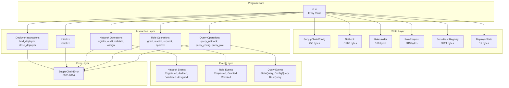
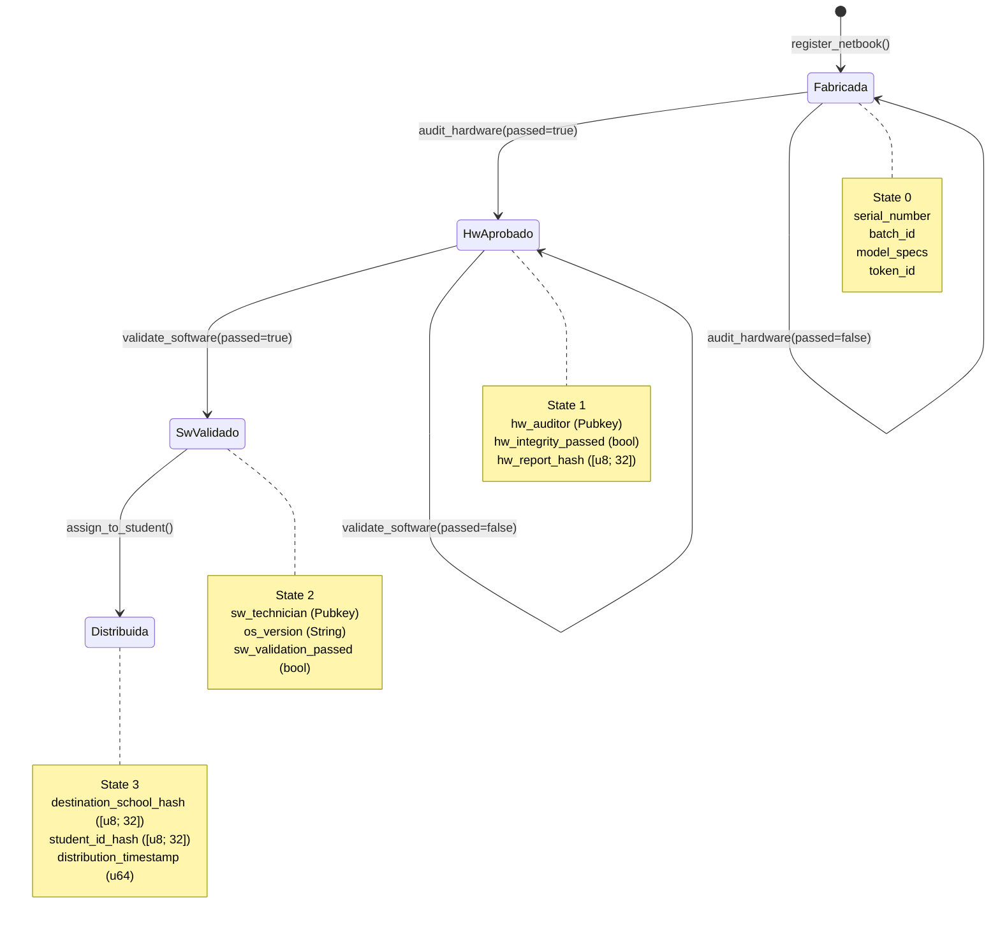
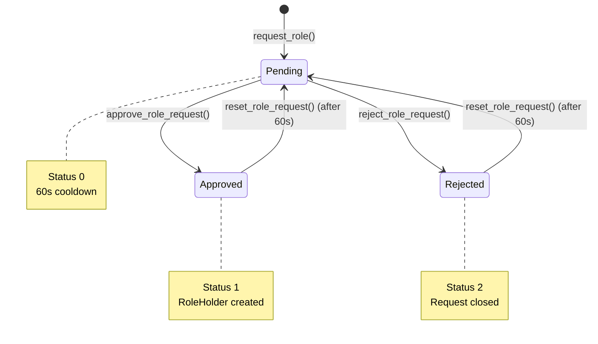
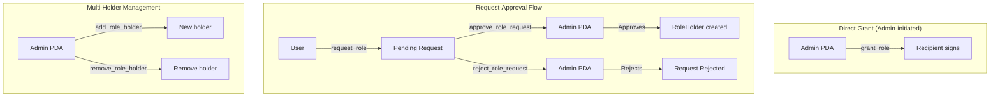

# 05 - Programa Solana

> Documentación detallada del programa Anchor SupplyChainTracker: state accounts, instruction handlers, eventos, errores y lógica de negocio.

---

## 📋 Tabla de Contenidos

1. [Visión General del Programa](#visión-general-del-programa)
2. [Program ID y Configuración](#program-id-y-configuración)
3. [State Accounts](#state-accounts)
4. [Instruction Handlers](#instruction-handlers)
5. [Eventos](#eventos)
6. [Error Codes](#error-codes)
7. [State Machine](#state-machine)
8. [RBAC (Role-Based Access Control)](#rbac-role-based-access-control)
9. [Constants y Límites](#constants-y-límites)
10. [Testing del Programa](#testing-del-programa)

---

## Visión General del Programa

SupplyChainTracker es un programa Anchor que implementa un sistema de trazabilidad para netbooks educativas. Rastrea el ciclo de vida completo desde la fabricación hasta la distribución a estudiantes.

### Características Principales

- **State Machine**: 4 estados para netbooks (Fabricada → HwAprobado → SwValidado → Distribuida)
- **RBAC**: 4 roles con soporte multi-holder (hasta 100 holders por rol)
- **PII Protection**: IDs almacenados como hashes SHA-256
- **Bounded Strings**: Límites de longitud para prevenir abuse
- **PDA-First**: Todas las cuentas son PDA-derivable
- **Duplicate Detection**: Registry de hashes de seriales



---

## Program ID y Configuración

### Program ID

```
BTSWNY97FaxeJrUNSq399tRbfMz68iaaY3csJwT9hQQW
```

### Anchor Configuration

[`Anchor.toml`](../../sc-solana/Anchor.toml)

```toml
[toolchain]
package_manager = "npm"

[features]
resolution = true
skip-lint = false

[programs.localnet]
sc_solana = "BTSWNY97FaxeJrUNSq399tRbfMz68iaaY3csJwT9hQQW"

[provider]
cluster = "localnet"
wallet = "~/.config/solana/id.json"
```

---

## State Accounts

### SupplyChainConfig

**Archivo**: [`state/config.rs`](../../sc-solana/programs/sc-solana/src/state/config.rs)

**Space**: 258 bytes

**PDA Seeds**: `[b"config"]`

```rust
pub struct SupplyChainConfig {
    pub admin: Pubkey,              // Admin PDA address
    pub deployer: Pubkey,           // Deployer wallet (can act as ADMIN)
    pub fabricante: Pubkey,         // Legacy FABRICANTE holder
    pub auditor_hw: Pubkey,         // Legacy AUDITOR_HW holder
    pub tecnico_sw: Pubkey,         // Legacy TECNICO_SW holder
    pub escuela: Pubkey,            // Legacy ESCUELA holder
    pub admin_bump: u8,             // Bump for config PDA
    pub admin_pda_bump: u8,         // Bump for admin PDA
    pub next_token_id: u64,         // Next netbook token ID
    pub total_netbooks: u64,        // Total registered netbooks
    pub role_requests_count: u64,   // Total role requests
    pub fabricante_count: u64,      // FABRICANTE holder count
    pub auditor_hw_count: u64,      // AUDITOR_HW holder count
    pub tecnico_sw_count: u64,      // TECNICO_SW holder count
    pub escuela_count: u64,         // ESCUELA holder count
}
```

**Métodos**:

| Método | Descripción |
|--------|-------------|
| `has_role(role, account)` | Check if account has role |
| `get_role_holder_count(role)` | Get holder count for role |

### Netbook

**Archivo**: [`state/netbook.rs`](../../sc-solana/programs/sc-solana/src/state/netbook.rs)

**Space**: ~1200 bytes (8 + 12 + 900 + 100 + 3 + 160 + 24)

**PDA Seeds**: `[b"netbook", token_id.to_le_bytes()]`

```rust
pub struct Netbook {
    pub serial_number: String,           // max 200 chars
    pub batch_id: String,                // max 100 chars
    pub initial_model_specs: String,     // max 500 chars
    pub hw_auditor: Pubkey,              // Hardware auditor
    pub hw_integrity_passed: bool,       // HW audit passed
    pub hw_report_hash: [u8; 32],        // HW report hash
    pub sw_technician: Pubkey,           // SW technician
    pub os_version: String,              // max 100 chars
    pub sw_validation_passed: bool,      // SW validation passed
    pub destination_school_hash: [u8; 32], // PII: school hash
    pub student_id_hash: [u8; 32],       // PII: student hash
    pub distribution_timestamp: u64,     // Distribution time
    pub state: u8,                        // NetbookState enum
    pub exists: bool,                     // Exists flag
    pub token_id: u64,                    // Token ID
}
```

**Campos de Bounded Strings**:

| Campo | Máximo | Offset |
|-------|--------|--------|
| `serial_number` | 200 chars | 12 bytes |
| `batch_id` | 100 chars | 12 bytes |
| `initial_model_specs` | 500 chars | 12 bytes |
| `os_version` | 100 chars | 12 bytes |

### RoleHolder

**Archivo**: [`state/role_holder.rs`](../../sc-solana/programs/sc-solana/src/state/role_holder.rs)

**Space**: 160 bytes

**PDA Seeds**: `[b"role_holder", account.key()]`

```rust
pub struct RoleHolder {
    pub id: u64,              // Holder ID
    pub account: Pubkey,      // Account address
    pub role: String,         // max 64 chars
    pub granted_by: Pubkey,   // Who granted the role
    pub timestamp: u64,       // Grant timestamp
}
```

### RoleRequest

**Archivo**: [`state/role_request.rs`](../../sc-solana/programs/sc-solana/src/state/role_request.rs)

**Space**: 313 bytes (8 + 8 + 32 + 4 + 256 + 1 + 8)

**PDA Seeds**: `[b"role_request", user.key()]`

```rust
pub struct RoleRequest {
    pub id: u64,              // Request ID
    pub user: Pubkey,         // Requesting user
    pub role: String,         // max 256 chars
    pub status: u8,           // RequestStatus enum
    pub timestamp: u64,       // Request timestamp
}
```

### SerialHashRegistry

**Archivo**: [`state/serial_hash_registry.rs`](../../sc-solana/programs/sc-solana/src/state/serial_hash_registry.rs)

**Space**: 3224 bytes

**PDA Seeds**: `[b"serial_hashes", config.key()]`

**Attribute**: `#[account(zero_copy)]` (memory-mapped, no stack copy)

```rust
#[repr(C)]
pub struct SerialHashRegistry {
    pub serial_hash_count: u64,
    pub config_bump: u8,
    pub _padding: [u8; 7],
    pub registered_serial_hashes: [u8; 3200], // 100 * 32
}
```

**Métodos**:

| Método | Descripción |
|--------|-------------|
| `is_serial_registered(hash)` | Check if serial hash exists |
| `store_serial_hash(hash)` | Store a new serial hash |
| `get_hash_at(index)` | Get hash at index |
| `set_hash_at(index, hash)` | Set hash at index |

### DeployerState

**Archivo**: [`instructions/deployer.rs`](../../sc-solana/programs/sc-solana/src/instructions/deployer.rs)

**Space**: 17 bytes

**PDA Seeds**: `[b"deployer"]`

```rust
pub struct DeployerState {
    pub bump: u8,
    pub total_funded: u64,
}
```

---

## Instruction Handlers

### Deployment Instructions

#### fund_deployer

**Context**: `FundDeployer`

**Cuentas Requeridas**:

| Cuenta | Tipo | Descripción |
|--------|------|-------------|
| `deployer` | init | Deployer PDA |
| `funder` | mut, signer | Wallet que financia |
| `system_program` | - | System Program |

**Argumentos**: `amount: u64`

**Lógica**:
1. Verificar amount >= MIN_DEPLOYER_BALANCE (10 SOL)
2. Actualizar deployer.bump y deployer.total_funded
3. Transferir lamports via CPI al System Program

---

#### close_deployer

**Context**: `CloseDeployer`

**Cuentas Requeridas**:

| Cuenta | Tipo | Descripción |
|--------|------|-------------|
| `config` | mut | Config PDA |
| `admin` | mut, signer | Admin signer |
| `deployer` | mut, close | Deployer PDA (close = admin) |
| `system_program` | - | System Program |

**Lógica**: Devuelve SOL al admin via constraint `close = admin`

---

#### initialize

**Context**: `Initialize`

**Cuentas Requeridas**:

| Cuenta | Tipo | Descripción |
|--------|------|-------------|
| `config` | init | Config PDA |
| `serial_hash_registry` | init | SerialHashRegistry PDA |
| `admin` | - | Admin PDA (derived) |
| `deployer` | mut | Deployer PDA |
| `funder` | mut, signer | Funder wallet |
| `system_program` | - | System Program |

**Argumentos**: Ninguno

**Lógica**:
1. Derivar admin PDA: `[b"admin", config.key()]`
2. Configurar admin, deployer, admin_pda_bump
3. Inicializar fabricante = funder (default role)
4. Resetear auditor_hw, tecnico_sw, escuela a Pubkey::default()
5. Inicializar contadores: next_token_id=1, total_netbooks=0
6. Inicializar SerialHashRegistry

---

### Netbook Lifecycle Instructions

#### register_netbook

**Context**: `RegisterNetbook`

**Cuentas Requeridas**:

| Cuenta | Tipo | Descripción |
|--------|------|-------------|
| `config` | mut | Config PDA |
| `serial_hash_registry` | mut | SerialHashRegistry |
| `manufacturer` | mut, signer | Fabricante (debe coincidir config.fabricante) |
| `netbook` | init | Netbook PDA |
| `system_program` | - | System Program |

**Argumentos**: `serial_number: String, batch_id: String, initial_model_specs: String`

**Lógica**:
1. Validar inputs (empty, length limits)
2. Compute SHA-256 hash del serial
3. Verificar no duplicado en SerialHashRegistry
4. Almacenar hash en registry
5. Incrementar next_token_id y total_netbooks
6. Inicializar Netbook account
7. Emit `NetbookRegistered` event

**Estado Resultante**: `Fabricada (0)`

---

#### register_netbooks_batch

**Context**: `RegisterNetbooksBatch`

**Límite**: MAX_BATCH_SIZE = 10 netbooks

**Lógica**: Similar a register_netbook pero en batch

**Estado Resultante**: `Fabricada (0)` para cada netbook

---

#### audit_hardware

**Context**: `AuditHardware`

**Cuentas Requeridas**:

| Cuenta | Tipo | Descripción |
|--------|------|-------------|
| `netbook` | mut | Netbook PDA |
| `config` | mut | Config PDA |
| `auditor` | signer | Auditor HW |
| `system_program` | - | System Program |

**Argumentos**: `serial: String, passed: bool, report_hash: [u8; 32]`

**Lógica**:
1. Verificar serial match
2. Validar estado actual = Fabricada (0)
3. Actualizar hw_auditor, hw_integrity_passed, hw_report_hash
4. Si passed = true: state = HwAprobado (1)
5. Emit `HardwareAudited` event

**Transición**: `Fabricada (0)` → `HwAprobado (1)`

---

#### validate_software

**Context**: `ValidateSoftware`

**Cuentas Requeridas**:

| Cuenta | Tipo | Descripción |
|--------|------|-------------|
| `netbook` | mut | Netbook PDA |
| `config` | mut | Config PDA |
| `technician` | signer | Técnico SW |
| `system_program` | - | System Program |

**Argumentos**: `serial: String, os_version: String, passed: bool`

**Lógica**:
1. Validar os_version length <= 100
2. Verificar serial match
3. Validar estado actual = HwAprobado (1)
4. Actualizar os_version, sw_technician, sw_validation_passed
5. Si passed = true: state = SwValidado (2)
6. Emit `SoftwareValidated` event

**Transición**: `HwAprobado (1)` → `SwValidado (2)`

---

#### assign_to_student

**Context**: `AssignToStudent`

**Cuentas Requeridas**:

| Cuenta | Tipo | Descripción |
|--------|------|-------------|
| `netbook` | mut | Netbook PDA |
| `config` | mut | Config PDA |
| `school` | signer | Escuela |
| `system_program` | - | System Program |

**Argumentos**: `serial: String, school_hash: [u8; 32], student_hash: [u8; 32]`

**Lógica**:
1. Verificar serial match
2. Validar estado actual = SwValidado (2)
3. Actualizar destination_school_hash, student_id_hash
4. Set distribution_timestamp = Clock::unix_timestamp
5. state = Distribuida (3)
6. Emit `NetbookAssigned` event

**Transición**: `SwValidado (2)` → `Distribuida (3)`

---

### Role Management Instructions

#### grant_role

**Context**: `GrantRole`

**Cuentas Requeridas**:

| Cuenta | Tipo | Descripción |
|--------|------|-------------|
| `config` | mut | Config PDA |
| `admin` | - | Admin PDA (seeds + bump verification) |
| `account_to_grant` | signer | Recipiente (consent) |
| `system_program` | - | System Program |

**Argumentos**: `role: String`

**Lógica**:
1. Validar role name (FABRICANTE, AUDITOR_HW, TECNICO_SW, ESCUELA)
2. Verificar no duplicado
3. Actualizar config.role = account
4. Emit `RoleGranted` event

---

#### revoke_role

**Context**: `RevokeRole`

**Cuentas Requeridas**:

| Cuenta | Tipo | Descripción |
|--------|------|-------------|
| `config` | mut | Config PDA |
| `admin` | - | Admin PDA |
| `account_to_revoke` | signer | Cuenta a revocar |
| `system_program` | - | System Program |

**Argumentos**: `role: String`

**Lógica**:
1. Verificar account tiene el role
2. Si no tiene: RoleHolderNotFound
3. Clear config.role = Pubkey::default()
4. Emit `RoleRevoked` event

---

#### request_role

**Context**: `RequestRole`

**Cuentas Requeridas**:

| Cuenta | Tipo | Descripción |
|--------|------|-------------|
| `config` | mut | Config PDA |
| `role_request` | init | RoleRequest PDA |
| `user` | mut, signer | Usuario solicitante |
| `system_program` | - | System Program |

**Argumentos**: `role: String`

**Lógica**:
1. Validar role name
2. Verificar no tiene role ya
3. Incrementar role_requests_count
4. Crear RoleRequest con status = Pending
5. Emit `RoleRequested` event

---

#### approve_role_request

**Context**: `ApproveRoleRequest`

**Cuentas Requeridas**:

| Cuenta | Tipo | Descripción |
|--------|------|-------------|
| `config` | mut | Config PDA |
| `admin` | - | Admin PDA |
| `payer` | mut, signer | Payer |
| `role_request` | mut | RoleRequest PDA |
| `role_holder` | init | RoleHolder PDA |
| `system_program` | - | System Program |

**Lógica**:
1. Verificar status = Pending
2. Validar role name
3. Set status = Approved
4. Actualizar config.role = user
5. Crear RoleHolder account
6. Emit `RoleRequestUpdated` + `RoleGranted` events

---

#### reject_role_request

**Context**: `RejectRoleRequest`

**Cuentas Requeridas**:

| Cuenta | Tipo | Descripción |
|--------|------|-------------|
| `config` | mut | Config PDA |
| `admin` | - | Admin PDA |
| `role_request` | mut | RoleRequest PDA |

**Lógica**:
1. Verificar status = Pending
2. Set status = Rejected
3. Emit `RoleRequestUpdated` event

---

#### reset_role_request

**Context**: `ResetRoleRequest`

**Lógica**:
1. Verificar status != Pending
2. Enforce cooldown: time_since_last >= 60 seconds
3. Set status = Pending, timestamp = now

---

#### add_role_holder

**Context**: `AddRoleHolder`

**Lógica**:
1. Validar role name
2. Verificar no tiene role legacy
3. Verificar current_count < MAX_ROLE_HOLDERS (100)
4. Crear RoleHolder account
5. Incrementar role holder count
6. Emit `RoleHolderAdded` event

---

#### remove_role_holder

**Context**: `RemoveRoleHolder`

**Lógica**:
1. Validar role_holder.role == role
2. Decrementar role holder count (saturating_sub)
3. Cerrar RoleHolder PDA (close = admin)
4. Emit `RoleHolderRemoved` event

---

#### close_role_holder

**Context**: `CloseRoleHolder`

**Lógica**: Similar a remove_role_holder

---

#### transfer_admin

**Context**: `TransferAdmin`

**Lógica**: Transfiere autoridad admin a nueva wallet

---

### Query Instructions

#### query_netbook_state

**Cuentas**: `netbook` (read-only)

**Argumentos**: `_serial: String`

**Emite**: `NetbookStateQuery` event

---

#### query_config

**Cuentas**: `config` (read-only)

**Argumentos**: Ninguno

**Emite**: `ConfigQuery` event

---

#### query_role

**Cuentas**: `config` (read-only)

**Argumentos**: `role: String`

**Emite**: `RoleQuery` event

---

## Eventos

### Netbook Events

| Evento | Campos | Emitido por |
|--------|--------|-------------|
| `NetbookRegistered` | serial_number, batch_id, token_id | register_netbook |
| `HardwareAudited` | serial_number, passed | audit_hardware |
| `SoftwareValidated` | serial_number, os_version, passed | validate_software |
| `NetbookAssigned` | serial_number | assign_to_student |
| `NetbooksRegistered` | count, start_token_id, timestamp | register_netbooks_batch |

### Role Events

| Evento | Campos | Emitido por |
|--------|--------|-------------|
| `RoleRequested` | id, user, role | request_role |
| `RoleRequestUpdated` | id, status | approve/reject/reset |
| `RoleGranted` | role, account, admin, timestamp | grant_role, approve |
| `RoleRevoked` | role, account | revoke_role, close |
| `RoleHolderAdded` | role, account, admin, timestamp | add_role_holder |
| `RoleHolderRemoved` | role, account, admin, timestamp | remove_role_holder |
| `AdminTransferred` | previous_admin, new_admin, timestamp | transfer_admin |

### Query Events

| Evento | Campos | Emitido por |
|--------|--------|-------------|
| `NetbookStateQuery` | serial_number, state, token_id, exists | query_netbook_state |
| `ConfigQuery` | admin, fabricante, auditor_hw, tecnico_sw, escuela, next_token_id, total_netbooks, role_requests_count, counts | query_config |
| `RoleQuery` | account, role, has_role | query_role |

---

## Error Codes

| Code | Error | Mensaje |
|------|-------|---------|
| 6000 | `Unauthorized` | Caller is not authorized |
| 6001 | `InvalidStateTransition` | Invalid state transition |
| 6002 | `NetbookNotFound` | Netbook not found |
| 6003 | `InvalidInput` | Invalid input |
| 6004 | `DuplicateSerial` | Serial number already registered |
| 6005 | `ArrayLengthMismatch` | Array lengths do not match |
| 6006 | `RoleAlreadyGranted` | Role already granted to this account |
| 6007 | `RoleNotFound` | Role not found |
| 6008 | `InvalidSignature` | Invalid signature |
| 6009 | `EmptySerial` | Serial number is empty |
| 6010 | `StringTooLong` | String exceeds maximum length |
| 6011 | `MaxRoleHoldersReached` | Maximum role holders reached for this role |
| 6012 | `RoleHolderNotFound` | Account not found in role holders list |
| 6013 | `InvalidRequestState` | Role request is not in pending state |
| 6014 | `RateLimited` | Role request rate limited |

---

## State Machine

### Netbook Lifecycle



### Role Request Flow



---

## RBAC (Role-Based Access Control)

### Roles Disponibles

| Role | Constante | Descripción | Puede |
|------|-----------|-------------|-------|
| FABRICANTE | `FABRICANTE_ROLE` | Fabricante de netbooks | register_netbook |
| AUDITOR_HW | `AUDITOR_HW_ROLE` | Auditor de hardware | audit_hardware |
| TECNICO_SW | `TECNICO_SW_ROLE` | Técnico de software | validate_software |
| ESCUELA | `ESCUELA_ROLE` | Escuela/Institución | assign_to_student |

### Flujos de Role Assignment



### PDA Hierarchy

```mermaid
graph TB
    Program[Program ID<br/>BTSWNY...] --> Deployer[Deployer PDA<br/>seeds: [b"deployer"]]
    Program --> Config[Config PDA<br/>seeds: [b"config"]]
    Config --> Admin[Admin PDA<br/>seeds: [b"admin", config.key()]]
    Config --> SerialReg[SerialHashRegistry<br/>seeds: [b"serial_hashes", config.key()]]
    Config -.->|token_id| Netbook[Netbook PDA<br/>seeds: [b"netbook", token_id]]
    Admin -.->|account| RoleHolder[RoleHolder PDA<br/>seeds: [b"role_holder", account]]
    User -.->|user| RoleRequest[RoleRequest PDA<br/>seeds: [b"role_request", user]]
```

---

## Constants y Límites

| Constante | Valor | Descripción |
|-----------|-------|-------------|
| `ROLE_REQUEST_COOLDOWN` | 60 seconds | Cooldown entre requests |
| `MAX_SERIAL_HASHES` | 100 | Máximo de seriales en registry |
| `MAX_ROLE_HOLDERS` | 100 | Máximo holders por rol |
| `MAX_BATCH_SIZE` | 10 | Máximo netbooks por batch |
| `MIN_DEPLOYER_BALANCE` | 10,000,000,000 lamports (~0.01 SOL) | Mínimo para deployer |

### Bounded Strings

| Campo | Máximo | Tipo |
|-------|--------|------|
| `serial_number` | 200 chars | String |
| `batch_id` | 100 chars | String |
| `initial_model_specs` | 500 chars | String |
| `os_version` | 100 chars | String |
| `role` (RoleHolder) | 64 chars | String |
| `role` (RoleRequest) | 256 chars | String |

---

## Testing del Programa

### Mollusk/LiteSVM Tests

| Test | Archivo | Descripción |
|------|---------|-------------|
| Unit Tests | [`tests/mollusk-tests.rs`](../../sc-solana/programs/sc-solana/tests/mollusk-tests.rs) | PDAs, discriminators, space calcs |
| Lifecycle Tests | [`tests/mollusk-lifecycle.rs`](../../sc-solana/programs/sc-solana/tests/mollusk-lifecycle.rs) | Full lifecycle state machine |
| Compute Units | [`tests/compute-units.rs`](../../sc-solana/programs/sc-solana/tests/compute-units.rs) | CU measurement per instruction |

### Comandos de Testing

```bash
# Unit tests (Mollusk)
cargo test --test mollusk-tests
cargo test --test mollusk-lifecycle
cargo test --test compute-units

# Integration tests (Anchor)
anchor test

# All tests
cargo test
```

### Tests Unitarios en lib.rs

[`lib.rs`](../../sc-solana/programs/sc-solana/src/lib.rs) incluye tests para:

| Test | Verifica |
|------|----------|
| `test_netbook_space` | Space calculation del Netbook account |
| `test_netbook_states` | Valores de NetbookState enum |
| `test_request_status` | Valores de RequestStatus enum |
| `test_error_codes` | Valores de error codes |
| `test_config_space` | Space calculation del Config account |
| `test_role_holder_space` | Space calculation del RoleHolder account |
| `test_role_holder_counts` | Métodos de role holder counts |
| `test_max_role_holders` | Valor de MAX_ROLE_HOLDERS |

---

## Resumen de Instruction Count

| Category | Instructions |
|----------|-------------|
| Deployment | fund_deployer, close_deployer, initialize |
| Netbook Lifecycle | register_netbook, register_netbooks_batch, audit_hardware, validate_software, assign_to_student |
| Role Management | grant_role, revoke_role, request_role, approve_role_request, reject_role_request, reset_role_request, add_role_holder, remove_role_holder, close_role_holder, transfer_admin |
| Query | query_netbook_state, query_config, query_role |
| **Total** | **18 instructions** |

---

## Referencias

- [Anchor Book](https://book.anchor-lang.com/)
- [Solana Docs](https://docs.solana.com/)
- [Program Source](../../sc-solana/programs/sc-solana/src/lib.rs)
