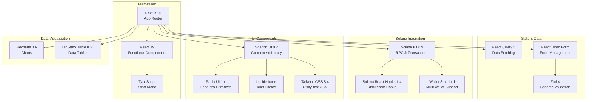
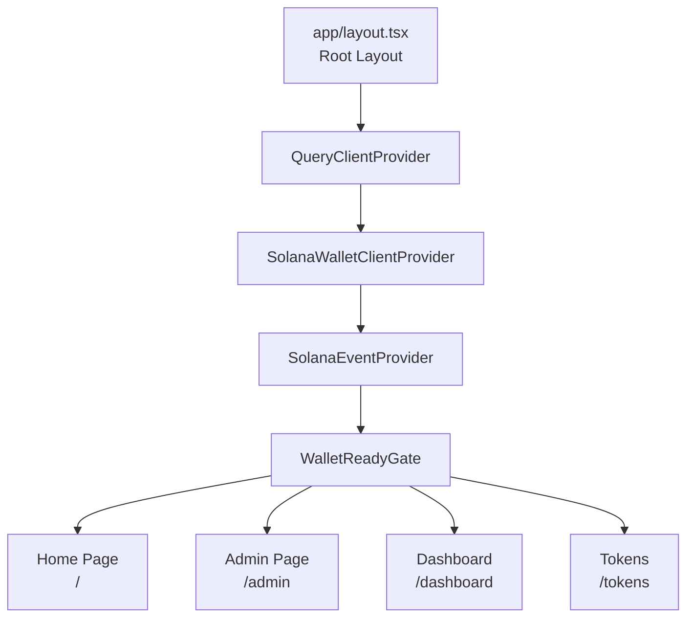

# 06 - Frontend Next.js

> Documentación completa del frontend Next.js: estructura, componentes, hooks, servicios y patrones de integración con Solana.

---

## 📋 Tabla de Contenidos

1. [Visión General del Frontend](#visión-general-del-frontend)
2. [Estructura de Directorios](#estructura-de-directorios)
3. [Páginas y Rutas](#páginas-y-rutas)
4. [Componentes](#componentes)
5. [Hooks](#hooks)
6. [Servicios](#servicios)
7. [Integración con Solana](#integración-con-solana)
8. [Patrones de UI](#patrones-de-ui)
9. [Testing del Frontend](#testing-del-frontend)

---

## Visión General del Frontend

El frontend de SupplyChainTracker es una aplicación Next.js construida con React, TypeScript y Tailwind CSS. Proporciona una interfaz web completa para interactuar con el programa Anchor de SupplyChainTracker en la blockchain de Solana.

### Características Principales

- **Wallet Integration**: Conexión con wallets Solana (Phantom, Solflare, etc.)
- **Real-time Updates**: Actualizaciones en tiempo real via Solana events
- **Role-based UI**: Interfaz adaptativa según roles del usuario
- **Form Validation**: Validación de formularios con Zod
- **Data Tables**: Tablas interactivas con TanStack Table
- **Charts & Analytics**: Gráficos con Recharts
- **PDF Generation**: Generación de reportes con jsPDF

### Stack Tecnológico



---

## Estructura de Directorios

```
web/
├── app/                          # Next.js App Router
│   ├── layout.tsx                # Root layout
│   ├── page.tsx                  # Home page
│   ├── globals.css               # Global styles
│   ├── admin/                    # Admin panel
│   │   ├── layout.tsx            # Admin layout
│   │   ├── page.tsx              # Admin dashboard
│   │   ├── analytics/            # Analytics section
│   │   ├── audit/                # Audit view
│   │   ├── roles/                # Role management
│   │   ├── settings/             # Settings
│   │   └── components/           # Admin components
│   ├── dashboard/                # User dashboard
│   │   ├── page.tsx              # Dashboard page
│   │   └── components/           # Dashboard components
│   ├── tokens/                   # Netbook management
│   │   ├── page.tsx              # Netbook list
│   │   ├── [id]/page.tsx         # Netbook detail
│   │   └── create/page.tsx       # Create netbook
│   ├── transfers/                # Transfers page
│   └── api/                      # API routes
│       └── revalidate/route.ts   # ISR revalidation
├── components/                   # React components
│   ├── SolanaWalletClientProvider.tsx  # Wallet provider
│   ├── WalletConnectButton.tsx   # Wallet button
│   ├── WalletReadyGate.tsx       # Wallet gate
│   ├── contracts/                # Contract forms
│   │   ├── NetbookForm.tsx       # Registration form
│   │   ├── HardwareAuditForm.tsx # Hardware audit
│   │   ├── SoftwareValidationForm.tsx # SW validation
│   │   ├── StudentAssignmentForm.tsx # Student assignment
│   │   └── TransactionConfirmation.tsx # Tx confirmation
│   ├── dashboard/                # Dashboard components
│   ├── admin/                    # Admin components
│   ├── real-time/                # Real-time components
│   ├── role-management/          # Role components
│   ├── ui/                       # Shadcn UI components
│   └── ...
├── hooks/                        # Custom React hooks
│   ├── useSupplyChainService.ts  # Main service hook
│   ├── useRoleData.ts            # Role data hook
│   ├── useRoleRequests.ts        # Role requests hook
│   ├── useFetchNetbooks.ts       # Netbooks fetch hook
│   ├── useFetchUsers.ts          # Users fetch hook
│   └── ...
├── lib/                          # Utilities and services
│   ├── solana/                   # Solana integration
│   │   ├── connection.ts         # RPC connection
│   │   ├── wallet-provider.tsx   # Wallet provider
│   │   ├── event-provider.tsx    # Event provider
│   │   └── ...
│   ├── contracts/                # Contract abstractions
│   │   ├── SupplyChainContract.ts
│   │   └── solana-program.ts
│   ├── services/                 # Business logic
│   │   └── event-service.ts
│   ├── constants/                # Constants
│   │   └── roles.ts
│   ├── types.ts                  # TypeScript types
│   ├── events.ts                 # Event types
│   ├── state-machine.ts          # State machine logic
│   └── ...
├── generated/                    # Generated client code
│   └── src/generated/            # @solana/kit generated
├── e2e/                          # Playwright E2E tests
│   ├── *.spec.ts                 # Test files
│   └── fixtures/                 # Test fixtures
├── contracts/                    # Program IDL
│   └── sc_solana.json            # Anchor IDL
├── package.json                  # Dependencies
├── playwright.config.ts          # Playwright config
├── jest.config.js                # Jest config
└── next.config.mjs               # Next.js config
```

---

## Páginas y Rutas

### Rutas Principales

| Ruta | Archivo | Descripción | Tipo |
|------|---------|-------------|------|
| `/` | [`app/page.tsx`](../../web/app/page.tsx) | Home / Dashboard principal | Client |
| `/admin` | [`app/admin/page.tsx`](../../web/app/admin/page.tsx) | Panel de administración | Client |
| `/admin/analytics` | `app/admin/analytics/page.tsx` | Analytics y métricas | Client |
| `/admin/audit` | `app/admin/audit/page.tsx` | Vista de auditoría | Client |
| `/admin/roles/pending-requests` | `app/admin/roles/pending-requests/page.tsx` | Requests pendientes | Client |
| `/admin/settings` | `app/admin/settings/page.tsx` | Configuración | Client |
| `/dashboard` | [`app/dashboard/page.tsx`](../../web/app/dashboard/page.tsx) | Dashboard de usuario | Client |
| `/tokens` | `app/tokens/page.tsx` | Lista de netbooks | Client |
| `/tokens/[id]` | `app/tokens/[id]/page.tsx` | Detalle de netbook | Client |
| `/tokens/create` | `app/tokens/create/page.tsx` | Crear nueva netbook | Client |
| `/transfers` | `app/transfers/page.tsx` | Transfers | Client |

### Layout Hierarchy



### Root Layout

[`app/layout.tsx`](../../web/app/layout.tsx)

```typescript
import { SolanaWalletClientProvider } from '@/components/SolanaWalletClientProvider';
import { QueryClientProvider } from '@/lib/providers/query-provider';

export default function RootLayout({ children }) {
  return (
    <html lang="es">
      <body>
        <QueryClientProvider>
          <SolanaWalletClientProvider>
            {children}
          </SolanaWalletClientProvider>
        </QueryClientProvider>
      </body>
    </html>
  );
}
```

---

## Componentes

### Componentes de Wallet

#### SolanaWalletClientProvider

[`SolanaWalletClientProvider.tsx`](../../web/src/components/SolanaWalletClientProvider.tsx)

Provider principal que envuelve toda la aplicación:

```typescript
export function SolanaWalletClientProvider({ children }) {
  return (
    <SolanaWalletProvider>
      <SolanaEventProvider>
        <WalletReadyGate>
          {children}
        </WalletReadyGate>
      </SolanaEventProvider>
    </SolanaWalletProvider>
  );
}
```

#### WalletConnectButton

[`WalletConnectButton.tsx`](../../web/src/components/WalletConnectButton.tsx)

Botón de conexión de wallet con soporte multi-wallet.

#### WalletReadyGate

[`WalletReadyGate.tsx`](../../web/src/components/WalletReadyGate.tsx)

Gate que protege componentes hasta que la wallet esté lista.

### Componentes de Contratos (Forms)

#### NetbookForm

[`NetbookForm.tsx`](../../web/src/components/contracts/NetbookForm.tsx)

Formulario para registrar netbooks:

| Campo | Tipo | Validación |
|-------|------|------------|
| serial_number | text | Required, max 200 chars |
| batch_id | text | Required, max 100 chars |
| model_specs | textarea | Required, max 500 chars |

#### HardwareAuditForm

[`HardwareAuditForm.tsx`](../../web/src/components/contracts/HardwareAuditForm.tsx)

Formulario para auditoría de hardware:

| Campo | Tipo | Validación |
|-------|------|------------|
| serial_number | select | Required |
| passed | boolean | Required |
| report_hash | text | Optional, 32 bytes |

#### SoftwareValidationForm

[`SoftwareValidationForm.tsx`](../../web/src/components/contracts/SoftwareValidationForm.tsx)

Formulario para validación de software:

| Campo | Tipo | Validación |
|-------|------|------------|
| serial_number | select | Required |
| os_version | text | Required, max 100 chars |
| passed | boolean | Required |

#### StudentAssignmentForm

[`StudentAssignmentForm.tsx`](../../web/src/components/contracts/StudentAssignmentForm.tsx)

Formulario para asignación a estudiantes:

| Campo | Tipo | Validación |
|-------|------|------------|
| serial_number | select | Required |
| school_hash | text | Required, 32 bytes |
| student_hash | text | Required, 32 bytes |

#### TransactionConfirmation

[`TransactionConfirmation.tsx`](../../web/src/components/contracts/TransactionConfirmation.tsx)

Diálogo de confirmación de transacción.

### Componentes de Dashboard

| Componente | Archivo | Descripción |
|------------|---------|-------------|
| NetbookDataTable | `dashboard/components/NetbookDataTable.tsx` | Tabla de netbooks |
| NetbookStats | `dashboard/components/NetbookStats.tsx` | Estadísticas |
| TrackingCard | `dashboard/components/TrackingCard.tsx` | Card de tracking |
| RoleActions | `dashboard/components/RoleActions.tsx` | Acciones de rol |
| StatusBadge | `dashboard/components/StatusBadge.tsx` | Badge de estado |
| UserDataTable | `dashboard/components/UserDataTable.tsx` | Tabla de usuarios |
| UserStats | `dashboard/components/UserStats.tsx` | Estadísticas de usuario |
| ProgressStepper | `dashboard/components/ProgressStepper.tsx` | Progress stepper |
| NetbookDetailsModal | `dashboard/components/NetbookDetailsModal.tsx` | Modal de detalles |

### Componentes de Admin

| Componente | Archivo | Descripción |
|------------|---------|-------------|
| AdminLayout | `admin/components/ui/AdminLayout.tsx` | Layout de admin |
| DashboardMetrics | `admin/components/DashboardMetrics.tsx` | Métricas del dashboard |
| PendingRoleRequests | `admin/components/PendingRoleRequests.tsx` | Requests pendientes |
| RoleManagementSection | `admin/components/RoleManagementSection.tsx` | Sección de roles |
| RoleRequestsDashboard | `admin/components/RoleRequestsDashboard.tsx` | Dashboard de requests |
| EnhancedRoleApprovalDialog | `admin/components/EnhancedRoleApprovalDialog.tsx` | Dialog de aprobación |
| NetbookStateMetrics | `admin/components/NetbookStateMetrics.tsx` | Métricas de estado |
| ApprovedAccountsList | `admin/components/ApprovedAccountsList.tsx` | Lista de cuentas aprobadas |

### Componentes de Real-time

| Componente | Archivo | Descripción |
|------------|---------|-------------|
| ConnectionIndicator | `real-time/ConnectionIndicator.tsx` | Indicador de conexión |
| SolanaActivityFeed | `real-time/SolanaActivityFeed.tsx` | Feed de actividad |

### Componentes UI (Shadcn)

| Componente | Archivo | Descripción |
|------------|---------|-------------|
| Button | `ui/button.tsx` | Botón |
| Card | `ui/card.tsx` | Card |
| Dialog | `ui/dialog.tsx` | Diálogo |
| Table | `ui/table.tsx` | Tabla |
| Tabs | `ui/tabs.tsx` | Tabs |
| Input | `ui/input.tsx` | Input |
| Select | `ui/select.tsx` | Select |
| Badge | `ui/badge.tsx` | Badge |
| Toast | `ui/toast.tsx` | Toast notification |
| Skeleton | `ui/skeleton.tsx` | Loading skeleton |
| Textarea | `ui/textarea.tsx` | Textarea |
| Checkbox | `ui/checkbox.tsx` | Checkbox |
| Popover | `ui/popover.tsx` | Popover |
| Label | `ui/label.tsx` | Label |
| Switch | `ui/switch.tsx` | Switch |
| Form | `ui/form.tsx` | Form wrapper |
| Calendar | `ui/calendar.tsx` | Calendar picker |

---

## Hooks

### useSupplyChainService

[`useSupplyChainService.ts`](../../web/src/hooks/useSupplyChainService.ts)

Hook principal para interactuar con el programa:

```typescript
function useSupplyChainService() {
  // Register netbook
  async function registerNetbook(...)
  
  // Audit hardware
  async function auditHardware(...)
  
  // Validate software
  async function validateSoftware(...)
  
  // Assign to student
  async function assignToStudent(...)
  
  // Query functions
  async function getNetbookState(...)
  async function getConfig()
  async function getRole(...)
}
```

### useRoleData

[`useRoleData.ts`](../../web/src/hooks/useRoleData.ts)

Hook para datos de roles:

```typescript
function useRoleData() {
  // Fetch role holders
  // Check if user has role
  // Role-based actions
}
```

### useRoleRequests

[`useRoleRequests.ts`](../../web/src/hooks/useRoleRequests.ts)

Hook para gestión de requests de roles:

```typescript
function useRoleRequests() {
  // requestRole()
  // approveRoleRequest()
  // rejectRoleRequest()
  // resetRoleRequest()
}
```

### useFetchNetbooks

[`useFetchNetbooks.ts`](../../web/src/hooks/useFetchNetbooks.ts)

Hook para fetch de netbooks:

```typescript
function useFetchNetbooks() {
  // Fetch all netbooks
  // Filter by state
  // Search by serial
}
```

### useFetchUsers

[`useFetchUsers.ts`](../../web/src/hooks/useFetchUsers.ts)

Hook para fetch de usuarios/role holders.

### useSolanaWeb3

[`useSolanaWeb3.ts`](../../web/src/hooks/useSolanaWeb3.ts)

Hook para integración directa con Solana RPC.

### useTransaction

[`useTransaction.ts`](../../web/src/hooks/useTransaction.ts)

Hook para manejo de transacciones:

```typescript
function useTransaction() {
  // sendTransaction()
  // getTransactionStatus()
  // waitForConfirmation()
}
```

### useWeb3

[`useWeb3.ts`](../../web/src/hooks/useWeb3.ts)

Hook para estado general de Web3.

### useCachedData

[`use-cached-data.ts`](../../web/src/hooks/use-cached-data.ts)

Hook para datos cacheados.

### useNotifications

[`use-notifications.ts`](../../web/src/hooks/use-notifications.ts)

Hook para sistema de notificaciones.

### useAnalyticsData

[`useAnalyticsData.ts`](../../web/src/hooks/useAnalyticsData.ts)

Hook para datos de analytics.

### useInitializeState

[`useInitializeState.ts`](../../web/src/hooks/useInitializeState.ts)

Hook para inicialización de estado.

### useRoleCallsManager

[`useRoleCallsManager.ts`](../../web/src/hooks/useRoleCallsManager.ts)

Hook para gestionar llamadas de roles.

### useUserRoles

[`useUserRoles.ts`](../../web/src/hooks/useUserRoles.ts)

Hook para roles del usuario actual.

### useSafeWallet

[`useSafeWallet.ts`](../../web/src/hooks/useSafeWallet.ts)

Hook para Safe wallet integration.

---

## Servicios

### SolanaSupplyChainService

Servicio principal para interacción con el programa:

```typescript
class SolanaSupplyChainService {
  // Deployment
  async fundDeployer(amount: u64)
  async initialize()
  
  // Netbook operations
  async registerNetbook(serial, batch, specs)
  async registerNetbooksBatch(serials, batches, specs)
  async auditHardware(serial, passed, reportHash)
  async validateSoftware(serial, osVersion, passed)
  async assignToStudent(serial, schoolHash, studentHash)
  
  // Role operations
  async grantRole(role)
  async revokeRole(role)
  async requestRole(role)
  async approveRoleRequest(id)
  async rejectRoleRequest(id)
  async addRoleHolder(role, account)
  async removeRoleHolder(role, account)
  async transferAdmin(newAdmin)
  
  // Queries
  async getNetbookState(serial)
  async getConfig()
  async getRole(role)
}
```

### SupplyChainContract

Abstracción del contrato:

```typescript
class SupplyChainContract {
  // Higher-level contract operations
  // Combines multiple instructions
}
```

### ServerRpcService

Servicio para llamadas RPC del lado del servidor:

```typescript
class ServerRpcService {
  // Server-side RPC calls
  // Used for API routes
}
```

### EventService

Servicio para manejo de eventos:

```typescript
class EventService {
  // Listen to on-chain events
  // Emit events to UI
  // Event caching
}
```

---

## Integración con Solana

### Connection Setup

[`lib/solana/connection.ts`](../../web/src/lib/solana/connection.ts)

```typescript
import { Connection, Cluster } from '@solana/web3.js';

const cluster = process.env.NEXT_PUBLIC_SOLANA_CLUSTER || 'localnet';
const rpcUrl = process.env.NEXT_PUBLIC_SOLANA_RPC_URL;

export const connection = new Connection(
  rpcUrl || ClusterUrl[cluster],
  'confirmed'
);
```

### Wallet Provider

[`lib/solana/wallet-provider.tsx`](../../web/src/lib/solana/wallet-provider.tsx)

```typescript
export function SolanaWalletProvider({ children }) {
  // Wallet adapter setup
  // Multi-wallet support
  // Connection management
}
```

### Event Provider

[`lib/solana/event-provider.tsx`](../../web/src/lib/solana/event-provider.tsx)

```typescript
export function SolanaEventProvider({ children }) {
  // Event listener setup
  // Real-time updates
  // Event caching
}
```

### State Machine

[`lib/state-machine.ts`](../../web/src/lib/state-machine.ts)

```typescript
export const NetbookStateMachine = {
  states: ['Fabricada', 'HwAprobado', 'SwValidado', 'Distribuida'],
  transitions: {
    Fabricada: ['HwAprobado'],
    HwAprobado: ['SwValidado'],
    SwValidado: ['Distribuida'],
  },
  canTransition(from, to) { ... },
  getStateName(stateCode) { ... },
};
```

### Role Constants

[`lib/constants/roles.ts`](../../web/src/lib/constants/roles.ts)

```typescript
export const ROLES = {
  FABRICANTE: 'FABRICANTE',
  AUDITOR_HW: 'AUDITOR_HW',
  TECNICO_SW: 'TECNICO_SW',
  ESCUELA: 'ESCUELA',
} as const;

export const ROLE_PERMISSIONS = {
  FABRICANTE: ['register_netbook'],
  AUDITOR_HW: ['audit_hardware'],
  TECNICO_SW: ['validate_software'],
  ESCUELA: ['assign_to_student'],
};
```

### Event Types

[`lib/events.ts`](../../web/src/lib/events.ts)

```typescript
export type NetbookRegisteredEvent = {
  serial_number: string;
  batch_id: string;
  token_id: bigint;
};

export type HardwareAuditedEvent = {
  serial_number: string;
  passed: boolean;
};

// ... more event types
```

---

## Patrones de UI

### Form Pattern

```typescript
// NetbookForm.tsx
import { useForm } from 'react-hook-form';
import { zodResolver } from '@hookform/resolvers/zod';
import { z } from 'zod';

const schema = z.object({
  serial_number: z.string().min(1).max(200),
  batch_id: z.string().min(1).max(100),
  model_specs: z.string().min(1).max(500),
});

export function NetbookForm() {
  const form = useForm({
    resolver: zodResolver(schema),
  });
  
  const { registerNetbook } = useSupplyChainService();
  
  async function onSubmit(data) {
    await registerNetbook(data.serial_number, data.batch_id, data.model_specs);
  }
  
  return (
    <Form {...form}>
      <form onSubmit={form.handleSubmit(onSubmit)}>
        <FormField control={form.control} name="serial_number" />
        <FormField control={form.control} name="batch_id" />
        <FormField control={form.control} name="model_specs" />
        <Button type="submit">Register</Button>
      </form>
    </Form>
  );
}
```

### Data Table Pattern

```typescript
// NetbookDataTable.tsx
import { useReactTable, getCoreRowModel } from '@tanstack/react-table';

const columns = netbookColumns; // from data/netbook-columns.tsx

export function NetbookDataTable({ data }) {
  const table = useReactTable({
    data,
    columns,
    getCoreRowModel: getCoreRowModel(),
  });
  
  return <Table>{/* ... */}</Table>;
}
```

### Chart Pattern

```typescript
// AnalyticsChart.tsx
import { LineChart, Line, XAxis, YAxis, CartesianGrid } from 'recharts';

export function AnalyticsChart({ data }) {
  return (
    <LineChart width={600} height={300} data={data}>
      <CartesianGrid />
      <XAxis dataKey="date" />
      <YAxis />
      <Line type="monotone" dataKey="value" stroke="#8884d8" />
    </LineChart>
  );
}
```

---

## Testing del Frontend

### Unit Tests (Jest)

```bash
# Run all unit tests
npm test

# Run with coverage
npm run test:coverage

# Run in watch mode
npm run test:watch
```

**Patrón de tests**: `*.test.tsx`, `*.test.ts`

### E2E Tests (Playwright)

```bash
# Run all E2E tests
npm run test:e2e

# Run with UI
npm run test:e2e:ui

# Run headed
npm run test:e2e:headed

# Show report
npm run test:e2e:report
```

**Archivos de test**:

| Test | Archivo | Descripción |
|------|---------|-------------|
| Homepage | `e2e/homepage.spec.ts` | Homepage loading |
| Netbook Registration | `e2e/netbook-registration.spec.ts` | Registration flow |
| Role Management | `e2e/role-management.spec.ts` | Role operations |
| Wallet Connection | `e2e/wallet-connection.spec.ts` | Wallet integration |
| Full Flow | `e2e/full-flow.spec.ts` | Complete user flow |
| Dashboard | `e2e/dashboard.spec.ts` | Dashboard functionality |
| Full Lifecycle | `e2e/integration/full-lifecycle.spec.ts` | Blockchain lifecycle |

### Mock Wallet

Los E2E tests utilizan un mock wallet adapter:

| Fixture | Archivo | Descripción |
|---------|---------|-------------|
| Browser Session | `e2e/fixtures/browser-session.ts` | Browser management |
| Global Fixtures | `e2e/fixtures/global-fixtures.ts` | Test setup/teardown |
| Mock Wallet | `e2e/fixtures/wallet-mock.ts` | Wallet simulation |
| Wallet Middleware | `e2e/fixtures/wallet-middleware.ts` | Wallet middleware |
| Validator Fixtures | `e2e/fixtures/validator-fixtures.ts` | Validator setup |

---

## Resumen de Componentes

| Categoría | Cantidad |
|-----------|----------|
| Páginas | 11+ |
| Componentes de Contratos | 5 |
| Componentes de Dashboard | 9 |
| Componentes de Admin | 8 |
| Componentes UI (Shadcn) | 17 |
| Custom Hooks | 15 |
| Servicios | 4 |
| Tests E2E | 7+ |

---

## Referencias

- [Next.js Docs](https://nextjs.org/docs)
- [React Docs](https://react.dev/)
- [Shadcn UI](https://ui.shadcn.com/)
- [TanStack Table](https://tanstack.com/table)
- [Recharts](https://recharts.org/)
- [Zod](https://zod.dev/)
- [React Hook Form](https://react-hook-form.com/)
