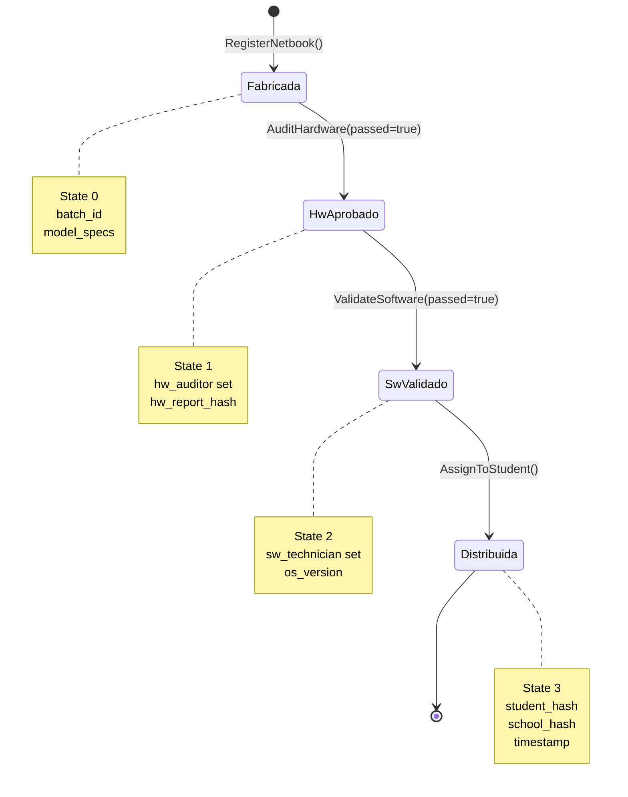
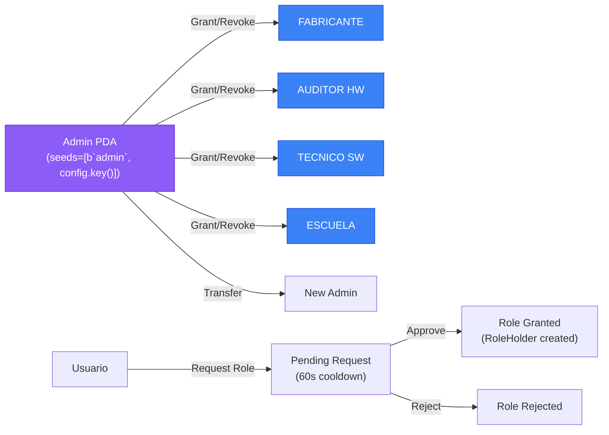

# 🏠 Home - SupplyChainTracker Wiki

> **Trazabilidad Inmutable para la Educación** — Plataforma blockchain para rastrear la distribución de netbooks educativas en Solana.

[](https://solana.com)
[](https://www.anchor-lang.com)
[](https://nextjs.org)
[](../../LICENSE)

---

## 📖 Bienvenido a la Wiki de SupplyChainTracker

Esta wiki contiene toda la documentación técnica del proyecto SupplyChainTracker, un sistema de trazabilidad descentralizado construido sobre Solana con Anchor. El programa rastrea el ciclo de vida completo de netbooks educativas desde su fabricación hasta su distribución a estudiantes.

---

## 🗂️ Contenido de la Wiki

### 1. [Arquitectura del Sistema](01-Arquitectura-del-Sistema.md)
Documentación completa de la arquitectura general del sistema, incluyendo diagramas de arquitectura, estructura de directorios, flujo de datos y patrones de comunicación entre frontend y programa Anchor.

### 2. [Framework Anchor](02-Framework-Anchor.md)
Guía detallada del framework Anchor: cómo se estructura un programa Anchor, explicación de macros, instrucciones, eventos, errores, PDA derivation y system accounts.

### 3. [Runbooks txtx](03-RUNBOOKS-txtx.md)
Documentación completa de los runbooks txtx/surfpool: qué son, cómo se estructuran, sintaxis HCL, funciones disponibles y detalle de cada runbook implementado.

### 4. [Tecnologías Implementadas](04-Tecnologias-Implementadas.md)
Descripción de todas las tecnologías utilizadas en el proyecto: Solana, Anchor, Next.js, Playwright, txtx/surfpool, Jest y más.

### 5. [Programa Solana](05-Programa-Solana.md)
Documentación detallada del programa Anchor: state accounts, instruction handlers, eventos, errores, estado máquina y lógica de negocio.

### 6. [Frontend Next.js](06-Frontend-NextJS.md)
Documentación del frontend: estructura de la aplicación Next.js, componentes, hooks, servicios, integración con Solana y patrones de UI.

---

## 🚀 Quick Start

```bash
# 1. Clone and install
git clone https://github.com/87maxi/SupplyChainTracker-solana-.git
cd SupplyChainTracker-solana-

# 2. Build Solana program
cd sc-solana && anchor build --ignore-keys && cd ..

# 3. Start Surfpool (local Solana validator)
surfpool start

# 4. Deploy and initialize program
surfpool run full-init --env localnet --browser -f

# 5. Start frontend
cd web && cp .env.example .env.local && npm install && npm run dev

# 6. Open http://localhost:3000
```

---

## 🏗️ Visión General del Sistema

### Netbook Lifecycle



### Role-Based Access Control (RBAC)



### Program ID

```
BTSWNY97FaxeJrUNSq399tRbfMz68iaaY3csJwT9hQQW
```

---

## 📁 Estructura del Proyecto

```
SupplyChainTracker-solana-/
├── sc-solana/                    # Anchor program
│   ├── programs/sc-solana/       # Rust source code
│   │   ├── src/
│   │   │   ├── lib.rs            # Program entry point
│   │   │   ├── state/            # Account structs
│   │   │   ├── instructions/     # Instruction handlers
│   │   │   ├── events/           # Event definitions
│   │   │   └── errors/           # Error codes
│   │   └── tests/                # Mollusk/LiteSVM tests
│   ├── runbooks/                 # txtx/surfpool runbooks
│   │   ├── 01-deployment/        # Deployment runbooks
│   │   ├── 02-operations/        # Operations runbooks
│   │   ├── 03-role-management/   # Role management runbooks
│   │   ├── 04-testing/           # Testing runbooks
│   │   └── environments/         # Environment configs
│   ├── Anchor.toml               # Anchor configuration
│   └── Cargo.toml                # Rust dependencies
├── web/                          # Next.js frontend
│   ├── app/                      # Next.js App Router
│   ├── components/               # React components
│   ├── hooks/                    # Custom React hooks
│   ├── lib/                      # Utilities and services
│   ├── services/                 # Business logic services
│   ├── e2e/                      # Playwright E2E tests
│   └── generated/                # Generated client code
├── config/                       # Configuration files
│   └── keypairs/                 # Wallet keypairs
└── .github/                      # GitHub configs
    └── WIKI/                     # This wiki
```

---

## 🔑 Conceptos Clave

### PDA-First Architecture

Todos los accounts del programa son PDA-derivable desde el IDL:

| PDA | Seeds | Descripción |
|-----|-------|-------------|
| `Deployer` | `[b"deployer"]` | Payer para creación de accounts |
| `Config` | `[b"config"]` | Configuración global del sistema |
| `Admin` | `[b"admin", config.key()]` | Admin PDA para operaciones de rol |
| `SerialHashRegistry` | `[b"serial_hashes", config.key()]` | Registro de hashes de serial |
| `Netbook` | `[b"netbook", token_id]` | Account de netbook individual |
| `RoleHolder` | `[b"role_holder", account.key()]` | Holder de rol individual |
| `RoleRequest` | `[b"role_request", user.key()]` | Solicitud de rol |

### Role System

| Role | Descripción |
|------|-------------|
| `FABRICANTE` | Fabrica y registra netbooks |
| `AUDITOR_HW` | Audita hardware |
| `TECNICO_SW` | Valida software |
| `ESCUELA` | Asigna netbooks a estudiantes |

### Error Codes

| Code | Error | Descripción |
|------|-------|-------------|
| 6000 | `Unauthorized` | Caller no autorizado |
| 6001 | `InvalidStateTransition` | Transición de estado inválida |
| 6002 | `NetbookNotFound` | Netbook no encontrada |
| 6003 | `InvalidInput` | Input inválido |
| 6004 | `DuplicateSerial` | Serial duplicado |
| 6005 | `ArrayLengthMismatch` | Longitudes de array no coinciden |
| 6006 | `RoleAlreadyGranted` | Role ya otorgado |
| 6007 | `RoleNotFound` | Role no encontrado |
| 6008 | `InvalidSignature` | Firma inválida |
| 6009 | `EmptySerial` | Serial vacío |
| 6010 | `StringTooLong` | String excede máximo |
| 6011 | `MaxRoleHoldersReached` | Máximo de holders alcanzado |
| 6012 | `RoleHolderNotFound` | Holder no encontrado |
| 6013 | `InvalidRequestState` | Request no en estado pending |
| 6014 | `RateLimited` | Rate limited (cooldown) |

---

## 🧪 Testing

| Tipo | Comando | Descripción |
|------|---------|-------------|
| Unit (Rust) | `cargo test --test mollusk-tests` | Mollusk/LiteSVM tests |
| Lifecycle | `cargo test --test mollusk-lifecycle` | Lifecycle state machine tests |
| Compute Units | `cargo test --test compute-units` | CU measurement tests |
| Unit (TS) | `npm test` (en `web/`) | Jest unit tests |
| E2E | `npm run test:e2e` (en `web/`) | Playwright E2E tests |
| Integration | `anchor test` | Anchor integration tests |

---

## 📚 Recursos Adicionales

- [README.md](../../README.md) - Guía principal del proyecto
- [AGENTS.md](../../AGENTS.md) - Instrucciones para agentes de código
- [ROADMAP.md](../../ROADMAP.md) - Roadmap del proyecto
- [PLAN-EVOLUTIVO-SISTEMA.md](../../PLAN-EVOLUTIVO-SISTEMA.md) - Plan evolutivo

---

## 📞 Soporte

Para reportar issues o solicitar documentación adicional, abrir un issue en el repositorio.
