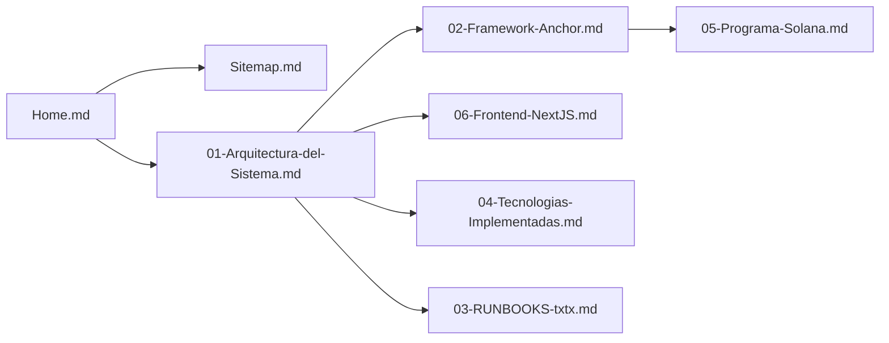
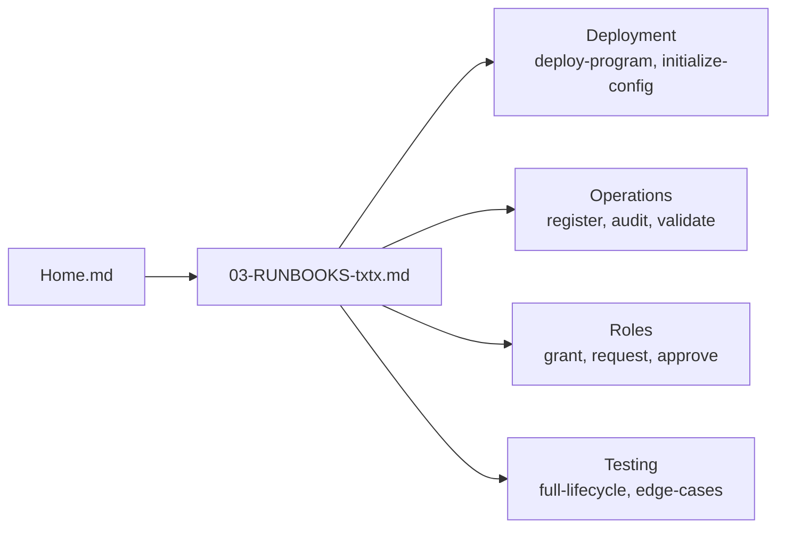
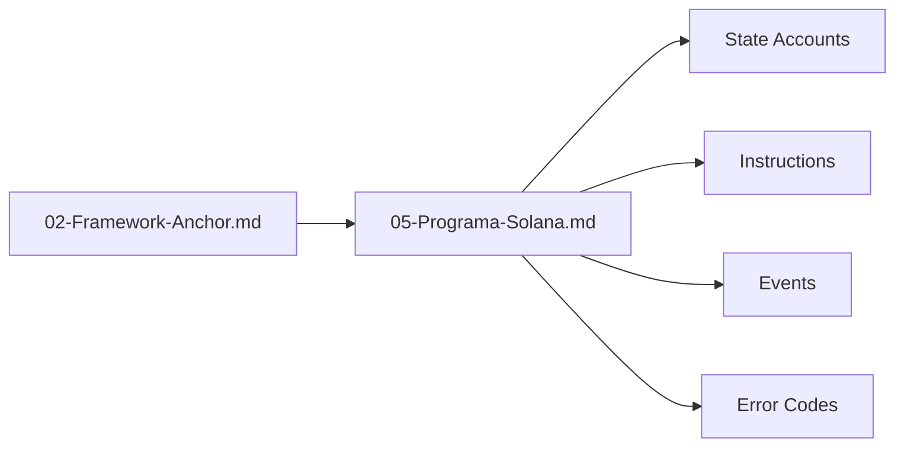
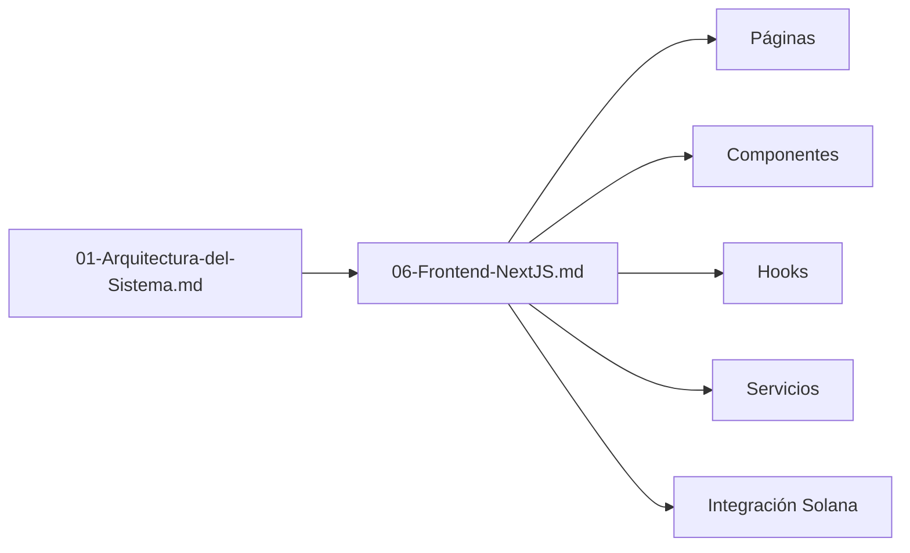
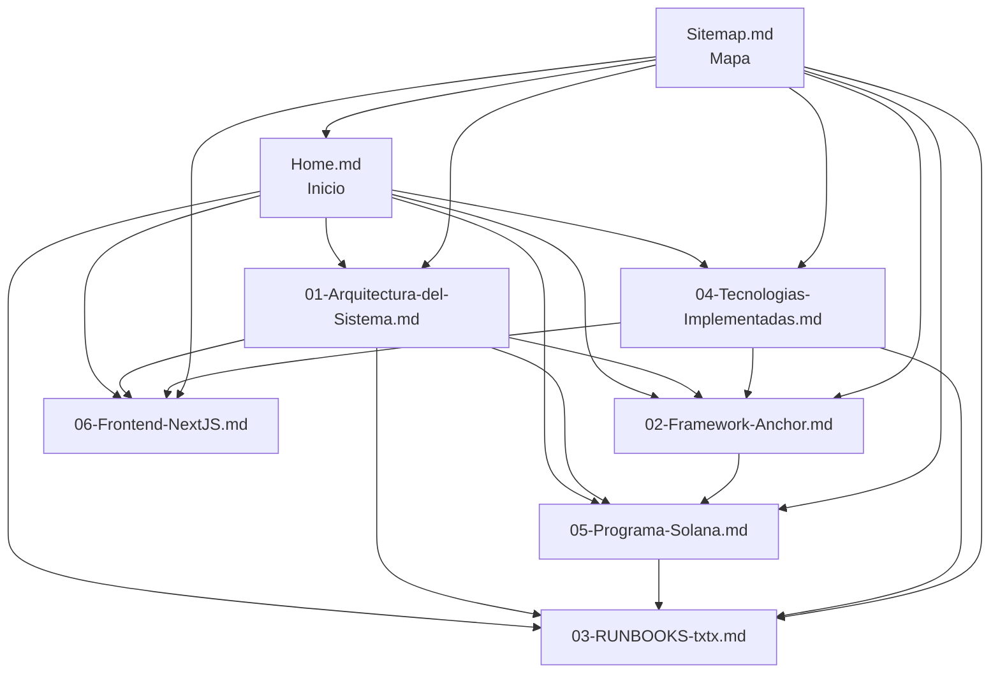

# Sitemap - SupplyChainTracker Wiki

> Mapa completo de toda la documentación del proyecto SupplyChainTracker.

---

## 📋 Tabla de Contenidos

1. [Estructura de la Wiki](#estructura-de-la-wiki)
2. [Navegación por Temas](#navegación-por-temas)
3. [Flujos de Lectura Recomendados](#flujos-de-lectura-recomendados)
4. [Documentación Relacionada](#documentación-relacionada)

---

## Estructura de la Wiki

```
.github/WIKI/
├── Home.md                     # Página principal
├── 01-Arquitectura-del-Sistema.md
├── 02-Framework-Anchor.md
├── 03-RUNBOOKS-txtx.md
├── 04-Tecnologias-Implementadas.md
├── 05-Programa-Solana.md
├── 06-Frontend-NextJS.md
└── Sitemap.md                  # Este archivo
```

---

## Navegación por Temas

### 🏗️ Arquitectura y Diseño

| Documento | Descripción | Enlace |
|-----------|-------------|--------|
| Arquitectura del Sistema | Visión general, diagramas, patrones | [01-Arquitectura-del-Sistema.md](01-Arquitectura-del-Sistema.md) |
| Framework Anchor | Guía completa de Anchor | [02-Framework-Anchor.md](02-Framework-Anchor.md) |
| Programa Solana | Detalle del programa Anchor | [05-Programa-Solana.md](05-Programa-Solana.md) |

### 🔧 Operaciones y Runbooks

| Documento | Descripción | Enlace |
|-----------|-------------|--------|
| Runbooks txtx | Documentación completa de runbooks | [03-RUNBOOKS-txtx.md](03-RUNBOOKS-txtx.md) |

### 💻 Frontend

| Documento | Descripción | Enlace |
|-----------|-------------|--------|
| Frontend Next.js | Documentación del frontend | [06-Frontend-NextJS.md](06-Frontend-NextJS.md) |

### 🛠️ Tecnologías

| Documento | Descripción | Enlace |
|-----------|-------------|--------|
| Tecnologías Implementadas | Stack tecnológico completo | [04-Tecnologias-Implementadas.md](04-Tecnologias-Implementadas.md) |

### 🏠 Inicio

| Documento | Descripción | Enlace |
|-----------|-------------|--------|
| Home | Página principal con quick start | [Home.md](Home.md) |

---

## Flujos de Lectura Recomendados

### Para Nuevos Desarrolladores



**Orden recomendado**:

1. **Home.md** - Visión general y quick start
2. **01-Arquitectura-del-Sistema.md** - Entender la arquitectura
3. **02-Framework-Anchor.md** - Aprender Anchor
4. **05-Programa-Solana.md** - Entender el programa
5. **06-Frontend-NextJS.md** - Entender el frontend
6. **03-RUNBOOKS-txtx.md** - Aprender runbooks
7. **04-Tecnologias-Implementadas.md** - Stack tecnológico

### Para Operadores / DevOps



**Orden recomendado**:

1. **Home.md** - Quick start
2. **03-RUNBOOKS-txtx.md** - Todos los runbooks
3. **04-Tecnologias-Implementadas.md** - Herramientas necesarias

### Para Desarrolladores del Programa (Rust/Anchor)



**Orden recomendado**:

1. **02-Framework-Anchor.md** - Fundamentos de Anchor
2. **05-Programa-Solana.md** - Detalle del programa
3. **03-RUNBOOKS-txtx.md** - Testing con runbooks

### Para Desarrolladores del Frontend (React/Next.js)



**Orden recomendado**:

1. **01-Arquitectura-del-Sistema.md** - Entender el sistema
2. **06-Frontend-NextJS.md** - Detalle del frontend
3. **05-Programa-Solana.md** - Entender el programa backend

---

## Documentación Relacionada (Fuera de la Wiki)

| Archivo | Descripción | Ubicación |
|---------|-------------|-----------|
| README.md | Guía principal del proyecto | [`README.md`](../README.md) |
| AGENTS.md | Instrucciones para agentes | [`AGENTS.md`](../AGENTS.md) |
| ROADMAP.md | Roadmap del proyecto | [`ROADMAP.md`](../ROADMAP.md) |
| PLAN-EVOLUTIVO-SISTEMA.md | Plan evolutivo | [`PLAN-EVOLUTIVO-SISTEMA.md`](../PLAN-EVOLUTIVO-SISTEMA.md) |
| LICENSE | Licencia MIT | [`LICENSE`](../LICENSE) |
| runbooks/README.md | Documentación de runbooks | [`sc-solana/runbooks/README.md`](../sc-solana/runbooks/README.md) |

---

## Resumen de Contenido

### Por Tipo de Contenido

| Tipo | Cantidad | Archivos |
|------|----------|----------|
| Documentación Principal | 7 | Home + 6 documentos |
| Diagramas Mermaid | 30+ | Distribuidos en todos los docs |
| Tablas de Referencia | 50+ | Distribuidas en todos los docs |
| Snippets de Código | 100+ | Distribuidos en todos los docs |

### Por Tema

| Tema | Páginas | Páginas de Código |
|------|---------|-------------------|
| Arquitectura | 1 | 01-Arquitectura-del-Sistema.md |
| Anchor Framework | 1 | 02-Framework-Anchor.md |
| Runbooks txtx | 1 | 03-RUNBOOKS-txtx.md |
| Tecnologías | 1 | 04-Tecnologias-Implementadas.md |
| Programa Solana | 1 | 05-Programa-Solana.md |
| Frontend Next.js | 1 | 06-Frontend-NextJS.md |

---

## Mapa de Relaciones entre Documentos



---

## Guía Rápida de Búsqueda

### ¿Necesitas saber...?

| Pregunta | Documento | Sección |
|----------|-----------|---------|
| ¿Cómo empiezo? | Home.md | Quick Start |
| ¿Cómo funciona el sistema? | 01-Arquitectura-del-Sistema.md | Visión General |
| ¿Qué es Anchor? | 02-Framework-Anchor.md | Introducción |
| ¿Cómo funciona `declare_id!()`? | 02-Framework-Anchor.md | `declare_id!()` Macro |
| ¿Qué son los `#[derive(Accounts)]`? | 02-Framework-Anchor.md | `#[derive(Accounts)]` Structs |
| ¿Qué PDAs existen? | 02-Framework-Anchor.md | PDA Derivation y Uso |
| ¿Qué es un runbook? | 03-RUNBOOKS-txtx.md | ¿Qué son los Runbooks? |
| ¿Cómo ejecuto un runbook? | 03-RUNBOOKS-txtx.md | Comandos Principales |
| ¿Cómo registro una netbook? | 03-RUNBOOKS-txtx.md | register-netbook.tx |
| ¿Cómo gestiono roles? | 03-RUNBOOKS-txtx.md | Role Management |
| ¿Qué tecnologías uso? | 04-Tecnologias-Implementadas.md | Resumen |
| ¿Qué versión de Anchor uso? | 04-Tecnologias-Implementadas.md | Anchor Framework |
| ¿Cuáles son los state accounts? | 05-Programa-Solana.md | State Accounts |
| ¿Cómo funciona el state machine? | 05-Programa-Solana.md | State Machine |
| ¿Cuáles son los error codes? | 05-Programa-Solana.md | Error Codes |
| ¿Cómo funciona el RBAC? | 05-Programa-Solana.md | RBAC |
| ¿Cuáles son las páginas del frontend? | 06-Frontend-NextJS.md | Páginas y Rutas |
| ¿Qué hooks existen? | 06-Frontend-NextJS.md | Hooks |
| ¿Cómo se conecta la wallet? | 06-Frontend-NextJS.md | Wallet Provider |
| ¿Cómo corro tests? | 04-Tecnologias-Implementadas.md | Testing |

---

## Estadísticas de la Wiki

| Métrica | Valor |
|---------|-------|
| Total de páginas | 8 |
| Total de diagramas Mermaid | 30+ |
| Total de tablas | 50+ |
| Total de snippets de código | 100+ |
| Páginas más extensas | 01-Arquitectura, 05-Programa, 06-Frontend |
| Páginas más cortas | Sitemap, 04-Tecnologías |

---

## Historial de Creación

| Fecha | Documento | Estado |
|-------|-----------|--------|
| 2026-05-17 | Home.md | ✅ Creado |
| 2026-05-17 | 01-Arquitectura-del-Sistema.md | ✅ Creado |
| 2026-05-17 | 02-Framework-Anchor.md | ✅ Creado |
| 2026-05-17 | 03-RUNBOOKS-txtx.md | ✅ Creado |
| 2026-05-17 | 04-Tecnologias-Implementadas.md | ✅ Creado |
| 2026-05-17 | 05-Programa-Solana.md | ✅ Creado |
| 2026-05-17 | 06-Frontend-NextJS.md | ✅ Creado |
| 2026-05-17 | Sitemap.md | ✅ Creado |

---

## Contacto y Contribuciones

Para sugerir cambios o agregar documentación a la wiki:

1. Abrir un issue en el repositorio
2. Proponer cambios en un pull request
3. Actualizar los archivos en `.github/WIKI/`

---

## Enlaces Externos

| Recurso | URL |
|---------|-----|
| Solana Docs | https://docs.solana.com/ |
| Anchor Book | https://book.anchor-lang.com/ |
| Next.js Docs | https://nextjs.org/docs |
| React Docs | https://react.dev/ |
| Txtx Docs | https://txtx.sh/ |
| Surfpool Docs | https://surfpool.run/ |
| Shadcn UI | https://ui.shadcn.com/ |
| Playwright | https://playwright.dev/ |
