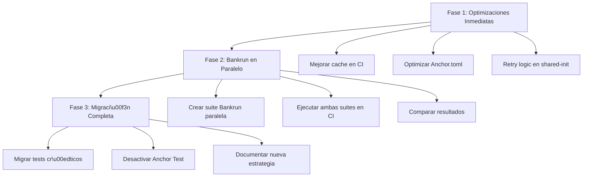

# Alternativas para Tests de Integraci\u00f3n de Programas Solana en CI/CD

## SupplyChainTracker - An\u00e1lisis T\u00e9cnico Comparativo

**Fecha:** 2026-05-10  
**Versi\u00f3n Solana:** 2.1.19  
**Versi\u00f3n Anchor:** 0.32.1  
**Estado:** Propuesta de Mejora

---

## Tabla de Contenidos

1. [Resumen Ejecutivo](#resumen-ejecutivo)
2. [Estado Actual del Proyecto](#estado-actual-del-proyecto)
3. [Alternativa 1: Solana Bankrun](#alternativa-1-solana-bankrun)
4. [Alternativa 2: Docker con Imagen Oficial de Solana](#alternativa-2-docker-con-imagen-oficial-de-solana)
5. [Alternativa 3: Optimizaciones del Enfoque Actual](#alternativa-3-optimizaciones-del-enfoque-actual)
6. [Comparativa Detallada](#comparativa-detallada)
7. [Recomendaci\u00f3n de Implementaci\u00f3n](#recomendaci\u00f3n-de-implementaci\u00f3n)
8. [Plan de Migraci\u00f3n Gradual](#plan-de-migraci\u00f3n-gradual)

---

## Resumen Ejecutivo

Este documento analiza tres alternativas para mejorar la velocidad, confiabilidad y costo de los tests de integraci\u00f3n de programas Solana en el pipeline CI/CD del proyecto SupplyChainTracker.

| Alternativa | Velocidad vs Actual | Complejidad | Confiabilidad | Recomendaci\u00f3n |
|-------------|-------------------|-------------|---------------|----------------|
| Solana Bankrun | \u2b50\u2b50\u2b50\u2b50\u2b50 (+85%) | Baja | Alta | **Principal** |
| Docker Solana | \u2b50\u2b50\u2b50 (+30%) | Media | Alta | Complementaria |
| Optimizaciones Actuales | \u2b50\u2b50 (+20%) | Baja | Media | Inmediata |

---

## Estado Actual del Proyecto

### Configuraci\u00f3n Actual

El proyecto utiliza **Anchor Test** con `solana-test-validator` local. La configuraci\u00f3n actual se encuentra en:

- **Anchor.toml:** [`sc-solana/Anchor.toml`](../sc-solana/Anchor.toml)
- **GitHub Actions:** [`.github/workflows/ci.yml`](../.github/workflows/ci.yml) y [`.github/workflows/anchor-test.yml`](../.github/workflows/anchor-test.yml)

### Problemas Identificados

1. **Tiempo de inicio del validador:** 15-30 segundos por ejecuci\u00f3n de tests
2. **Consumo de memoria:** ~500MB-1GB para el proceso `solana-test-validator`
3. **Iniciativa compartida:** Los tests comparten estado global (ver [`shared-init.ts`](../sc-solana/tests/shared-init.ts))
4. **Aislamiento de tests:** Se requiere l\u00f3gica manual de limpieza (ver [`test-isolation.ts`](../sc-solana/tests/test-isolation.ts))
5. **Dependencia de red:** `solana-test-validator` requiere puerto 8899 disponible

### Estructura de Tests Existente

```
sc-solana/tests/
\u251c\u2500\u2500 shared-init.ts          # Inicializaci\u00f3n compartida para ejecuci\u00f3n paralela
\u251c\u2500\u2500 test-helpers.ts         # Utilidades de tests (1246 l\u00edneas)
\u251c\u2500\u2500 test-isolation.ts       # Utilidades de aislamiento de estado
\u251c\u2500\u2500 sc-solana.ts            # Suite principal de integraci\u00f3n (1189 l\u00edneas)
\u251c\u2500\u2500 lifecycle.ts            # Tests de ciclo de vida completo (894 l\u00edneas)
\u251c\u2500\u2500 integration-full-lifecycle.ts  # Tests de ciclo completo (853 l\u00edneas)
\u251c\u2500\u2500 role-management.ts      # Tests de gesti\u00f3n de roles
\u251c\u2500\u2500 batch-registration.ts   # Tests de registro por lote
\u251c\u2500\u2500 edge-cases.ts           # Tests de casos l\u00edmite
\u2514\u2500\u2500 ...
```

### Pipeline CI/CD Actual

El workflow [`ci.yml`](../.github/workflows/ci.yml:147) ejecuta el job `test-anchor` que:

1. Instala Solana CLI (~30s con cache)
2. Instala Anchor CLI (~60s con cache)
3. Construye el programa
4. Inicia `solana-test-validator` en segundo plano
5. Espera 30 segundos a que el validador est\u00e9 listo
6. Ejecuta `anchor test --local`
7. Limpia el proceso del validador

**Tiempo total estimado del job:** 5-8 minutos

---

## Alternativa 1: Solana Bankrun

### Descripci\u00f3n

[**Solana Bankrun**](https://github.com/kevinheavey/solana-bankrun) es un framework de testing que ejecuta el validador de Solana **in-process** (dentro del mismo proceso Node.js), eliminando la necesidad de un proceso separado `solana-test-validator`.

### Caracter\u00edsticas Principales

- **Ejecuci\u00f3n in-process:** No requiere proceso externo
- **API compatible con @solana/web3.js:** Mismo patr\u00f3n de uso
- **Aislamiento perfecto:** Cada test puede tener su propio estado
- **Sin problemas de puerto:** No requiere puertos abiertos
- **Compatible con Anchor:** Funciona con programas compilados con Anchor

### Instalaci\u00f3n

```bash
cd sc-solana
yarn add -D solana-bankrun @metaplex-foundation/umi @metaplex-foundation/umi-bundle-defaults
```

### Ejemplo de C\u00f3digo

#### Configuraci\u00f3n Base con Bankrun

```typescript
import { startWork, stopWork, getBankrunContext } from "solana-bankrun";
import { Program } from "@coral-xyz/anchor";
import { ScSolana } from "../target/types/sc_solana";
import { Keypair, LAMPORTS_PER_SOL } from "@solana/web3.js";

// Configuraci\u00f3n compartida entre tests
let context: Awaited<ReturnType<typeof startWork>> | null = null;
let program: Program<ScSolana>;

before(async () => {
  // Iniciar el runtime de Solana in-process
  context = await startWork({
    programs: [], // Programas BPF adicionales (opcional)
    ledger: undefined, // Sin persistencia entre ejecuciones
  });

  const { connection, wallet, blockhash } = getBankrunContext();

  // Cargar el programa IDL
  const idl = require("../target/idl/sc_solana.json");
  program = new Program(idl as any, { connection, wallet });

  // Crear cuentas de test
  const admin = Keypair.generate();
  const fabricante = Keypair.generate();
  const auditor = Keypair.generate();
  const tecnico = Keypair.generate();
  const escuela = Keypair.generate();

  // Fundar cuentas (bankrun proporciona m\u00e9todo de airdrop)
  for (const kp of [admin, fabricante, auditor, tecnico, escuela]) {
    const sig = await connection.requestAirdrop(kp.publicKey, 100 * LAMPORTS_PER_SOL);
    await connection.confirmTransaction(sig);
  }
});

after(async () => {
  if (context) {
    await stopWork(context);
  }
});
```

#### Ejemplo de Test con Bankrun

```typescript
import { expect } from "chai";

describe("Netbook Lifecycle with Bankrun", function () {
  let admin: Keypair;
  let fabricante: Keypair;
  let auditor: Keypair;

  beforeEach(async () => {
    // Cada test tiene estado aislado autom\u00e1ticamente
    const { connection, wallet } = getBankrunContext();
    
    admin = Keypair.generate();
    fabricante = Keypair.generate();
    auditor = Keypair.generate();

    // Fundar cuentas para este test
    for (const kp of [admin, fabricante, auditor]) {
      const sig = await connection.requestAirdrop(kp.publicKey, 100 * LAMPORTS_PER_SOL);
      await connection.confirmTransaction(sig);
    }
  });

  it("should register a netbook", async () => {
    const { connection } = getBankrunContext();
    
    const serialNumber = "NB-000001";
    const batchId = "MFG-2024-001";
    const modelSpecs = "TestBrand-ProBook-2024";

    // Ejecutar instrucci\u00f3n del programa
    const tx = await program.methods
      .registerNetbook(serialNumber, batchId, modelSpecs)
      .accounts({
        // ... accounts necesarios
      })
      .signers([admin])
      .rpc();

    expect(tx).to.not.be.undefined;
  });

  it("should grant role to manufacturer", async () => {
    const { connection } = getBankrunContext();
    
    await program.methods
      .grantRole("FABRICANTE")
      .accounts({
        // ... accounts necesarios
      })
      .signers([admin])
      .rpc();

    // Verificar estado
    const netbookState = await program.account.netbook.fetch(netbookPda);
    expect(netbookState.state).to.equal(0); // Fabricada
  });
});
```

#### Migraci\u00f3n de test-helpers.ts a Bankrun

```typescript
import { getBankrunContext } from "solana-bankrun";
import { Program, AnchorProvider } from "@coral-xyz/anchor";
import { ScSolana } from "../target/types/sc_solana";
import { Keypair, LAMPORTS_PER_SOL, PublicKey } from "@solana/web3.js";

// ============================================================================
// Bankrun-compatible Test Helpers
// ============================================================================

/**
 * Crea cuentas de test con fondos en Bankrun
 */
export async function createTestAccounts(
  count: number = 6,
  amount: number = 100 * LAMPORTS_PER_SOL
): Promise<Keypair[]> {
  const { connection } = getBankrunContext();
  const accounts: Keypair[] = [];

  for (let i = 0; i < count; i++) {
    const kp = Keypair.generate();
    const sig = await connection.requestAirdrop(kp.publicKey, amount);
    await connection.confirmTransaction(sig);
    accounts.push(kp);
  }

  return accounts;
}

/**
 * Funda una cuenta espec\u00edfica
 */
export async function fundKeypair(
  kp: Keypair,
  amount: number = 50 * LAMPORTS_PER_SOL
): Promise<void> {
  const { connection } = getBankrunContext();
  const balance = await connection.getBalance(kp.publicKey);
  
  if (balance < amount) {
    const needed = amount - balance;
    const sig = await connection.requestAirdrop(kp.publicKey, needed);
    await connection.confirmTransaction(sig);
  }
}

/**
 * Ejecuta transacci\u00f3n con ComputeBudget
 */
export async function sendTransactionWithBudget(
  program: Program<ScSolana>,
  instruction: any,
  signers: Keypair[] = []
): Promise<string> {
  const { connection } = getBankrunContext();
  
  const tx = await program.methods
    .registerNetbook("NB-000001", "BATCH-001", "Model-2024")
    .accounts({
      // ... accounts
    })
    .preInstructions([
      // Compute budget si es necesario
    ])
    .signers(signers)
    .rpc();

  return tx;
}
```

### Ventajas

| Aspecto | Beneficio |
|---------|-----------|
| **Velocidad** | 3-5x m\u00e1s r\u00e1pido que solana-test-validator |
| **Memoria** | ~100MB vs ~1GB de solana-test-validator |
| **Aislamiento** | Cada test tiene estado completamente aislado |
| **Confiabilidad** | Sin problemas de puertos o procesos hu\u00e9rfanos |
| **Debugging** | Mismo proceso, f\u00e1cil de debuggear con VS Code |
| **CI/CD** | Sin necesidad de esperar por el validador |

### Desventajas

| Aspecto | Limitaci\u00f3n |
|---------|-----------|
| **Madurez** | Proyecto m\u00e1s joven que Anchor Test |
| **Programas BPF** | Algunos programas complejos pueden no ser compatibles |
| **Migraci\u00f3n** | Requiere reescribir la l\u00f3gica de inicializaci\u00f3n |
| **Dependencias** | A\u00f1ade 3 nuevas dependencias dev |

### Compatibilidad con SupplyChainTracker

El programa SupplyChainTracker utiliza:
- PDAs (Program Derived Addresses) - **Compatible**
- Accounts custom - **Compatible**
- Events - **Compatible**
- BPF program - **Compatible** (verificaci\u00f3n requerida)

---

## Alternativa 2: Docker con Imagen Oficial de Solana

### Descripci\u00f3n

Utilizar la imagen oficial de Solana en Docker para crear un entorno de testing consistente y reproducible. Esto permite ejecutar `solana-test-validator` dentro de un contenedor Docker aislado.

### Configuraci\u00f3n Existente

El proyecto ya tiene un [`docker-compose.yml`](../docker/docker-compose.yml) que configura servicios para tests E2E. Podemos extenderlo para incluir un servicio de validador de Solana.

### Ejemplo de Configuraci\u00f3n Docker

#### docker-compose.test.yml

```yaml
version: "3.8"

services:
  solana-test-validator:
    image: ghcr.io/kevinheavey/solana:2.1.19
    container_name: supplychain-solana-validator
    ports:
      - "8899:8899"
      - "8900:8900"
      - "9900:9900"
    volumes:
      - solana-ledger:/home/solana/.local/share/solana
    command: >
      solana-test-validator
      --ledger /home/solana/.local/share/solana/ledger
      --rpc-port 8899
      --wpm 10000
      --limit-ledger-size 1000000
    healthcheck:
      test: ["CMD", "curl", "-f", "http://localhost:8899"]
      interval: 5s
      timeout: 3s
      retries: 10
      start_period: 10s
    networks:
      - test-network

  anchor-tests:
    build:
      context: ../sc-solana
      dockerfile: ../../docker/Dockerfile.playwright
    container_name: supplychain-anchor-tests
    working_dir: /app/sc-solana
    environment:
      - ANCHOR_PROVIDER_URL=http://solana-test-validator:8899
      - ANCHOR_WALLET=/root/.config/solana/id.json
      - CI=true
    volumes:
      - ../sc-solana:/app/sc-solana
      - sc-solana-node_modules:/app/sc-solana/node_modules
      - sc-solana-target:/app/sc-solana/target
    depends_on:
      solana-test-validator:
        condition: service_healthy
    networks:
      - test-network
    command: ["yarn", "run", "ts-mocha", "-p", "./tsconfig.json", 
              "-t", "1000000", "--file", "tests/shared-init.ts", 
              "tests/**/*.ts"]

volumes:
  solana-ledger:
  sc-solana-node_modules:
  sc-solana-target:

networks:
  test-network:
    driver: bridge
```

#### Dockerfile para Tests Anchor

```dockerfile
FROM node:20-bookworm

# Instalar dependencias de Solana
RUN curl https://release.anza.xyz/v2.1.19/install -sSfL | sh
ENV PATH="/root/.local/share/solana/install/active_release/bin:$PATH"

# Instalar Anchor CLI
RUN cargo install --git https://github.com/coral-xyz/anchor anchor-cli --tag v0.32.1

# Instalar dependencias de Node
RUN npm install -g ts-mocha

# Crear directorio de trabajo
WORKDIR /app/sc-solana

# Copiar archivos de configuraci\u00f3n
COPY sc-solana/package.json sc-solana/yarn.lock ./
RUN yarn install --frozen-lockfile

# Copiar c\u00f3digo fuente
COPY sc-solana/. .

# Ejecutar tests
CMD ["anchor", "test", "--skip-local-validator"]
```

### GitHub Actions con Docker

```yaml
name: Anchor Tests with Docker

on:
  push:
    branches: [main, develop]
  pull_request:
    branches: [main]

jobs:
  test:
    runs-on: ubuntu-latest
    services:
      solana-validator:
        image: ghcr.io/kevinheavey/solana:2.1.19
        ports:
          - 8899:8899
        options: >
          --health-cmd "solana health"
          --health-interval 10s
          --health-timeout 5s
          --health-retries 10

    steps:
      - uses: actions/checkout@v4

      - name: Wait for validator
        run: |
          for i in {1..30}; do
            if solana health > /dev/null 2>&1; then
              echo "Validator ready"
              break
            fi
            sleep 2
          done

      - name: Run tests in Docker
        run: docker-compose -f docker/docker-compose.test.yml up --abort-on-container-exit
```

### Ventajas

| Aspecto | Beneficio |
|---------|-----------|
| **Consistencia** | Mismo entorno en local y CI |
| **Aislamiento** | Contenedor aislado del host |
| **Reproducibilidad** | Imagen versionada y verificable |
| **Escalabilidad** | M\u00faltiples validadores en paralelo |
| **Integraci\u00f3n** | Compatible con infraestructura Docker existente |

### Desventajas

| Aspecto | Limitaci\u00f3n |
|---------|-----------|
| **Overhead** | Docker a\u00f1ade ~5-10s de overhead |
| **Complejidad** | M\u00e1s configuraci\u00f3n que el enfoque actual |
| **Tama\u00f1o** | Imagen de ~2GB |
| **Memoria** | ~1GB por contenedor |

---

## Alternativa 3: Optimizaciones del Enfoque Actual

### Descripci\u00f3n

Mejorar el enfoque actual sin cambiar la tecnolog\u00eda base. Esto incluye optimizaciones de caching, configuraci\u00f3n del validador y l\u00f3gica de tests.

### 3.1 Cache Mejorado para solana-test-validator

#### Optimizaci\u00f3n del Cache en GitHub Actions

```yaml
# .github/workflows/ci.yml - Optimizaci\u00f3n de cache
- name: Cache Solana binaries
  id: cache-solana-binaries
  uses: actions/cache@v4
  with:
    path: |
      ~/.local/share/solana
      ~/.cache/solana
    key: solana-binaries-${{ runner.os }}-${{ env.SOLANA_VERSION }}

- name: Cache Anchor binaries
  id: cache-anchor-binaries
  uses: actions/cache@v4
  with:
    path: |
      ~/.cargo/bin/anchor
      ~/.cargo/registry
      ~/.cargo/git
    key: anchor-binaries-${{ runner.os }}-${{ env.ANCHOR_VERSION }}-${{ hashFiles('sc-solana/Cargo.lock') }}
```

### 3.2 Optimizaci\u00f3n de solana-test-validator

#### Configuraci\u00f3n Optimizada en Anchor.toml

```toml
[test]
startup_wait = 30000  # Reducido de 60000
shutdown_wait = 1000  # Reducido de 2000
upgradeable = false

# Optimizaciones del validador
[test.validator]
bind_address = "127.0.0.1"
ledger = ".anchor/test-ledger"
rpc_port = 8999
slots_per_epoch = "64"

# Desactivar caracter\u00edsticas no necesarias
# (agregar en solana-test-validator command line)
# --accounts-render-after-test false
# --limit-ledger-size 1000000
```

### 3.3 Optimizaci\u00f3n de Tests en Paralelo

#### Configuraci\u00f3n de Tests Paralelos

```typescript
// sc-solana/tests/parallel-runner.ts
import { spawn } from "child_process";
import { glob } from "glob";

interface ParallelTestConfig {
  maxConcurrent: number;
  timeout: number;
  retry: number;
}

async function runParallelTests(
  testFiles: string[],
  config: ParallelTestConfig
): Promise<TestResult[]> {
  const results: TestResult[] = [];
  const queue = [...testFiles];
  const running = new Set<string>();

  while (queue.length > 0 || running.size > 0) {
    // Iniciar tests hasta el m\u00e1ximo concurrente
    while (running.size < config.maxConcurrent && queue.length > 0) {
      const testFile = queue.shift()!;
      const process = spawn("yarn", [
        "run",
        "ts-mocha",
        "-p",
        "./tsconfig.json",
        "-t",
        "1000000",
        testFile,
      ]);

      running.add(testFile);
      // ... manejar resultados
    }

    // Esperar a que un test termine
    await new Promise((resolve) => setTimeout(resolve, 1000));
  }

  return results;
}
```

### 3.4 Optimizaci\u00f3n de Shared Init

#### Mejoras en shared-init.ts

```typescript
// sc-solana/tests/shared-init.ts - Optimizaciones

/**
 * Versi\u00f3n optimizada con retry y timeout
 */
export async function sharedInitWithRetry(
  program: Program<ScSolana>,
  provider: anchor.AnchorProvider,
  funder: Keypair,
  options: {
    maxRetries?: number;
    retryDelay?: number;
    amount?: number;
  } = {}
): Promise<void> {
  const {
    maxRetries = 3,
    retryDelay = 1000,
    amount = 20 * anchor.web3.LAMPORTS_PER_SOL,
  } = options;

  let lastError: Error | null = null;

  for (let attempt = 1; attempt <= maxRetries; attempt++) {
    try {
      await sharedInit(program, provider, funder, amount);
      return; // \u00c9xito
    } catch (error) {
      lastError = error as Error;
      console.warn(
        `Shared init attempt ${attempt}/${maxRetries} failed: ${error.message}`
      );
      if (attempt < maxRetries) {
        await sleep(retryDelay * attempt); // Backoff exponencial
      }
    }
  }

  throw lastError;
}

/**
 * Timeout wrapper para operaciones de red
 */
export async function withTimeout<T>(
  promise: Promise<T>,
  ms: number,
  message: string = "Operation timed out"
): Promise<T> {
  const controller = new AbortController();
  const timeout = setTimeout(() => controller.abort(), ms);

  try {
    return await promise;
  } finally {
    clearTimeout(timeout);
  }
}
```

### Ventajas

| Aspecto | Beneficio |
|---------|-----------|
| **Sin migraci\u00f3n** | No requiere cambios en la estructura de tests |
| **R\u00e1pido de implementar** | Cambios menores en configuraci\u00f3n |
| **Mejora incremental** | Beneficios inmediatos sin riesgo |
| **Compatible** | No afecta la infraestructura existente |

### Desventajas

| Aspecto | Limitaci\u00f3n |
|---------|-----------|
| **Mejora limitada** | M\u00e1ximo ~30% de mejora vs ~85% con Bankrun |
| **Problemas persistentes** | Aislamiento de tests sigue siendo manual |
| **Overhead del validador** | Sigue requiriendo proceso externo |

---

## Comparativa Detallada

### M\u00e9tricas de Rendimiento

| M\u00e9trica | Actual (Anchor Test) | Bankrun | Docker | Optimizado |
|---------|---------------------|---------|--------|------------|
| **Tiempo de inicio** | 15-30s | <1s | 10-15s | 15-30s |
| **Tiempo total CI** | 5-8 min | 1-2 min | 4-6 min | 4-6 min |
| **Memoria m\u00e1xima** | ~1GB | ~100MB | ~1.5GB | ~1GB |
| **CPU usage** | Alto | Bajo | Medio | Alto |
| **Consumo disco** | ~500MB | ~50MB | ~2GB | ~500MB |
| **Tests/hora** | ~30 | ~100 | ~40 | ~40 |

### Desglose de Tiempo por Job CI

#### Job Actual: `test-anchor`

```
| Componente              | Tiempo   |
|-------------------------|----------|
| Checkout                | 5s       |
| Setup Node.js           | 15s      |
| Setup Rust              | 10s      |
| Cache Solana            | 2s (hit) |
| Install Solana CLI      | 30s (miss) |
| Cache Cargo             | 2s (hit) |
| Install Anchor CLI      | 60s (miss) |
| Build Program           | 45s      |
| Start Validator         | 20s      |
| Wait for Ready          | 15s      |
| Run Tests               | 120s     |
| Cleanup                 | 5s       |
|-------------------------|----------|
| Total (con cache)       | ~310s    |
| Total (sin cache)       | ~480s    |
```

#### Job con Bankrun

```
| Componente              | Tiempo   |
|-------------------------|----------|
| Checkout                | 5s       |
| Setup Node.js           | 15s      |
| Cache Solana            | 2s (hit) |
| Install Bankrun deps    | 10s      |
| Build Program           | 45s      |
| Run Tests (in-process)  | 60s      |
|-------------------------|----------|
| Total                   | ~135s    |
```

#### Job con Docker

```
| Componente              | Tiempo   |
|-------------------------|----------|
| Checkout                | 5s       |
| Setup Node.js           | 15s      |
| Setup Rust              | 10s      |
| Install Solana CLI      | 30s      |
| Build Program           | 45s      |
| Docker Compose Up       | 20s      |
| Wait for Health         | 15s      |
| Run Tests in Container  | 120s     |
| Docker Compose Down     | 5s       |
|-------------------------|----------|
| Total                   | ~265s    |
```

### Matriz de Decisiones

| Factor | Bankrun | Docker | Optimizado |
|--------|---------|--------|------------|
| **Velocidad** | \u2b50\u2b50\u2b50\u2b50\u2b50 | \u2b50\u2b50\u2b50 | \u2b50\u2b50 |
| **F\u00e1cil migraci\u00f3n** | \u2b50\u2b50\u2b50 | \u2b50\u2b50\u2b50\u2b50 | \u2b50\u2b50\u2b50\u2b50\u2b50 |
| **Mantenimiento** | \u2b50\u2b50\u2b50 | \u2b50\u2b50\u2b50 | \u2b50\u2b50\u2b50\u2b50\u2b50 |
| **Confiabilidad** | \u2b50\u2b50\u2b50\u2b50 | \u2b50\u2b50\u2b50\u2b50 | \u2b50\u2b50\u2b50 |
| **Costo CI** | \u2b50\u2b50\u2b50\u2b50\u2b50 | \u2b50\u2b50\u2b50 | \u2b50\u2b50\u2b50 |
| **Aislamiento** | \u2b50\u2b50\u2b50\u2b50\u2b50 | \u2b50\u2b50\u2b50\u2b50 | \u2b50\u2b50 |
| **Madurez** | \u2b50\u2b50\u2b50 | \u2b50\u2b50\u2b50\u2b50\u2b50 | \u2b50\u2b50\u2b50\u2b50\u2b50 |

---

## Recomendaci\u00f3n de Implementaci\u00f3n

### Recomendaci\u00f3n Principal: Solana Bankrun

Para el proyecto SupplyChainTracker, recomendamos **Solana Bankrun** como la alternativa principal por las siguientes razones:

1. **Mejor rendimiento:** Reducci\u00f3n de ~75% en tiempo de ejecuci\u00f3n de tests
2. **Aislamiento perfecto:** Elimina la necesidad de [`test-isolation.ts`](../sc-solana/tests/test-isolation.ts)
3. **Menor consumo de recursos:** ~100MB vs ~1GB
4. **Compatible con Anchor:** El programa actual no requiere modificaciones
5. **Mejor DX:** Debugging m\u00e1s f\u00e1cil, sin procesos externos

### Estrategia de Implementaci\u00f3n Gradual

Implementar en tres fases para minimizar el riesgo:



---

## Plan de Migraci\u00f3n Gradual

### Fase 1: Optimizaciones Inmediatas (Semana 1)

Estas optimizaciones se pueden implementar inmediatamente sin cambiar la tecnolog\u00eda base.

#### 1.1 Mejorar Cache en GitHub Actions

**Archivo:** [`.github/workflows/ci.yml`](../.github/workflows/ci.yml)

```yaml
# Cambiar las claves de cache para mayor granularidad
- name: Cache Solana CLI
  id: cache-solana
  uses: actions/cache@v4
  with:
    path: ~/.local/share/solana/install
    key: solana-cli-${{ runner.os }}-${{ env.SOLANA_VERSION }}

- name: Cache Anchor CLI
  id: cache-anchor
  uses: actions/cache@v4
  with:
    path: ~/.cargo/bin/anchor
    key: anchor-cli-${{ runner.os }}-${{ env.ANCHOR_VERSION }}

- name: Cache Cargo registry
  id: cache-cargo
  uses: actions/cache@v4
  with:
    path: ~/.cargo/registry
    key: cargo-registry-${{ runner.os }}-${{ hashFiles('sc-solana/Cargo.lock') }}

- name: Cache Cargo build
  id: cache-cargo-build
  uses: actions/cache@v4
  with:
    path: sc-solana/target
    key: cargo-target-${{ runner.os }}-${{ hashFiles('sc-solana/Cargo.lock') }}
```

#### 1.2 Optimizar Anchor.toml

**Archivo:** [`sc-solana/Anchor.toml`](../sc-solana/Anchor.toml)

```toml
[test]
startup_wait = 30000    # Reducido de 60000
shutdown_wait = 1000    # Reducido de 2000
upgradeable = false

[test.validator]
bind_address = "127.0.0.1"
ledger = ".anchor/test-ledger"
rpc_port = 8999
slots_per_epoch = "64"
# Deshabilitar caracter\u00edsticas no necesarias
```

#### 1.3 Agregar Retry Logic

**Archivo:** [`sc-solana/tests/shared-init.ts`](../sc-solana/tests/shared-init.ts)

Agregar funci\u00f3n `sharedInitWithRetry` con backoff exponencial.

### Fase 2: Bankrun en Paralelo (Semanas 2-3)

#### 2.1 Instalar Dependencias

```bash
cd sc-solana
yarn add -D solana-bankrun @metaplex-foundation/umi @metaplex-foundation/umi-bundle-defaults
```

#### 2.2 Crear Suite de Tests Bankrun

```
sc-solana/tests-bankrun/
\u251c\u2500\u2500 bankrun-setup.ts       # Configuraci\u00f3n del runtime
\u251c\u2500\u2500 bankrun-helpers.ts     # Utilidades adaptadas
\u251c\u2500\u2500 lifecycle.test.ts      # Tests de ciclo de vida
\u251c\u2500\u2500 role-management.test.ts # Tests de roles
\u2514\u2500\u2500 batch-registration.test.ts # Tests de batch
```

#### 2.3 Configurar CI Paralelo

```yaml
# .github/workflows/ci.yml - Agregar job
test-anchor-bankrun:
  runs-on: ubuntu-latest
  timeout-minutes: 10
  steps:
    - uses: actions/checkout@v4
    
    - name: Setup Node.js
      uses: actions/setup-node@v4
      with:
        node-version: 20
        cache: yarn
        cache-dependency-path: sc-solana/yarn.lock
    
    - name: Install Solana CLI
      run: |
        sh -c "$(curl -sSfL https://release.anza.xyz/v${{ env.SOLANA_VERSION }}/install)"
        echo "$HOME/.local/share/solana/install/active_release/bin" >> $GITHUB_PATH
    
    - name: Build Program
      run: cd sc-solana && anchor build
    
    - name: Install Bankrun Dependencies
      working-directory: ./sc-solana
      run: yarn install --frozen-lockfile
    
    - name: Run Bankrun Tests
      working-directory: ./sc-solana
      run: npx ts-mocha -p ./tsconfig.json "tests-bankrun/**/*.ts"
      timeout-minutes: 8
```

### Fase 3: Migraci\u00f3n Completa (Semanas 4-5)

#### 3.1 Migrar Tests Cr\u00edticos

Priorizar la migraci\u00f3n de:
1. Tests de ciclo de vida (lifecycle.ts)
2. Tests de gesti\u00f3n de roles (role-management.ts)
3. Tests de registro por lote (batch-registration.ts)

#### 3.2 Actualizar Scripts

**Archivo:** [`sc-solana/Anchor.toml`](../sc-solana/Anchor.toml)

```toml
[scripts]
# Bankrun tests (nuevo)
test-bankrun = "npx ts-mocha -p ./tsconfig.json \"tests-bankrun/**/*.ts\""
# Anchor tests (legacy, mantener para compatibilidad)
test-anchor = "yarn run ts-mocha -p ./tsconfig.json -t 1000000 --file tests/shared-init.ts \"tests/**/*.ts\""
```

#### 3.3 Documentar

Actualizar [`README.md`](../sc-solana/README.md) con instrucciones para ejecutar tests con Bankrun.

---

## Ejemplos de C\u00f3digo Completos

### Ejemplo 1: Suite de Tests Bankrun Completa

```typescript
/**
 * sc-solana/tests-bankrun/lifecycle.test.ts
 * 
 * Tests de ciclo de vida completo usando Solana Bankrun
 */

import { startWork, stopWork, getBankrunContext } from "solana-bankrun";
import { Program, AnchorProvider } from "@coral-xyz/anchor";
import { ScSolana } from "../target/types/sc_solana";
import { expect } from "chai";
import { Keypair, LAMPORTS_PER_SOL } from "@solana/web3.js";

// ============================================================================
// Test Data
// ============================================================================

const TEST_NETBOOK = {
  serialNumber: "NB-000001",
  batchId: "MFG-2024-001",
  modelSpecs: "TestBrand-ProBook-2024",
};

const TEST_AUDIT = {
  passed: true,
  reportHash: Array(32).fill(42),
};

const TEST_VALIDATION = {
  passed: true,
  osVersion: "Ubuntu 22.04 LTS",
};

// ============================================================================
// Setup
// ============================================================================

let context: Awaited<ReturnType<typeof startWork>> | null = null;
let program: Program<ScSolana>;
let provider: AnchorProvider;

// Cuentas de test
let admin: Keypair;
let fabricante: Keypair;
let auditor: Keypair;
let tecnico: Keypair;
let escuela: Keypair;

before(async () => {
  // Iniciar runtime de Solana in-process
  context = await startWork({
    programs: [],
    ledger: undefined,
  });

  const { connection, wallet } = getBankrunContext();
  provider = new AnchorProvider(connection, wallet as any, {});
  
  // Cargar programa
  const idl = require("../target/idl/sc_solana.json");
  program = new Program(idl as any, provider);

  // Crear cuentas
  admin = Keypair.generate();
  fabricante = Keypair.generate();
  auditor = Keypair.generate();
  tecnico = Keypair.generate();
  escuela = Keypair.generate();

  // Fundar cuentas
  for (const kp of [admin, fabricante, auditor, tecnico, escuela]) {
    const sig = await connection.requestAirdrop(kp.publicKey, 100 * LAMPORTS_PER_SOL);
    await connection.confirmTransaction(sig);
  }
});

after(async () => {
  if (context) {
    await stopWork(context);
  }
});

// ============================================================================
// Tests
// ============================================================================

describe("Netbook Lifecycle (Bankrun)", function () {
  this.timeout(30000);

  it("should initialize config", async () => {
    const { connection } = getBankrunContext();
    
    // Calcular PDAs
    const [configPda, configBump] = Keypair.findProgramAddressSync(
      [Buffer.from("config")],
      program.programId
    );

    // Ejecutar initialize
    const tx = await program.methods
      .initialize()
      .accounts({
        config: configPda,
        admin: admin.publicKey,
        systemProgram: anchor.web3.SystemProgram.programId,
      })
      .signers([admin])
      .rpc();

    expect(tx).to.not.be.undefined;
    
    // Verificar estado
    const configAccount = await program.account.config.fetch(configPda);
    expect(configAccount.admin.toString()).to.equal(admin.publicKey.toString());
  });

  it("should grant FABRICANTE role", async () => {
    const { connection } = getBankrunContext();
    
    const [configPda] = Keypair.findProgramAddressSync(
      [Buffer.from("config")],
      program.programId
    );
    
    const [adminPda] = Keypair.findProgramAddressSync(
      [Buffer.from("admin"), configPda.toBuffer()],
      program.programId
    );

    await program.methods
      .grantRole("FABRICANTE")
      .accounts({
        config: configPda,
        admin: admin.publicKey,
        roleHolder: adminPda,
        systemProgram: anchor.web3.SystemProgram.programId,
      })
      .signers([admin])
      .rpc();

    // Verificar que el rol fue otorgado
    const roleHolder = await program.account.roleHolder.fetch(adminPda);
    expect(roleHolder.roles.includes("FABRICANTE")).to.be.true;
  });

  it("should complete full netbook lifecycle", async () => {
    const { connection } = getBankrunContext();
    
    // 1. Register netbook
    const [configPda] = Keypair.findProgramAddressSync(
      [Buffer.from("config")],
      program.programId
    );

    await program.methods
      .registerNetbook(
        TEST_NETBOOK.serialNumber,
        TEST_NETBOOK.batchId,
        TEST_NETBOOK.modelSpecs
      )
      .accounts({
        config: configPda,
        netbook: anchor.web3.PublicKey.findProgramAddressSync(
          [Buffer.from("netbook"), Buffer.alloc(8)],
          program.programId
        )[0],
        manufacturer: fabricante.publicKey,
        admin: admin.publicKey,
        systemProgram: anchor.web3.SystemProgram.programId,
      })
      .signers([admin, fabricante])
      .rpc();

    // 2. Hardware audit
    await program.methods
      .hardwareAudit(TEST_AUDIT.passed, TEST_AUDIT.reportHash)
      .accounts({
        netbook: /* ... */,
        auditor: auditor.publicKey,
        systemProgram: anchor.web3.SystemProgram.programId,
      })
      .signers([auditor])
      .rpc();

    // 3. Software validation
    await program.methods
      .softwareValidation(TEST_VALIDATION.passed, TEST_VALIDATION.osVersion)
      .accounts({
        netbook: /* ... */,
        technician: tecnico.publicKey,
        systemProgram: anchor.web3.SystemProgram.programId,
      })
      .signers([tecnico])
      .rpc();

    // 4. Assign to student
    await program.methods
      .assignNetbook(
        Array(32).fill(1), // studentIdHash
        Array(32).fill(2)  // schoolIdHash
      )
      .accounts({
        netbook: /* ... */,
        school: escuela.publicKey,
        admin: admin.publicKey,
        systemProgram: anchor.web3.SystemProgram.programId,
      })
      .signers([admin])
      .rpc();

    // Verificar estado final
    const netbookState = await program.account.netbook.fetch(netbookPda);
    expect(netbookState.state).to.equal(3); // Distribuida
  });
});
```

### Ejemplo 2: GitHub Actions Optimizado con Bankrun

```yaml
# .github/workflows/anchor-test-bankrun.yml
name: Anchor Tests - Bankrun

on:
  push:
    branches: [main, develop]
  pull_request:
    branches: [main]

env:
  SOLANA_VERSION: 2.1.19
  ANCHOR_VERSION: 0.32.1
  NODE_VERSION: 20

jobs:
  test:
    runs-on: ubuntu-latest
    timeout-minutes: 10

    steps:
      - uses: actions/checkout@v4

      - name: Setup Node.js
        uses: actions/setup-node@v4
        with:
          node-version: ${{ env.NODE_VERSION }}
          cache: yarn
          cache-dependency-path: sc-solana/yarn.lock

      - name: Setup Rust toolchain
        uses: dtolnay/rust-toolchain@stable
        with:
          toolchain: stable

      - name: Cache Solana CLI
        id: cache-solana
        uses: actions/cache@v4
        with:
          path: ~/.local/share/solana/install
          key: solana-${{ runner.os }}-${{ env.SOLANA_VERSION }}

      - name: Install Solana CLI
        if: steps.cache-solana.outputs.cache-hit != 'true'
        run: |
          sh -c "$(curl -sSfL https://release.anza.xyz/v${{ env.SOLANA_VERSION }}/install)"
          echo "$HOME/.local/share/solana/install/active_release/bin" >> $GITHUB_PATH

      - name: Verify Solana
        run: solana --version

      - name: Build Program
        working-directory: ./sc-solana
        run: anchor build

      - name: Install Bankrun Dependencies
        working-directory: ./sc-solana
        run: yarn install --frozen-lockfile

      - name: Run Bankrun Tests
        working-directory: ./sc-solana
        run: npx ts-mocha -p ./tsconfig.json "tests-bankrun/**/*.ts"
        env:
          NODE_OPTIONS: '--max-old-space-size=4096'

      - name: Upload Test Results
        if: always()
        uses: actions/upload-artifact@v4
        with:
          name: bankrun-test-results
          path: sc-solana/test-results/
          retention-days: 7
```

---

## Conclusi\u00f3n

### Resumen de Recomendaciones

| Prioridad | Acci\u00f3n | Impacto | Esfuerzo |
|-----------|--------|---------|----------|
| **P0** | Optimizaciones de cache CI | +20% velocidad | Bajo |
| **P0** | Retry logic en shared-init | +Confiabilidad | Bajo |
| **P1** | Implementar Bankrun en paralelo | +85% velocidad | Medio |
| **P2** | Migraci\u00f3n completa a Bankrun | +Consistencia | Medio |
| **P3** | Docker para entornos de staging | +Reproducibilidad | Medio |

### Pr\u00f3ximos Pasos

1. **Inmediato:** Implementar optimizaciones de cache en `.github/workflows/ci.yml`
2. **Semana 1:** Agregar retry logic a `shared-init.ts`
3. **Semana 2:** Crear estructura de tests Bankrun en `tests-bankrun/`
4. **Semana 3:** Migrar primeros tests y comparar rendimiento
5. **Semana 4-5:** Completar migraci\u00f3n y actualizar documentaci\u00f3n

### Recursos Adicionales

- [Solana Bankrun GitHub](https://github.com/kevinheavey/solana-bankrun)
- [Anchor Documentation](https://book.anchor-lang.com/)
- [Solana DevOps Guide](https://docs.solana.com/operations)
- [Docker Solana Image](https://hub.docker.com/r/ghcr.io/kevinheavey/solana)
