# SupplyChainTracker - Solana Anchor Implementation

> **Trazabilidad Inmutable para la Educación** — Plataforma blockchain para rastrear la distribución de netbooks educativas en Solana.

[](https://solana.com)
[](https://www.anchor-lang.com)
[](https://nextjs.org)
[](LICENSE)

---

## Tabla de Contenidos

1. [Overview](#overview)
2. [Quick Start](#quick-start)
3. [Development Setup](#development-setup)
   - [Prerequisites](#prerequisites)
   - [Step-by-Step Installation](#step-by-step-installation)
   - [Local Development with Surfpool](#local-development-with-surfpool)
   - [Environment Configuration](#environment-configuration)
   - [Account Management for RBAC](#account-management-for-rbac)
   - [Development Workflow](#development-workflow)
4. [Solana Anchor Program](#solana-anchor-program)
   - [Program ID](#program-id)
   - [State Accounts](#state-accounts)
   - [Netbook State Machine](#netbook-state-machine)
   - [Instructions](#instructions)
   - [Events](#events)
   - [Errors](#errors)
5. [Frontend Web Application](#frontend-web-application)
   - [Technology Stack](#technology-stack)
   - [Directory Structure](#directory-structure)
   - [Pages & Routes](#pages--routes)
   - [Hooks Architecture](#hooks-architecture)
   - [Services Layer](#services-layer)
   - [Components Library](#components-library)
6. [Testing](#testing)
7. [Deployment](#deployment)
8. [Troubleshooting](#troubleshooting)

---

## Overview

SupplyChainTracker es un sistema de trazabilidad descentralizado que migra un sistema existente de Ethereum/Solidity a Solana/Anchor. El programa rastrea el ciclo de vida completo de netbooks educativas desde su fabricación hasta su distribución a estudiantes.

### Netbook Lifecycle

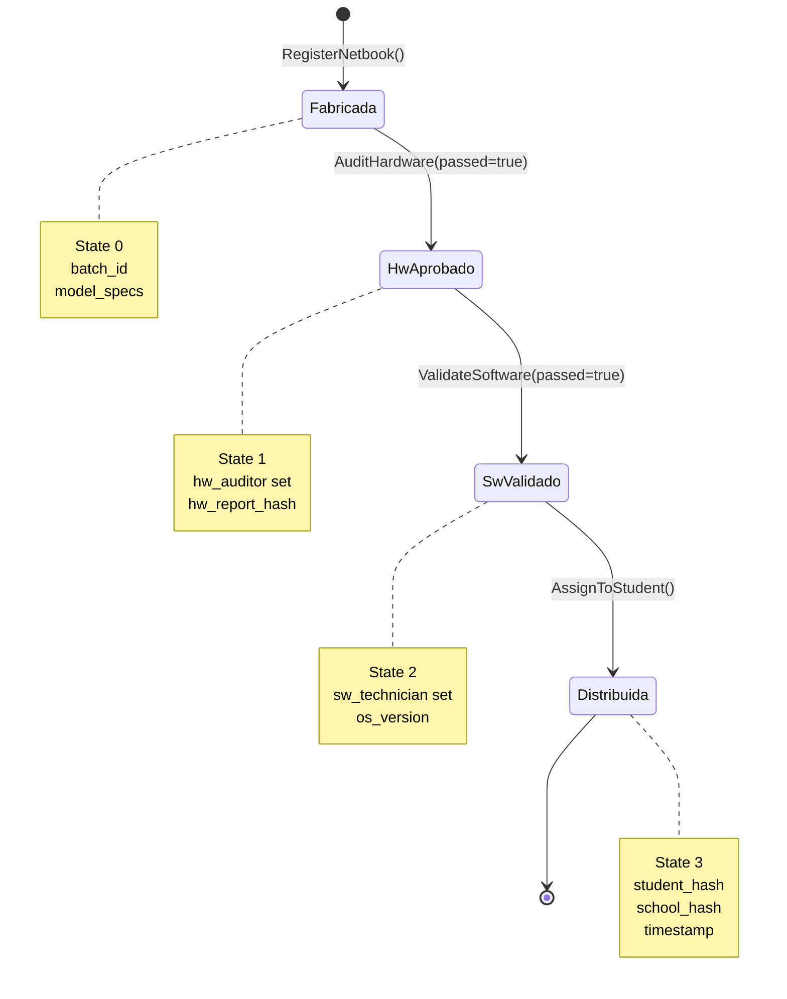

### Role-Based Access Control (RBAC)

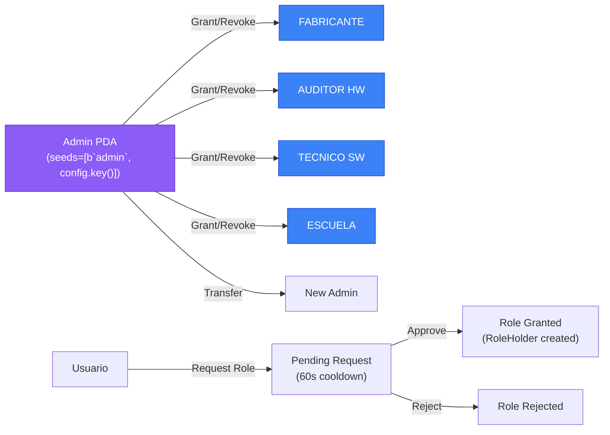

### Role Request Flow

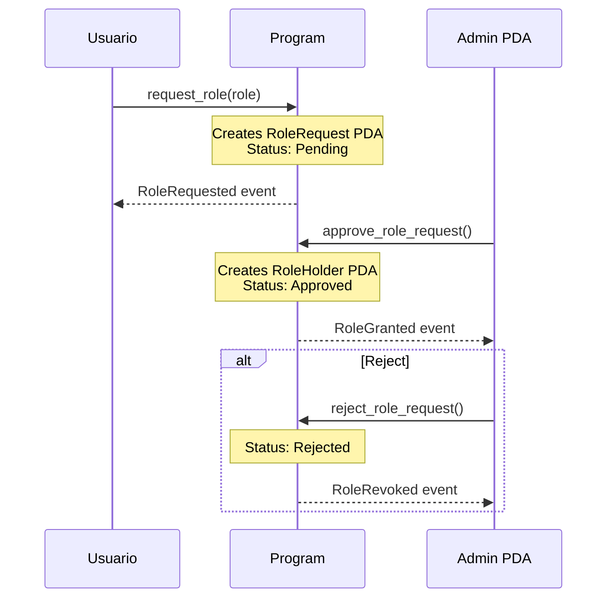

---

## Quick Start

Get the full system running locally in 5 minutes:

```bash
# 1. Clone and install
git clone https://github.com/87maxi/SupplyChainTracker-solana-.git
cd SupplyChainTracker-solana-

# 2. Build Solana program
cd sc-solana && anchor build --ignore-keys && cd ..

# 3. Start Surfpool (local Solana validator)
surfpool start

# 4. Deploy and initialize program
txtx run sc-solana/runbooks/01-deployment/full-init.tx

# 5. Start frontend
cd web && cp .env.example .env.local && npm install && npm run dev

# 6. Open http://localhost:3000
```

---

## Development Setup

### Prerequisites

| Tool | Version | Purpose | Installation |
|------|---------|---------|--------------|
| Rust | 1.75+ (stable) | Solana program compilation | [`rustup`](https://rustup.rs/) |
| Anchor CLI | 0.32.1 | Solana program framework | `cargo install --locked anchor-cli --version 0.32.1` |
| Node.js | 20 LTS | Frontend development | [`nvm`](https://github.com/nvm-sh/nvm) or [nodejs.org](https://nodejs.org) |
| npm | 10+ | Package manager | Bundled with Node.js |
| Solana CLI | 2.1.18 | Solana validator & tools | [`sh -c "$(curl -sSfL https://release.solana.com/stable/install)"`](https://docs.solana.com/cli/install-solana-cli-tools) |
| Surfpool | Latest | Local deployment system | `npm install -g @surfpool/cli` |
| txtx | Latest | Runbook execution engine | `cargo install txtx-cli --locked` |

### Step-by-Step Installation

#### 1. Clone the Repository

```bash
git clone https://github.com/87maxi/SupplyChainTracker-solana-.git
cd SupplyChainTracker-solana-
```

#### 2. Install Solana Tools

```bash
# Install Rust
curl --proto '=https' --tlsv1.2 -sSf https://sh.rustup.rs | sh
source ~/.cargo/env
rustup update stable

# Install Anchor CLI (version 0.32.1 required)
cargo install --locked anchor-cli --version 0.32.1

# Install Solana CLI (version 2.1.18)
sh -c "$(curl -sSfL https://release.solana.com/v2.1.18/install)"
source ~/.local/share/solana/install/active_solana/env

# Install Surfpool CLI
npm install -g @surfpool/cli

# Install txtx runbook runner
cargo install txtx-cli --locked

# Verify installations
anchor --version        # Should show 0.32.1
solana --version        # Should show 2.1.18
surfpool --version
txtx --version
cargo --version
```

#### 3. Build the Solana Program

```bash
cd sc-solana

# Build the program (compiles Rust + generates IDL)
# --ignore-keys skips keypair validation (uses existing program ID)
anchor build --ignore-keys

# This produces:
# - target/deploy/sc_solana.so        (program binary)
# - target/idl/sc_solana.json         (IDL for Surfpool/txtx)

# Verify build
ls -la target/deploy/
ls -la target/idl/

# Run Mollusk unit tests (no validator needed)
cd programs/sc-solana
cargo test --test mollusk-tests        # PDA derivation, discriminators
cargo test --test mollusk-lifecycle    # Full state machine
cargo test --test compute-units        # CU measurement
```

#### 4. Configure Environment Variables

```bash
# Navigate to web directory
cd ../web

# Create local environment file
cp .env.example .env.local

# Edit .env.local with your configuration
nano .env.local
```

**Required Environment Variables (`.env.local`):**

```bash
# Solana Local Validator (Surfpool)
NEXT_PUBLIC_RPC_URL=http://localhost:8899
NEXT_PUBLIC_WS_URL=ws://localhost:8900
NEXT_PUBLIC_CLUSTER=localnet
NEXT_PUBLIC_NETWORK=localnet

# Program ID - MUST match declare_id!() in lib.rs
NEXT_PUBLIC_PROGRAM_ID=7bGrgLgTDyQY4SMmHpQpdT2VDur8iVCRGBBjSMrcCvrb

# WalletConnect (optional - for Phantom mobile)
# NEXT_PUBLIC_WALLETCONNECT_PROJECT_ID=your_project_id

# Debug (optional)
# NEXT_PUBLIC_DEBUG_MODE=true
```

**Environment Profiles:**

| Profile | RPC URL | Cluster | Use Case |
|---------|---------|---------|----------|
| Localnet | `http://localhost:8899` | `localnet` | Development with Surfpool |
| Devnet | `https://api.devnet.solana.com` | `devnet` | Testing on Solana devnet |
| Mainnet | `https://api.mainnet-beta.solana.com` | `mainnet` | Production |

#### 5. Install Frontend Dependencies

```bash
# Install all dependencies
npm install

# Verify installation
npm list --depth=0
```

#### 6. Generate Codama Types (if needed)

```bash
# Codama types are committed to the repo, but regenerate if program changes:
cd ../sc-solana
npx codama run --all
# This generates TypeScript types in ../web/src/generated/
```

### Local Development with Surfpool

Surfpool provides a managed local Solana simulator (Simnet) that eliminates the need for manual validator management.

#### Start Surfpool Simnet

```bash
# Start Surfpool (local Solana validator)
surfpool start

# Simnet runs on:
# - RPC: http://localhost:8899
# - WebSocket: ws://localhost:8900

# Verify Simnet is running
solana balance --url http://localhost:8899
```

#### Deploy and Initialize Program

```bash
# Method 1: Full initialization (deploy + fund + initialize + grant roles)
txtx run sc-solana/runbooks/01-deployment/full-init.tx

# Method 2: Step-by-step
# Step 1: Deploy program
txtx run sc-solana/runbooks/01-deployment/deploy-program.tx

# Step 2: Fund deployer PDA
txtx run sc-solana/runbooks/01-deployment/fund-deployer.tx

# Step 3: Initialize config
txtx run sc-solana/runbooks/01-deployment/initialize-config.tx

# Step 4: Grant roles to pre-generated keypairs
txtx run sc-solana/runbooks/01-deployment/grant-all-to-deployer.tx
```

#### Verify Deployment

```bash
# Check program is deployed
solana program show --program-id 7bGrgLgTDyQY4SMmHpQpdT2VDur8iVCRGBBjSMrcCvrb \
  --url http://localhost:8899

# Query config using txtx
txtx run sc-solana/runbooks/02-operations/query/query-config.tx

# List available runbooks
txtx ls sc-solana/runbooks/
```

#### Start Frontend Development Server

```bash
cd web
npm run dev

# The frontend runs on:
# - HTTP: http://localhost:3000
# - The server will hot-reload on file changes
```

#### Stop Surfpool When Done

```bash
surfpool stop
```

**Surfpool vs solana-test-validator:**

| Feature | Surfpool | solana-test-validator |
|---------|----------|----------------------|
| Setup | Single command (`surfpool start`) | Manual config + keypair funding |
| Program Deployment | Automatic via runbooks | Manual (`anchor deploy`) |
| Explorer | Built-in (if available) | None |
| State Persistence | Managed via `.surfpool/` | Ledger directory |
| MCP Server | `surfpool mcp` | N/A |
| Recommended | ✅ Yes | Manual setups only |

**Troubleshooting Surfpool:**

```bash
# If you get "Address already in use" error:
lsof -ti:8899 | xargs kill -9
surfpool start

# Check Surfpool logs
cat .surfpool/logs/simnet_*.log

# Verify Simnet is running
solana balance --url http://localhost:8899
```

### Account Management for RBAC

The RBAC (Role-Based Access Control) system requires Solana accounts (keypairs) to be created and funded before roles can be assigned.

#### Pre-generated Keypairs

The project includes pre-generated keypairs for each role in `config/keypairs/`:

| Role | Keypair File | Address |
|------|-------------|---------|
| Admin | `config/keypairs/admin_new.json` | `GdbFCcdZ2hBzx9PXLkXchBHx9EcZYLVeHbrXxtACmNTg` |
| Fabricante | `config/keypairs/fabricante.json` | `HrhY7bqE3EwabHHZKU3yqShrtkqWfbYoLt3HfVofggeK` |
| Auditor HW | `config/keypairs/auditor_hw.json` | `AfB2jE6T3mSq3ijWQ7EX51RpphWuoY9PpEnu2BK2j86D` |
| Tecnico SW | `config/keypairs/tecnico_sw.json` | `3pmKDqD4oTzHR8djXpfXPpwp71d5kFfHFQmxG41tApKf` |
| Escuela | `config/keypairs/escuela.json` | `7RXymetjyToHhMZfRdeQz6u5KHQPrpvVoyquAExcdhay` |

#### Funding Accounts (Localnet)

```bash
# Airdrop SOL to all pre-generated keypairs
for keypair in config/keypairs/*.json; do
  addr=$(solana address --keypair "$keypair")
  echo "Airdropping 10 SOL to $addr ($keypair)"
  solana airdrop 10 "$addr" --url http://localhost:8899
done
```

#### Loading Keypairs into Phantom Wallet

1. **Export the private key**:
   ```bash
   cat config/keypairs/admin_new.json
   ```

2. **Import into Phantom**:
   - Open Phantom Wallet extension
   - Settings → Security & Privacy → Import Existing Wallet
   - Choose "Secret Recovery Phrase" or "Raw Key"
   - Paste the private key from the JSON file

3. **Connect to the dApp**:
   - Navigate to `http://localhost:3000`
   - Click "Connect Wallet"
   - Select the imported account from Phantom

#### Assigning Roles via Admin Dashboard

1. Navigate to **Admin Dashboard**: `http://localhost:3000/admin`
2. Go to **Pending Role Requests**: `http://localhost:3000/admin/roles/pending-requests`
3. Review pending role requests from users
4. Click **Approve** or **Reject** on each request
5. Confirm the transaction in Phantom wallet

#### Programmatic Role Assignment (txtx)

```bash
cd sc-solana

# Grant a role to an account
txtx run runbooks/03-role-management/add-role-holder.tx \
  --role FABRICANTE \
  --holder HrhY7bqE3EwabHHZKU3yqShrtkqWfbYoLt3HfVofggeK

# Request a role (as the user)
txtx run runbooks/03-role-management/request-role.tx \
  --role AUDITOR_HW
```

### Development Workflow

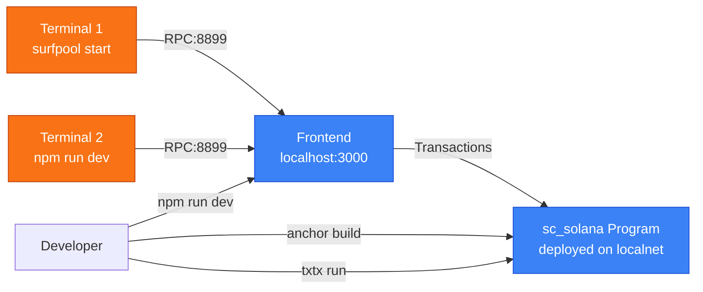

### Recommended Terminal Layout

| Terminal | Command | Purpose |
|----------|---------|---------|
| 1 | `surfpool start` | Local Solana validator (Surfpool) |
| 2 | `cd web && npm run dev` | Frontend dev server |
| 3 | `cd sc-solana && anchor build --watch` | Program build watcher |
| 4 | `cd sc-solana && cargo test` | Run tests on demand |

---

## Solana Anchor Program

### Program ID

```
Program ID: 7bGrgLgTDyQY4SMmHpQpdT2VDur8iVCRGBBjSMrcCvrb
```

> **Nota Crítico:** El Program ID debe ser consistente en tres lugares:
> 1. [`declare_id!`](sc-solana/programs/sc-solana/src/lib.rs:17) en lib.rs
> 2. [`target/idl/sc_solana.json`](sc-solana/target/idl/sc_solana.json) (generado por Anchor)
> 3. [`Anchor.toml`](sc-solana/Anchor.toml:11) (`[programs.localnet]`)

Si hay mismatch entre el keypair y el IDL, el deploy con surfpool/txtx fallará con:
```
program keypair does not match program pubkey found in IDL
```

### State Accounts

El programa utiliza 5 tipos de cuentas de estado (todas PDA-based):

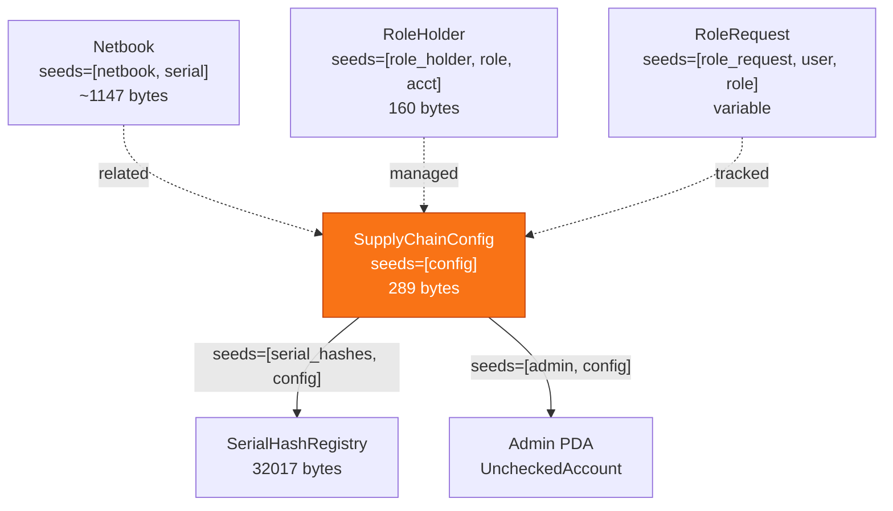

#### SupplyChainConfig

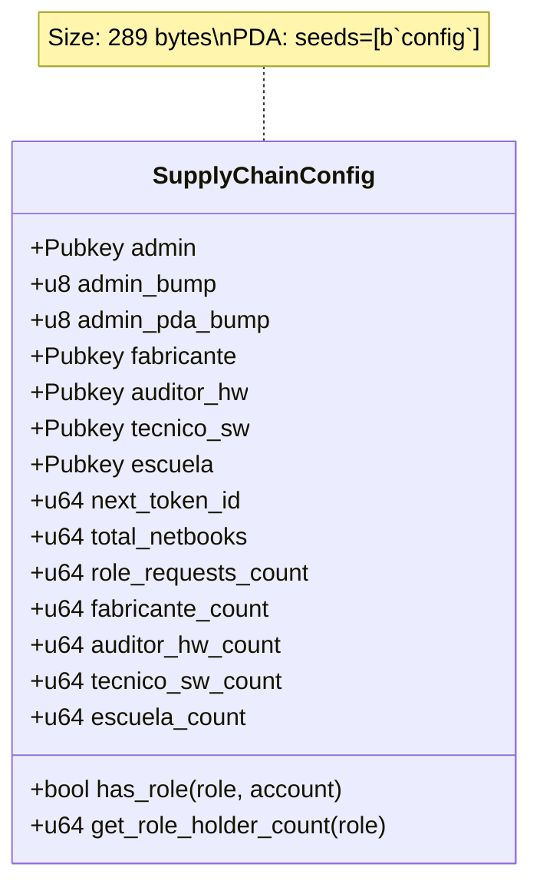

**Campos:**
| Campo | Tipo | Descripción |
|-------|------|-------------|
| `admin` | `Pubkey` | Admin PDA address |
| `admin_bump` | `u8` | Bump seed for Config PDA (`seeds=[b"config"]`) |
| `admin_pda_bump` | `u8` | Bump seed for Admin PDA (`seeds=[b"admin", config.key()]`) |
| `fabricante` | `Pubkey` | Legacy single fabricante (multiple holders via RoleHolder) |
| `auditor_hw` | `Pubkey` | Legacy single auditor (multiple holders via RoleHolder) |
| `tecnico_sw` | `Pubkey` | Legacy single technician (multiple holders via RoleHolder) |
| `escuela` | `Pubkey` | Legacy single school (multiple holders via RoleHolder) |
| `next_token_id` | `u64` | Next token ID to assign |
| `total_netbooks` | `u64` | Total registered netbooks |
| `role_requests_count` | `u64` | Total role requests |
| `*_count` | `u64` | Role holder counts per role type |

#### SerialHashRegistry

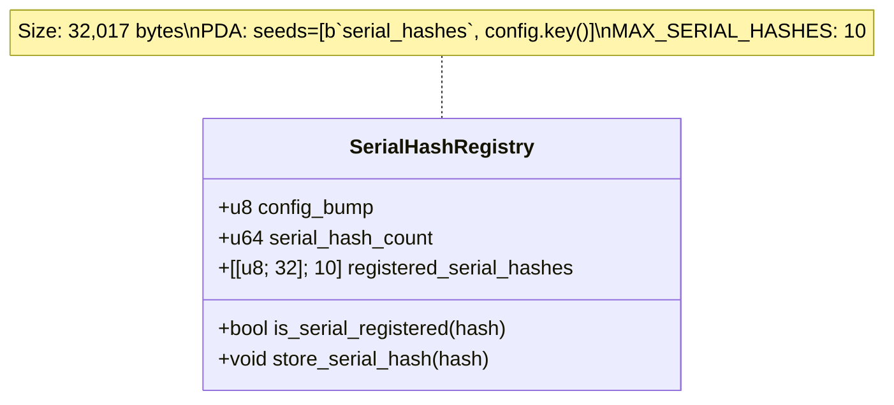

**Función:** Detección de duplicados de serial_number para prevenir registro duplicado.

#### Netbook

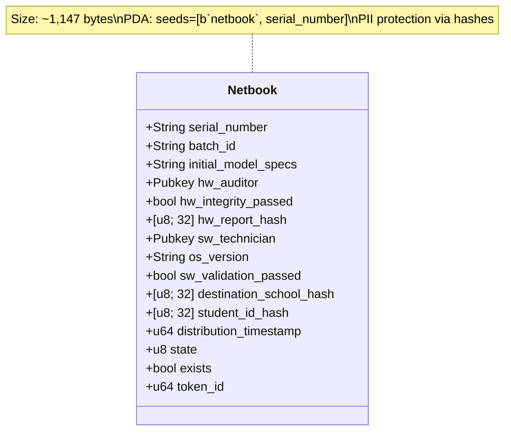

**Campos:**
| Campo | Tipo | Límite | Descripción |
|-------|------|--------|-------------|
| `serial_number` | `String` | 200 chars | Número de serie único |
| `batch_id` | `String` | 100 chars | ID del lote de fabricación |
| `initial_model_specs` | `String` | 500 chars | Especificaciones del modelo |
| `hw_auditor` | `Pubkey` | - | Address del auditor HW |
| `hw_integrity_passed` | `bool` | - | Resultado auditoría HW |
| `hw_report_hash` | `[u8; 32]` | - | Hash del reporte HW (SHA-256) |
| `sw_technician` | `Pubkey` | - | Address del técnico SW |
| `os_version` | `String` | 100 chars | Versión del OS instalado |
| `sw_validation_passed` | `bool` | - | Resultado validación SW |
| `destination_school_hash` | `[u8; 32]` | - | Hash PII de la escuela |
| `student_id_hash` | `[u8; 32]` | - | Hash PII del estudiante |
| `distribution_timestamp` | `u64` | - | Timestamp de distribución |
| `state` | `u8` | - | Estado actual (NetbookState) |
| `exists` | `bool` | - | Flag de existencia |
| `token_id` | `u64` | - | Token ID único |

#### RoleHolder

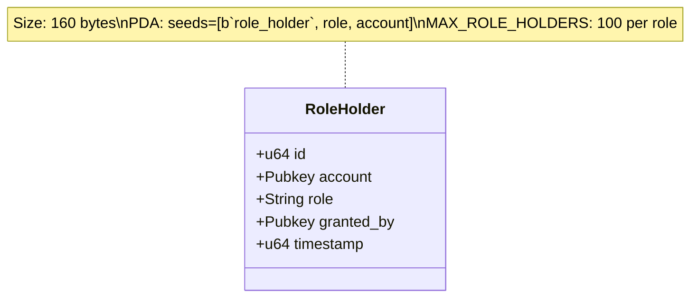

#### RoleRequest

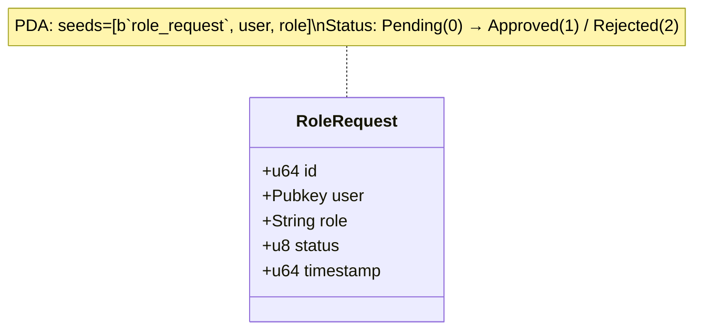

### Netbook State Machine

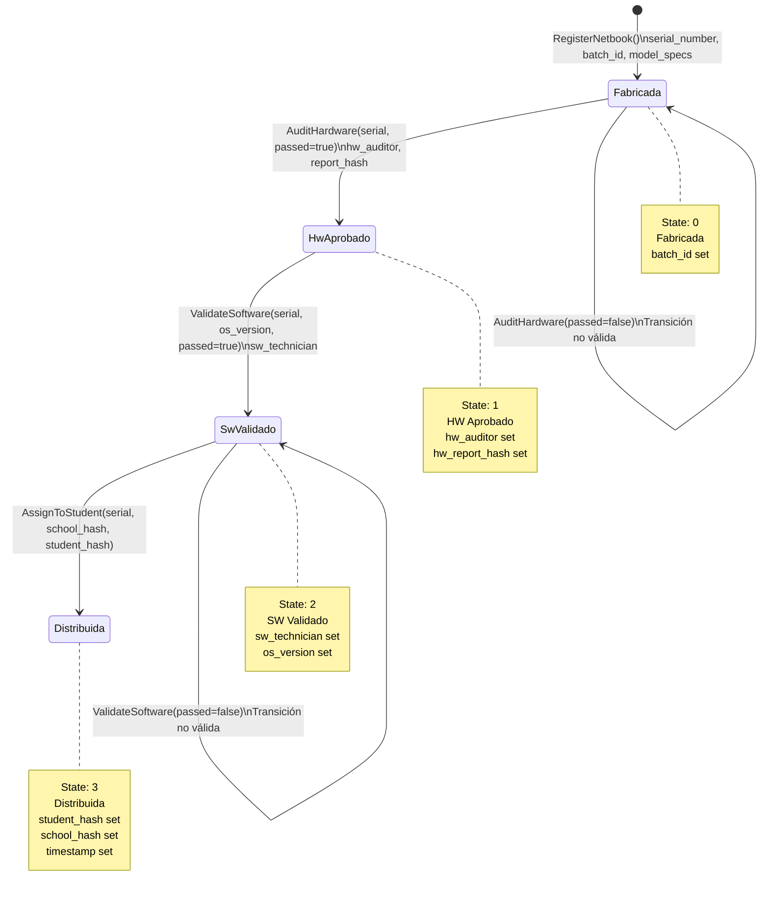

### Instructions

El programa implementa 22 instrucciones organizadas en 5 módulos:

```mermaid
graph TD
    Program["sc_solana Program"] --> Deployer["deployer/"]
    Program --> Init["initialize/"]
    Program --> Netbook["netbook/"]
    Program --> Role["role/"]
    Program --> Query["query/"]

    Deployer --> fund["fund_deployer()"]
    Deployer --> close["close_deployer()"]

    Init --> init["initialize()"]

    Netbook --> reg["register_netbook()"]
    Netbook --> regBatch["register_netbooks_batch()"]
    Netbook --> audit["audit_hardware()"]
    Netbook --> validate["validate_software()"]
    Netbook --> assign["assign_to_student()"]

    Role --> grant["grant_role()"]
    Role --> revoke["revoke_role()"]
    Role --> req["request_role()"]
    Role --> approve["approve_role_request()"]
    Role --> reject["reject_role_request()"]
    Role --> reset["reset_role_request()"]
    Role --> addHolder["add_role_holder()"]
    Role --> removeHolder["remove_role_holder()"]
    Role --> closeHolder["close_role_holder()"]
    Role --> transfer["transfer_admin()"]

    Query --> queryNB["query_netbook_state()"]
    Query --> queryCfg["query_config()"]
    Query --> queryRole["query_role()"]

    classDef module fill:#f97316,stroke:#c2410c,color:#fff
    class Deployer,Init,Netbook,Role,Query module
```

#### Instruction Details

| Module | Instruction | Accounts | Description |
|--------|-------------|----------|-------------|
| **deployer** | `fund_deployer` | deployer (PDA), funder, system | Fund the deployer PDA for rent exemption |
| **deployer** | `close_deployer` | deployer (PDA), funder | Close deployer and return funds |
| **initialize** | `initialize` | config, serial_hash_registry, admin, deployer, funder, system | Initialize all accounts |
| **netbook** | `register_netbook` | config, netbook (PDA), manufacturer, system | Register single netbook |
| **netbook** | `register_netbooks_batch` | config, manufacturer, system | Register multiple netbooks |
| **netbook** | `audit_hardware` | config, netbook (PDA), auditor, system | Hardware audit |
| **netbook** | `validate_software` | config, netbook (PDA), technician, system | Software validation |
| **netbook** | `assign_to_student` | config, netbook (PDA), system | Assign to student |
| **role** | `grant_role` | config, role_holder (PDA), admin, recipient, system | Grant role with consent |
| **role** | `revoke_role` | config, role_holder (PDA), admin, system | Revoke role |
| **role** | `request_role` | config, role_request (PDA), requester, system | Request role (60s cooldown) |
| **role** | `approve_role_request` | config, role_request (PDA), role_holder (PDA), admin, system | Approve request |
| **role** | `reject_role_request` | config, role_request (PDA), admin, system | Reject request |
| **role** | `reset_role_request` | config, role_request (PDA), requester, system | Reset request |
| **role** | `add_role_holder` | config, role_holder (PDA), admin, system | Add holder to role |
| **role** | `remove_role_holder` | config, role_holder (PDA), admin, system | Remove holder from role |
| **role** | `close_role_holder` | config, role_holder (PDA), admin, system | Close role_holder account |
| **role** | `transfer_admin` | config, admin (PDA), new_admin, system | Transfer admin role |
| **query** | `query_netbook_state` | config, netbook (PDA), system | Query netbook state |
| **query** | `query_config` | config, system | Query config |
| **query** | `query_role` | config, system | Query role membership |

### Events

El programa emite 18 eventos organizados en 3 categorías:

#### Netbook Events
| Event | Fields | Description |
|-------|--------|-------------|
| `NetbookRegistered` | serial_number, batch_id, token_id | Netbook registered |
| `HardwareAudited` | serial_number, auditor, passed, report_hash | Hardware audit completed |
| `SoftwareValidated` | serial_number, technician, os_version, passed | Software validation completed |
| `NetbookAssigned` | serial_number, school_hash, student_hash, timestamp | Netbook assigned to student |

#### Role Events
| Event | Fields | Description |
|-------|--------|-------------|
| `RoleGranted` | role, account, granted_by | Role granted to account |
| `RoleRevoked` | role, account, revoked_by | Role revoked from account |
| `RoleRequested` | role, user, request_id | Role request created |
| `RoleRequestApproved` | role, user, request_id | Role request approved |
| `RoleRequestRejected` | role, user, request_id | Role request rejected |

#### System Events
| Event | Fields | Description |
|-------|--------|-------------|
| `ConfigInitialized` | admin, bump | Config account initialized |
| `AdminTransferred` | old_admin, new_admin | Admin role transferred |
| `DeployerFunded` | amount | Deployer PDA funded |
| `DeployerClosed` | amount_returned | Deployer PDA closed |

### Errors

| Code | Name | Description |
|------|------|-------------|
| 6000 | `InvalidStateTransition` | Invalid state transition for netbook |
| 6001 | `UnauthorizedRole` | Caller does not have required role |
| 6002 | `SerialAlreadyRegistered` | Serial number already exists |
| 6003 | `NetbookNotFound` | Netbook account not found |
| 6004 | `RoleAlreadyGranted` | Role already granted to account |
| 6005 | `RoleRequestCooldown` | Role request cooldown active (60s) |
| 6006 | `MaxRoleHoldersReached` | Maximum role holders (100) reached |
| 6007 | `InvalidRole` | Invalid role type |
| 6008 | `ConfigNotInitialized` | Config account not initialized |
| 6009 | `DeployerNotFunded` | Deployer PDA not funded |
| 6010 | `BatchTooLarge` | Batch size exceeds maximum |
| 6011 | `StringTooLong` | String exceeds maximum length |
| 6012 | `InvalidHash` | Invalid hash format |
| 6013 | `RoleRequestNotFound` | Role request not found |
| 6014 | `RoleRequestAlreadyProcessed` | Role request already processed |

---

## Frontend Web Application

### Technology Stack

| Category | Technology | Version | Purpose |
|----------|-----------|---------|---------|
| Framework | Next.js | 14+ (App Router) | Full-stack React framework |
| Language | TypeScript | 5.7+ | Type-safe development |
| Styling | Tailwind CSS | 3+ | Utility-first CSS framework |
| UI Components | shadcn/ui | Latest | Accessible component library |
| Solana Client | @solana/kit | 6.9+ | Modern Solana client |
| React Hooks | @solana/react-hooks | Latest | Solana wallet hooks |
| Wallet | Wallet Standard | Latest | Wallet connection (Phantom, etc.) |
| State | React Hooks + Zustand | - | Client state management |
| Forms | react-hook-form + zod | Latest | Form validation |
| Testing | Jest + Playwright | Latest | Unit + E2E testing |
| Code Generation | Codama | Latest | TypeScript types from Anchor IDL |

### Directory Structure

```
web/
├── src/
│   ├── app/                    # Next.js App Router
│   │   ├── layout.tsx          # Root layout with providers
│   │   ├── page.tsx            # Landing page
│   │   ├── dashboard/          # Dashboard pages
│   │   │   ├── page.tsx        # Main dashboard
│   │   │   └── components/     # Dashboard components
│   │   │       ├── RoleActions.tsx
│   │   │       ├── StatusBadge.tsx
│   │   │       └── TrackingCard.tsx
│   │   └── admin/              # Admin pages
│   │       └── components/     # Admin components
│   ├── components/             # Shared components
│   │   ├── contracts/          # Blockchain interaction forms
│   │   │   ├── NetbookForm.tsx
│   │   │   ├── HardwareAuditForm.tsx
│   │   │   ├── SoftwareValidationForm.tsx
│   │   │   └── StudentAssignmentForm.tsx
│   │   ├── real-time/          # Real-time components
│   │   │   └── ConnectionIndicator.tsx
│   │   └── ui/                 # shadcn/ui components
│   ├── generated/              # Codama-generated types (committed)
│   │   └── src/generated/      # TypeScript types from Anchor IDL
│   │       ├── accounts/       # Account type definitions
│   │       ├── instructions/   # Instruction builders
│   │       ├── pdas/           # PDA derivation helpers
│   │       ├── programs/       # Program definitions
│   │       └── errors/         # Error definitions
│   ├── hooks/                  # Custom React hooks
│   │   ├── useSupplyChainService.ts
│   │   └── useSolanaWeb3.ts
│   ├── lib/                    # Utilities
│   │   ├── activity-logger.ts  # In-memory activity logger
│   │   ├── cache/              # Cache service
│   │   │   └── cache-service.ts
│   │   └── contracts/          # Contract integration
│   │       ├── SupplyChainContract.ts
│   │       └── solana-program.ts
│   ├── services/               # Service layer
│   │   └── UnifiedSupplyChainService.ts
│   └── types/                  # TypeScript type definitions
├── e2e/                        # Playwright E2E tests
│   ├── full-flow.spec.ts
│   └── playwright.config.ts
├── public/                     # Static assets
├── .env.local                  # Local environment variables
├── .env.ci                     # CI environment variables
├── next.config.js              # Next.js configuration
├── tailwind.config.ts          # Tailwind CSS configuration
└── tsconfig.json               # TypeScript configuration
```

### Pages & Routes

| Route | Component | Description |
|-------|-----------|-------------|
| `/` | Landing Page | Welcome page with features overview |
| `/dashboard` | ManagerDashboard | Main dashboard with netbook tracking |
| `/admin` | AdminDashboard | Admin panel for role management |
| `/admin/roles/pending-requests` | PendingRequests | Role request approval/rejection |

### Hooks Architecture

| Hook | Purpose |
|------|---------|
| `useSupplyChainService` | Main hook for all blockchain operations |
| `useSolanaWeb3` | Solana connection and wallet management |
| `useWallet` | Wallet connection state (@solana/react-hooks) |

### Services Layer

| Service | Purpose |
|---------|---------|
| `UnifiedSupplyChainService` | Unified service for all program interactions |
| `CacheService` | TTL-based caching with tags |
| `ActivityLogger` | In-memory activity tracking |
| `SolanaEventListener` | WebSocket-based real-time updates |

### Components Library

| Component | Purpose |
|-----------|---------|
| `NetbookForm` | Register new netbook |
| `HardwareAuditForm` | Perform hardware audit |
| `SoftwareValidationForm` | Validate software installation |
| `StudentAssignmentForm` | Assign netbook to student |
| `ConnectionIndicator` | Wallet connection status |
| `StatusBadge` | Netbook lifecycle status display |
| `RoleActions` | Role management actions |
| `TrackingCard` | Netbook tracking card |

---

## Testing

### Solana Program Tests

```bash
cd sc-solana

# Mollusk unit tests (in-process SVM, no validator needed)
cd programs/sc-solana
cargo test --test mollusk-tests        # PDA derivation, discriminators, error codes
cargo test --test mollusk-lifecycle    # Full lifecycle state machine
cargo test --test compute-units        # Compute unit measurement

# Rust formatting and linting
cd ../..
cargo fmt --check
cargo clippy -- -D warnings
```

#### Test Files

| File | Description | Type |
|------|-------------|------|
| `programs/sc-solana/tests/mollusk-tests.rs` | PDA derivation, discriminators, error codes | Mollusk (in-process SVM) |
| `programs/sc-solana/tests/mollusk-lifecycle.rs` | Full lifecycle state machine, roles, encoding | Mollusk (in-process SVM) |
| `programs/sc-solana/tests/compute-units.rs` | Compute unit measurement per instruction | Mollusk (CU profiling) |

> **Note**: Mollusk tests run in-process with the Solana runtime simulation and do not require a validator. These are the primary tests used in CI for fast, reliable program validation.

### Frontend Tests

```bash
cd web

# Jest unit tests
npm test

# E2E tests with Playwright
npm run test:e2e

# E2E tests with UI
npm run test:e2e:ui

# TypeScript type checking
npx tsc --noEmit

# ESLint
npx eslint src/
```

### CI/CD Pipeline

The GitHub Actions CI pipeline runs 14 jobs:

| Job | Description |
|-----|-------------|
| `rust-lint` | cargo fmt + clippy |
| `build-program` | cargo check --all-targets |
| `test-mollusk` | Mollusk unit tests |
| `test-mollusk-lifecycle` | Full state machine tests |
| `type-check` | TypeScript type checking |
| `frontend-lint` | ESLint |
| `test-unit` | Jest unit tests |
| `build-frontend` | Next.js production build |
| `test-e2e` | Playwright E2E tests (Chromium) |
| `test-e2e-full-flow` | Full user flow E2E tests |
| `security-scan` | Vulnerability scanning |
| `test-runbooks` | Runbook syntax validation |
| `compute-report` | Compute unit reporting |
| `summary` | Pipeline status aggregation |

---

## Deployment

### Deploy to Devnet

```bash
cd sc-solana

# Build program
anchor build --ignore-keys

# Deploy to devnet
anchor deploy --provider.cluster devnet

# Update frontend environment
# In web/.env.local:
# NEXT_PUBLIC_RPC_URL=https://api.devnet.solana.com
# NEXT_PUBLIC_CLUSTER=devnet
```

### Deploy to Mainnet

```bash
cd sc-solana

# Deploy to mainnet (requires sufficient SOL for rent)
anchor deploy --provider.cluster mainnet

# Update frontend environment
# In web/.env.local:
# NEXT_PUBLIC_RPC_URL=https://api.mainnet-beta.solana.com
# NEXT_PUBLIC_CLUSTER=mainnet
```

---

## Troubleshooting

### Common Issues

#### "Program ID mismatch"

```
Error: Program ID mismatch detected
```

**Solution:** Ensure the program ID is consistent in:
1. `sc-solana/programs/sc-solana/src/lib.rs` — `declare_id!()`
2. `sc-solana/target/idl/sc_solana.json` — `"address"` field
3. `sc-solana/Anchor.toml` — `[programs.localnet]`
4. `web/.env.local` — `NEXT_PUBLIC_PROGRAM_ID`

#### "Address already in use" (port 8899)

```bash
lsof -ti:8899 | xargs kill -9
surfpool start
```

#### "Cannot find module '@/generated/...'"

```bash
cd sc-solana
anchor build --ignore-keys
npx codama run --all
```

#### "Program not deployed"

```bash
# Check if program is deployed
solana program show --program-id 7bGrgLgTDyQY4SMmHpQpdT2VDur8iVCRGBBjSMrcCvrb \
  --url http://localhost:8899

# If not deployed, run full initialization
txtx run sc-solana/runbooks/01-deployment/full-init.tx
```

#### "Insufficient funds"

```bash
# Airdrop SOL to your wallet (localnet only)
solana airdrop 100 <YOUR_ADDRESS> --url http://localhost:8899
```

#### Frontend build errors

```bash
cd web
rm -rf .next node_modules/.cache
npm run clean-build
```

---

## License

MIT License — See [LICENSE](LICENSE) for details.
