# SupplyChainTracker - Solana Anchor Implementation

> **Trazabilidad Inmutable para la Educación** — Plataforma blockchain para rastrear la distribución de netbooks educativas en Solana.

[](https://solana.com)
[](https://www.anchor-lang.com)
[](https://nextjs.org)
[](LICENSE)

---

## Tabla de Contenidos

1. [Overview](#overview)
2. [Solana Anchor Program](#solana-anchor-program)
   - [Program ID](#program-id)
   - [State Accounts](#state-accounts)
   - [Netbook State Machine](#netbook-state-machine)
   - [Instructions](#instructions)
   - [Events](#events)
   - [Errors](#errors)
3. [Frontend Web Application](#frontend-web-application)
   - [Technology Stack](#technology-stack)
   - [Directory Structure](#directory-structure)
   - [Pages & Routes](#pages--routes)
   - [Hooks Architecture](#hooks-architecture)
   - [Services Layer](#services-layer)
   - [Components Library](#components-library)
4. [Development Setup](#development-setup)
5. [Testing](#testing)
6. [Deployment](#deployment)
7. [Troubleshooting](#troubleshooting)

---

## Overview

SupplyChainTracker es un sistema de trazabilidad descentralizado que migra un sistema existente de Ethereum/Solidity a Solana/Anchor. El programa rastrea el ciclo de vida completo de netbooks educativas desde su fabricación hasta su distribución a estudiantes.

### Netbook Lifecycle

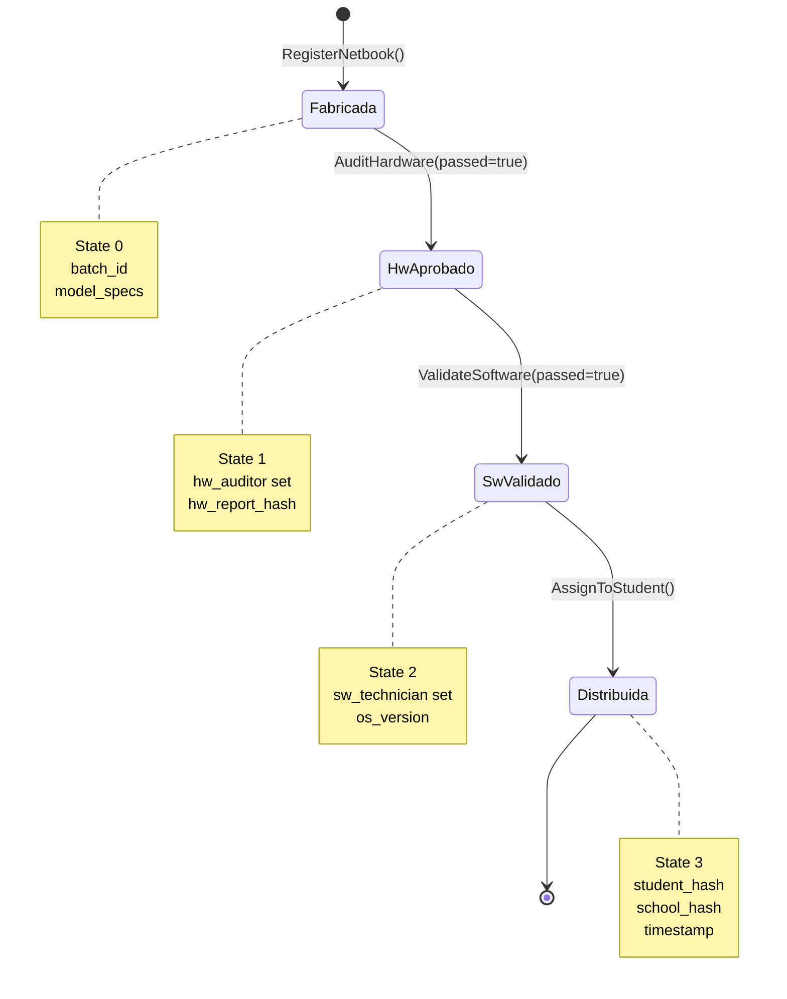

### Role-Based Access Control (RBAC)

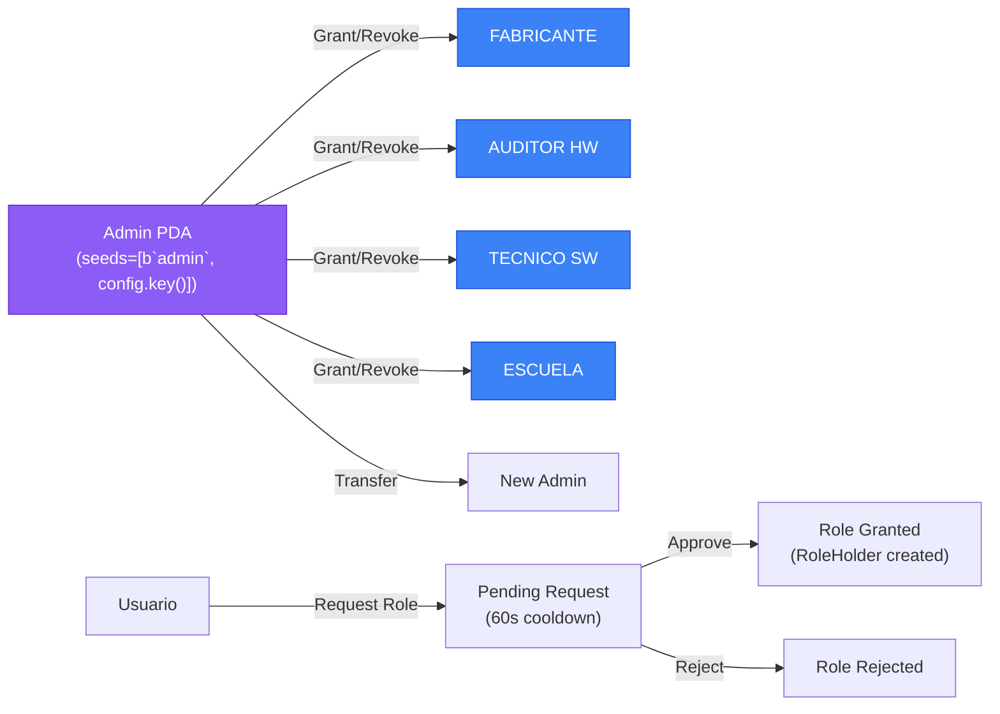

### Role Request Flow

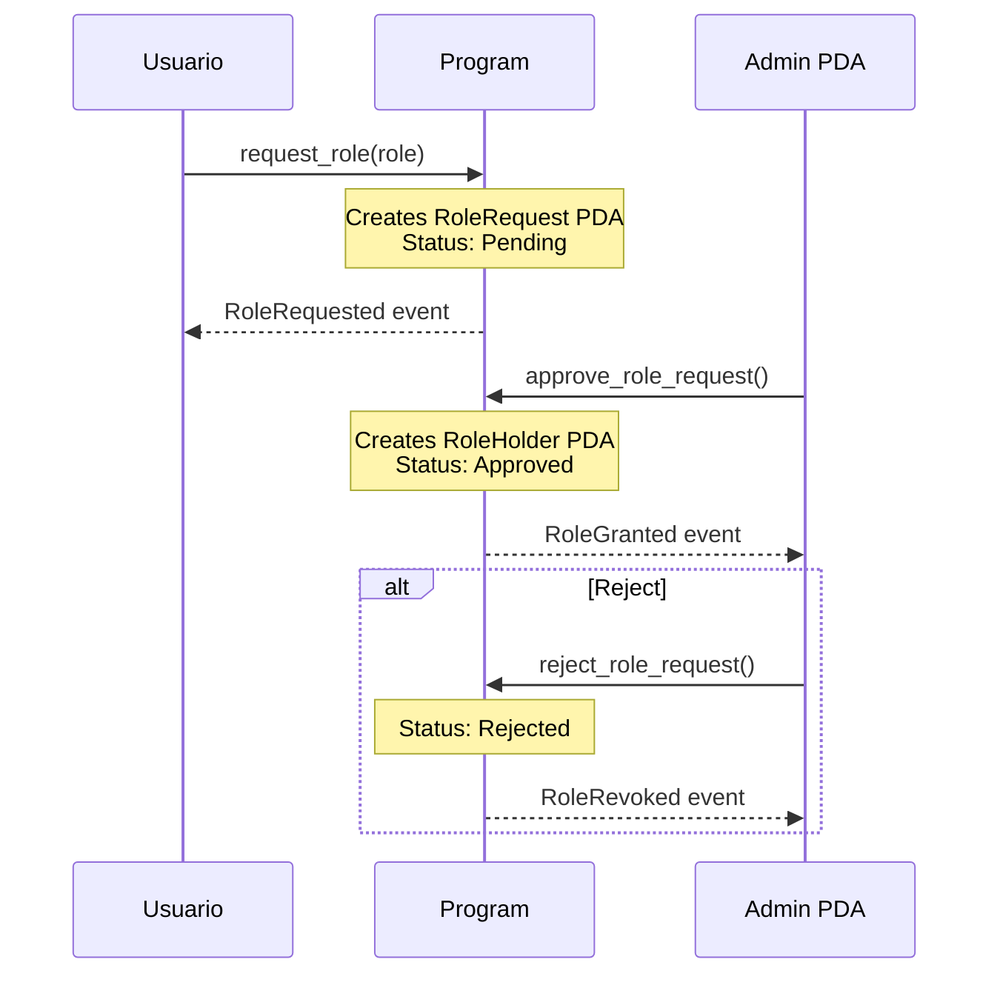

---

## Solana Anchor Program

### Program ID

```
Program ID: 7bGrgLgTDyQY4SMmHpQpdT2VDur8iVCRGBBjSMrcCvrb
```

> **Nota Crítico:** El Program ID debe ser consistente en tres lugares:
> 1. [`declare_id!`](sc-solana/programs/sc-solana/src/lib.rs:17) en lib.rs
> 2. [`target/idl/sc_solana.json`](sc-solana/target/idl/sc_solana.json) (generado por Anchor)
> 3. [`Anchor.toml`](sc-solana/Anchor.toml:11) (`[programs.localnet]`)

Si hay mismatch entre el keypair y el IDL, el deploy con surfpool/txtx fallará con:
```
program keypair does not match program pubkey found in IDL
```

### State Accounts

El programa utiliza 5 tipos de cuentas de estado (todas PDA-based):

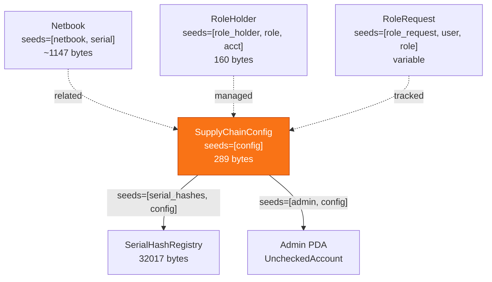

#### SupplyChainConfig

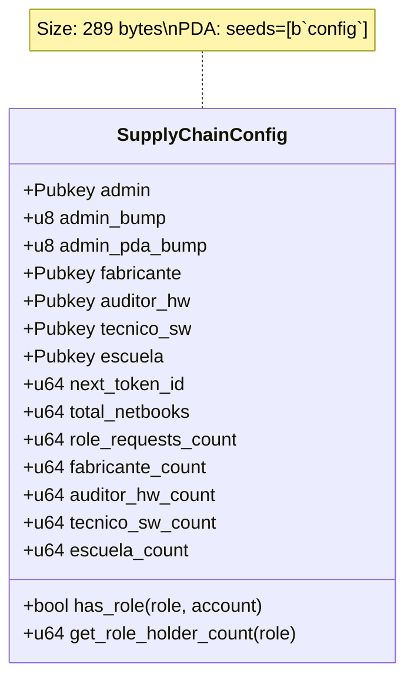

**Campos:**
| Campo | Tipo | Descripción |
|-------|------|-------------|
| `admin` | `Pubkey` | Admin PDA address |
| `admin_bump` | `u8` | Bump seed for Config PDA (`seeds=[b"config"]`) |
| `admin_pda_bump` | `u8` | Bump seed for Admin PDA (`seeds=[b"admin", config.key()]`) |
| `fabricante` | `Pubkey` | Legacy single fabricante (multiple holders via RoleHolder) |
| `auditor_hw` | `Pubkey` | Legacy single auditor (multiple holders via RoleHolder) |
| `tecnico_sw` | `Pubkey` | Legacy single technician (multiple holders via RoleHolder) |
| `escuela` | `Pubkey` | Legacy single school (multiple holders via RoleHolder) |
| `next_token_id` | `u64` | Next token ID to assign |
| `total_netbooks` | `u64` | Total registered netbooks |
| `role_requests_count` | `u64` | Total role requests |
| `*_count` | `u64` | Role holder counts per role type |

#### SerialHashRegistry

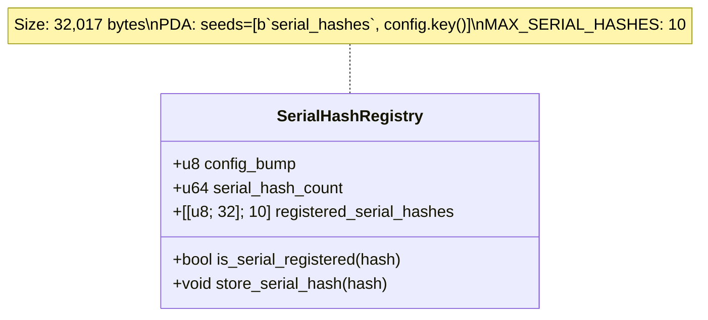

**Función:** Detección de duplicados de serial_number para prevenir registro duplicado.

#### Netbook

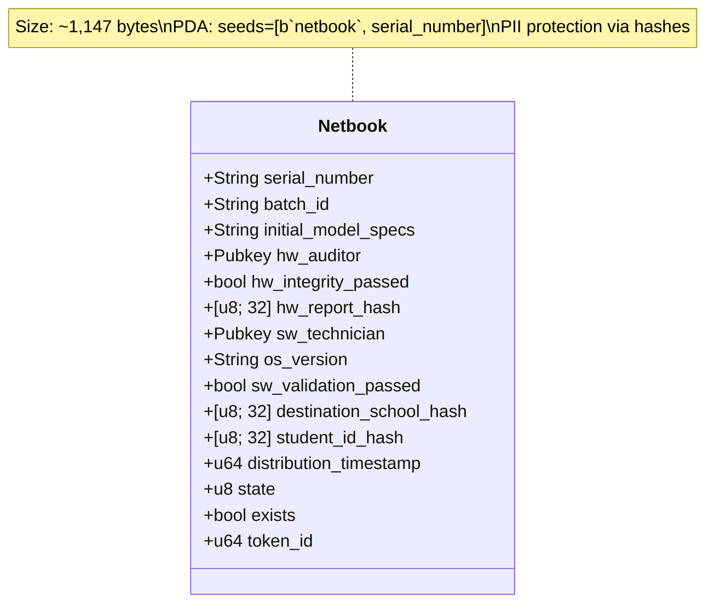

**Campos:**
| Campo | Tipo | Límite | Descripción |
|-------|------|--------|-------------|
| `serial_number` | `String` | 200 chars | Número de serie único |
| `batch_id` | `String` | 100 chars | ID del lote de fabricación |
| `initial_model_specs` | `String` | 500 chars | Especificaciones del modelo |
| `hw_auditor` | `Pubkey` | - | Address del auditor HW |
| `hw_integrity_passed` | `bool` | - | Resultado auditoría HW |
| `hw_report_hash` | `[u8; 32]` | - | Hash del reporte HW (SHA-256) |
| `sw_technician` | `Pubkey` | - | Address del técnico SW |
| `os_version` | `String` | 100 chars | Versión del OS instalado |
| `sw_validation_passed` | `bool` | - | Resultado validación SW |
| `destination_school_hash` | `[u8; 32]` | - | Hash PII de la escuela |
| `student_id_hash` | `[u8; 32]` | - | Hash PII del estudiante |
| `distribution_timestamp` | `u64` | - | Timestamp de distribución |
| `state` | `u8` | - | Estado actual (NetbookState) |
| `exists` | `bool` | - | Flag de existencia |
| `token_id` | `u64` | - | Token ID único |

#### RoleHolder

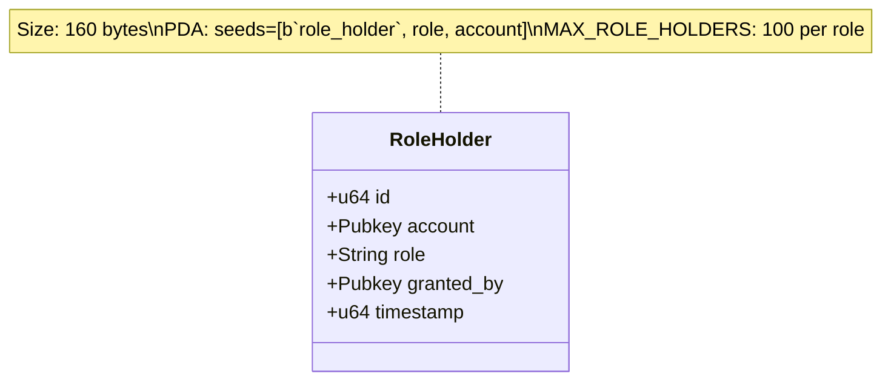

#### RoleRequest

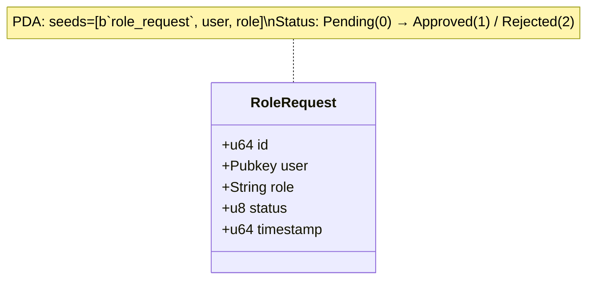

### Netbook State Machine

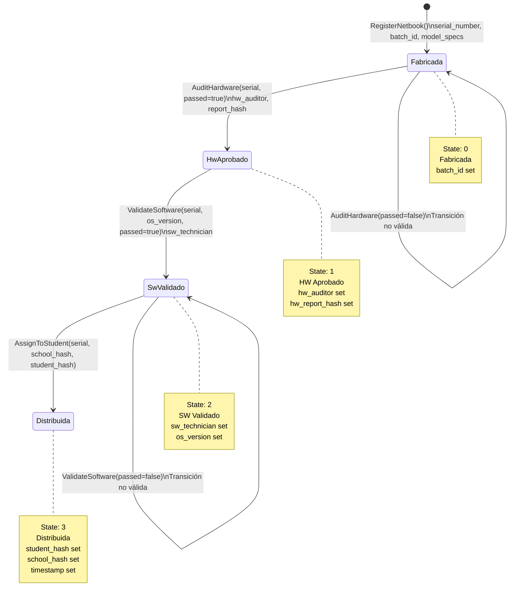

### Instructions

El programa implementa 22 instrucciones organizadas en 5 módulos:

```mermaid
graph TD
    Program["sc_solana Program"] --> Deployer["deployer/"]
    Program --> Init["initialize/"]
    Program --> Netbook["netbook/"]
    Program --> Role["role/"]
    Program --> Query["query/"]

    Deployer --> fund["fund_deployer()"]
    Deployer --> close["close_deployer()"]

    Init --> init["initialize()"]

    Netbook --> reg["register_netbook()"]
    Netbook --> regBatch["register_netbooks_batch()"]
    Netbook --> audit["audit_hardware()"]
    Netbook --> validate["validate_software()"]
    Netbook --> assign["assign_to_student()"]

    Role --> grant["grant_role()"]
    Role --> revoke["revoke_role()"]
    Role --> req["request_role()"]
    Role --> approve["approve_role_request()"]
    Role --> reject["reject_role_request()"]
    Role --> reset["reset_role_request()"]
    Role --> addHolder["add_role_holder()"]
    Role --> removeHolder["remove_role_holder()"]
    Role --> closeHolder["close_role_holder()"]
    Role --> transfer["transfer_admin()"]

    Query --> queryNB["query_netbook_state()"]
    Query --> queryCfg["query_config()"]
    Query --> queryRole["query_role()"]

    classDef module fill:#f97316,stroke:#c2410c,color:#fff
    class Deployer,Init,Netbook,Role,Query module
```

#### Instruction Details

| Module | Instruction | Accounts | Description |
|--------|-------------|----------|-------------|
| **deployer** | `fund_deployer` | deployer (PDA), funder, system | Fund the deployer PDA for rent exemption |
| **deployer** | `close_deployer` | deployer (PDA), funder | Close deployer and return funds |
| **initialize** | `initialize` | config, serial_hash_registry, admin, deployer, funder, system | Initialize all accounts |
| **netbook** | `register_netbook` | config, netbook (PDA), manufacturer, system | Register single netbook |
| **netbook** | `register_netbooks_batch` | config, manufacturer, system | Register multiple netbooks |
| **netbook** | `audit_hardware` | config, netbook (PDA), auditor, system | Hardware audit |
| **netbook** | `validate_software` | config, netbook (PDA), technician, system | Software validation |
| **netbook** | `assign_to_student` | config, netbook (PDA), system | Assign to student |
| **role** | `grant_role` | config, role_holder (PDA), admin, recipient, system | Grant role with consent |
| **role** | `revoke_role` | config, role_holder (PDA), admin, system | Revoke role |
| **role** | `request_role` | config, role_request (PDA), requester, system | Request role (60s cooldown) |
| **role** | `approve_role_request` | config, role_request (PDA), role_holder (PDA), admin, system | Approve request |
| **role** | `reject_role_request` | config, role_request (PDA), admin, system | Reject request |
| **role** | `reset_role_request` | config, role_request (PDA), requester, system | Reset request |
| **role** | `add_role_holder` | config, role_holder (PDA), admin, system | Add holder to role |
| **role** | `remove_role_holder` | config, role_holder (PDA), admin, system | Remove holder from role |
| **role** | `close_role_holder` | config, role_holder (PDA), admin, system | Close role_holder account |
| **role** | `transfer_admin` | config, admin (PDA), new_admin, system | Transfer admin role |
| **query** | `query_netbook_state` | config, netbook (PDA), system | Query netbook state |
| **query** | `query_config` | config, system | Query config |
| **query** | `query_role` | config, system | Query role membership |

### Events

El programa emite 18 eventos organizados en 3 categorías:

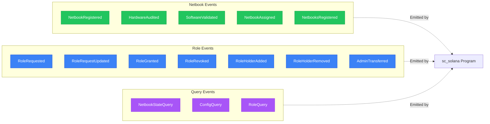

#### Event Details

**Netbook Events** (`netbook_events.rs`):
| Event | Fields |
|-------|--------|
| `NetbookRegistered` | serial_number, batch_id, token_id |
| `HardwareAudited` | serial_number, passed |
| `SoftwareValidated` | serial_number, os_version, passed |
| `NetbookAssigned` | serial_number |
| `NetbooksRegistered` | count, start_token_id, timestamp |

**Role Events** (`role_events.rs`):
| Event | Fields |
|-------|--------|
| `RoleRequested` | id, user, role |
| `RoleRequestUpdated` | id, status |
| `RoleGranted` | role, account, admin, timestamp |
| `RoleRevoked` | role, account |
| `RoleHolderAdded` | role, account, admin, timestamp |
| `RoleHolderRemoved` | role, account, admin, timestamp |
| `AdminTransferred` | previous_admin, new_admin, timestamp |

**Query Events** (`query_events.rs`):
| Event | Fields |
|-------|--------|
| `NetbookStateQuery` | serial_number, state, token_id, exists |
| `ConfigQuery` | admin, fabricante, auditor_hw, tecnico_sw, escuela, next_token_id, total_netbooks, role_requests_count, *_count |
| `RoleQuery` | account, role, has_role |

### Errors

El programa define 15 error codes (range 6000-6014):

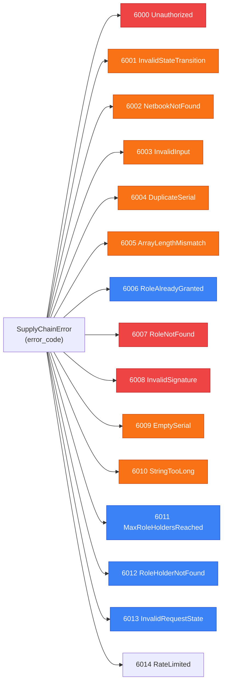

---

## Frontend Web Application

### Technology Stack

| Layer | Technology | Version |
|-------|------------|---------|
| Framework | Next.js | 16.0.10 |
| Language | TypeScript (strict mode) | Latest |
| UI Library | React | 19.2.3 |
| Styling | Tailwind CSS | Latest |
| Component Library | shadcn/ui + Radix UI | Latest |
| Solana SDK | @solana/web3.js | ^1.98.0 |
| Anchor SDK | @coral-xyz/anchor | ^0.32.0 |
| Wallet Adapter | @solana/wallet-adapter-react/ui | Latest |
| State Management | TanStack React Query + Table | Latest |
| Testing (Unit) | Jest + Testing Library | Latest |
| Testing (E2E) | Playwright | Latest |
| Linting | ESLint | Latest |

### Directory Structure

```
web/
├── .env                    # Environment variables (needs Solana config)
├── .env.local              # Local environment overrides
├── EXAMPLE.env             # Example with Solana configuration
├── next.config.mjs         # Next.js configuration
├── tailwind.config.js      # Tailwind CSS configuration
├── postcss.config.mjs      # PostCSS configuration
├── tsconfig.json           # TypeScript configuration
├── playwright.config.ts    # Playwright E2E configuration
├── jest.config.js          # Jest unit test configuration
├── jest.setup.js           # Jest setup file
├── components.json         # shadcn/ui configuration
├── eslint.config.mjs       # ESLint configuration
├── role-requests.json      # Role requests data
│
├── public/                 # Static assets
│   ├── file.svg
│   ├── globe.svg
│   ├── next.svg
│   ├── vercel.svg
│   ├── window.svg
│   └── health-check.txt
│
├── e2e/                    # Playwright E2E tests
│   ├── dashboard.spec.ts
│   ├── full-user-flow.spec.ts
│   ├── homepage.spec.ts
│   ├── netbook-registration.spec.ts
│   ├── role-management.spec.ts
│   ├── wallet-connection.spec.ts
│   ├── helpers/
│   │   └── test-utils.ts
│   └── README.md
│
├── playwright-report/      # Test reports
│   └── index.html
│
├── scripts/                # Test scripts
│   ├── run-all-tests.sh
│   ├── run-e2e-tests.sh
│   └── run-unit-tests.sh
│
└── src/
    ├── app/                # Next.js App Router (pages)
    ├── components/         # React components
    ├── hooks/              # Custom React hooks
    ├── lib/                # Utilities and configuration
    └── services/           # Business logic services
```

### Pages & Routes

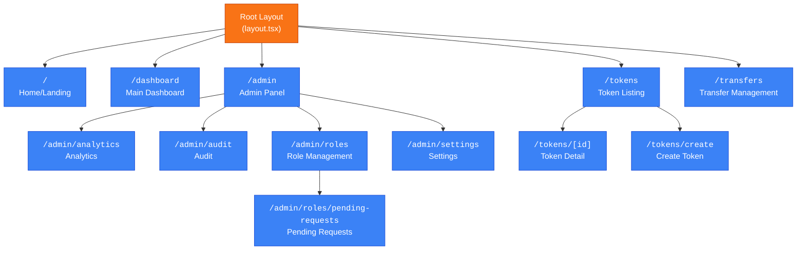

#### Page Components

| Route | Main Component | Key Sub-components |
|-------|---------------|-------------------|
| `/` | `page.tsx` | Hero, FeatureCard, WalletMultiButton |
| `/dashboard` | `dashboard/page.tsx` | NetbookDataTable, UserDataTable, NetbookStats, RoleActions, PendingRoleApprovals |
| `/admin` | `admin/page.tsx` | AdminClient, ActivityLogs, DashboardMetrics, DataManagementPanel, UsersList |
| `/admin/analytics` | `admin/analytics/page.tsx` | AnalyticsChart, DateRangeSelector, ReportGenerator, PeriodSummary |
| `/admin/audit` | `admin/audit/page.tsx` | AuditTimeline |
| `/admin/roles/pending-requests` | `pending-requests/page.tsx` | EnhancedPendingRoleRequests |
| `/admin/settings` | `admin/settings/page.tsx` | Settings panel |
| `/tokens` | `tokens/page.tsx` | Token listing |
| `/tokens/[id]` | `tokens/[id]/page.tsx` | Token detail view |
| `/tokens/create` | `tokens/create/page.tsx` | Create token form |
| `/transfers` | `transfers/page.tsx` | Transfer management |

### Hooks Architecture

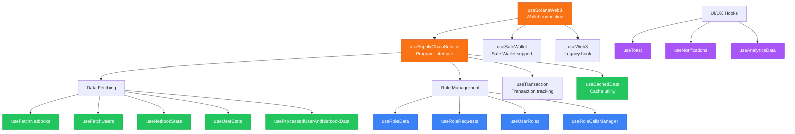

#### Hooks Reference

| Hook | Category | Purpose |
|------|----------|---------|
| `useSolanaWeb3()` | Solana Core | Wallet connection & state |
| `useSupplyChainService()` | Solana Core | Program interaction wrapper |
| `useWeb3()` | Solana Core | Legacy Web3 hook |
| `useSafeWallet()` | Solana Core | Safe Wallet support |
| `useTransaction()` | Solana Core | Transaction tracking |
| `useFetchNetbooks()` | Data Fetching | Fetch netbooks from chain |
| `useFetchUsers()` | Data Fetching | Fetch users data |
| `useNetbookStats()` | Data Fetching | Netbook statistics |
| `useUserStats()` | Data Fetching | User statistics |
| `useProcessedUserAndNetbookData()` | Data Fetching | Processed combined data |
| `useCachedData()` | Data Fetching | Cached data utility |
| `useRoleData()` | Role Management | Role data fetching |
| `useRoleRequests()` | Role Management | Role request management |
| `useUserRoles()` | Role Management | User roles query |
| `useRoleCallsManager()` | Role Management | Role call orchestration |
| `useToast()` | UI/UX | Toast notifications |
| `useNotifications()` | UI/UX | Notification management |
| `useAnalyticsData()` | UI/UX | Analytics data |

### Services Layer

```mermaid
graph TD
    Components["Components/Hooks"] --> Unified["UnifiedSupplyChainService<br/>(Singleton - Active)"]

    Unified --> NetbookOps["Netbook Operations"]
    NetbookOps --> Reg["registerNetbook()"]
    NetbookOps --> RegBatch["registerNetbooksBatch()"]
    NetbookOps --> Audit["auditHardware()"]
    NetbookOps --> Validate["validateSoftware()"]
    NetbookOps --> Assign["assignToStudent()"]

    Unified --> RoleOps["Role Operations"]
    RoleOps --> Grant["grantRole()"]
    RoleOps --> Revoke["revokeRole()"]
    RoleOps --> Request["requestRole()"]
    RoleOps --> Approve["approveRoleRequest()"]
    RoleOps --> Reject["rejectRoleRequest()"]

    Unified --> QueryOps["Query Operations"]
    QueryOps --> QNB["queryNetbookState()"]
    QueryOps --> QCfg["queryConfig()"]
    QueryOps --> QRole["queryRole()"]

    Unified --> Events["Event Emission"]
    Events --> E1["NetbookRegistered"]
    Events --> E2["HardwareAudited"]
    Events --> E3["SoftwareValidated"]
    Events --> E4["NetbookAssigned"]

    Legacy1["SolanaSupplyChainService<br/>(Deprecated)"] -.->|Delegates to| Unified
    Legacy2["SupplyChainService<br/>(Deprecated)"] -.->|Delegates to| Unified

    Other["RoleRequestService<br/>ContractRegistryService<br/>actions.ts"]

    classDef active fill:#22c55e,stroke:#16a34a,color:#fff
    classDef deprecated fill:#ef4444,stroke:#b91c1c,color:#fff
    class Unified,Other active
    class Legacy1,Legacy2 deprecated
```

#### Services Reference

| Service | Status | Purpose |
|---------|--------|---------|
| `UnifiedSupplyChainService` | Active | Main Solana program interface (singleton) |
| `SolanaSupplyChainService` | Deprecated | Legacy wrapper (delegates to Unified) |
| `SupplyChainService` | Deprecated | Legacy service |
| `RoleRequestService` | Active | Role request management |
| `ContractRegistryService` | Active | Contract address registry |
| `actions.ts` | Active | Server actions |

### Components Library

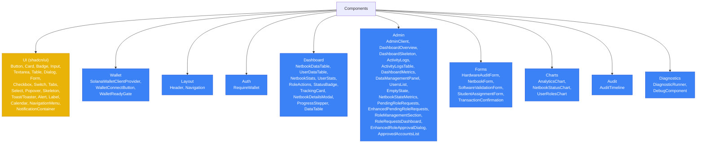

---

## Development Setup

### Prerequisites

| Tool | Version | Purpose | Installation |
|------|---------|---------|--------------|
| Rust | Latest stable | Solana program compilation | [`rustup`](https://rustup.rs/) |
| Anchor | 0.32.0 | Solana program framework | `cargo install anchor-cli --locked` |
| Node.js | Latest LTS | Frontend development | [`nvm`](https://github.com/nvm-sh/nvm) or [nodejs.org](https://nodejs.org) |
| Yarn | Latest | Package manager | `npm install -g yarn` |
| Solana CLI | Latest | Solana validator & tools | [`sh -c "$(curl -sSfL https://release.solana.com/stable/install)"`](https://docs.solana.com/cli/install-solana-cli-tools) |
| Surfpool/txtx | Latest | Local deployment system | `npm install -g @surfpool/txtx` |

### Step-by-Step Installation

#### 1. Clone the Repository

```bash
git clone https://github.com/your-org/SupplyChainTracker-solana.git
cd SupplyChainTracker-solana
```

#### 2. Install Solana Tools

```bash
# Install Rust
curl --proto '=https' --tlsv1.2 -sSf https://sh.rustup.rs | sh
source ~/.cargo/env
rustup update stable

# Install Anchor CLI
cargo install anchor-cli --locked

# Install Solana CLI
sh -c "$(curl -sSfL https://release.solana.com/stable/install)"
source ~/.local/share/solana/install/active_solana/env

# Verify installations
anchor --version
solana --version
cargo --version
```

#### 3. Build the Solana Program

```bash
cd sc-solana

# Build the program (compiles Rust + generates IDL + keypair)
anchor build

# This produces:
# - target/deploy/sc_solana.so        (program binary)
# - target/deploy/sc_solana-keypair.json (program keypair)
# - target/idl/sc_solana.json         (IDL)
# - target/types/sc_solana.ts         (TypeScript types)

# Verify build
ls -la target/deploy/
ls -la target/idl/
```

#### 4. Configure Environment Variables

```bash
# Navigate to web directory
cd ../web

# Copy example environment
cp EXAMPLE.env .env.local

# Edit .env.local with your configuration
nano .env.local
```

**Required Environment Variables:**

| Variable | Description | Example Value |
|----------|-------------|---------------|
| `NEXT_PUBLIC_RPC_URL` | Solana RPC endpoint | `http://localhost:8899` (local) or `https://api.devnet.solana.com` |
| `NEXT_PUBLIC_WS_URL` | WebSocket RPC endpoint | `ws://localhost:8900` (local) or `wss://api.devnet.solana.com` |
| `NEXT_PUBLIC_PROGRAM_ID` | Program ID pubkey | `7bGrgLgTDyQY4SMmHpQpdT2VDur8iVCRGBBjSMrcCvrb` |
| `NEXT_PUBLIC_WALLETCONNECT_PROJECT_ID` | WalletConnect project ID | Your WC project ID from [cloud.walletconnect.com](https://cloud.walletconnect.com) |

**Optional Environment Variables:**

| Variable | Description | Example Value |
|----------|-------------|---------------|
| `NEXT_PUBLIC_MONGODB_URI` | MongoDB connection | `mongodb://localhost:27017/supplychain` |
| `NEXT_PUBLIC_DEBUG_MODE` | Enable debug mode | `true` |

#### 5. Install Frontend Dependencies

```bash
# Install all dependencies
yarn install

# Verify installation
yarn list --depth=0
```

#### 6. Start Local Solana Validator

```bash
# In a separate terminal
solana-test-validator

# Or with specific configuration (from Anchor.toml)
anchor test --localnet

# The validator runs on:
# - RPC: http://localhost:8899
# - WebSocket: ws://localhost:8900
```

#### 7. Deploy Program to Localnet

```bash
# Method 1: Using anchor deploy
cd sc-solana
anchor deploy

# Method 2: Using txtx runbook (Surfpool)
txtx run runbooks/01-deployment/deploy-program.tx

# Verify deployment
solana program show --program-id 7bGrgLgTDyQY4SMmHpQpdT2VDur8iVCRGBBjSMrcCvrb
```

#### 8. Start Frontend Development Server

```bash
cd web
yarn dev

# The frontend runs on:
# - HTTP: http://localhost:3000
# - The server will hot-reload on file changes
```

### Development Workflow

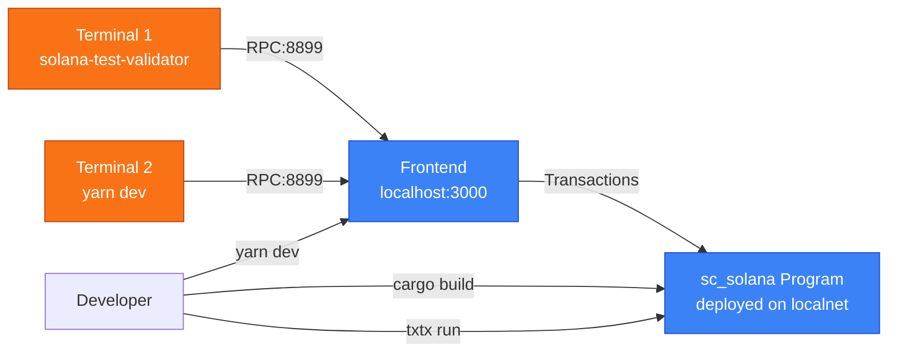

### Recommended Terminal Layout

| Terminal | Command | Purpose |
|----------|---------|---------|
| 1 | `solana-test-validator` | Local Solana validator |
| 2 | `cd web && yarn dev` | Frontend dev server |
| 3 | `cd sc-solana && anchor build --watch` | Program build watcher |
| 4 | `cd sc-solana && cargo test` | Run tests on demand |

---

## Testing

### Solana Program Tests

```bash
cd sc-solana

# Run all Cargo unit tests
cargo test

# Run all Anchor integration tests
anchor test

# Run Anchor tests with verbose output
anchor test -- --nocapture

# Run specific test file
anchor test -- --test tests/lifecycle.ts

# Run specific test function
anchor test -- --test tests/lifecycle.ts --grep "test_netbook_space"
```

#### Test Files

| File | Description | Type |
|------|-------------|------|
| `tests/lifecycle.ts` | Full netbook lifecycle test | Integration |
| `tests/batch-registration.ts` | Batch registration tests | Integration |
| `tests/pda-derivation.ts` | PDA derivation verification | Integration |
| `tests/deployer-pda.ts` | Deployer PDA tests | Integration |
| `tests/query-instructions.ts` | Query instruction tests | Integration |
| `tests/rbac-consistency.ts` | RBAC consistency tests | Integration |
| `tests/edge-cases.ts` | Edge case tests | Integration |
| `tests/overflow-protection.ts` | Overflow protection tests | Integration |
| `tests/integration-full-lifecycle.ts` | Full lifecycle integration | Integration |
| `tests/unit-tests.ts` | Unit test equivalents | Unit |

### Frontend Tests

```bash
cd web

# Run all Jest unit tests
yarn test

# Run Jest tests in watch mode
yarn test --watch

# Run Jest tests with coverage
yarn test --coverage

# Run Playwright E2E tests
yarn exec playwright test

# Run Playwright E2E tests with UI mode
yarn exec playwright test --ui

# Run Playwright E2E tests with headed browser
yarn exec playwright test --headed

# Run specific E2E test
yarn exec playwright test e2e/dashboard.spec.ts

# Generate Playwright report
yarn exec playwright show-report

# Run all tests (unit + E2E)
./scripts/run-all-tests.sh
```

#### E2E Test Files

| File | Description |
|------|-------------|
| `e2e/homepage.spec.ts` | Homepage rendering and wallet connection |
| `e2e/dashboard.spec.ts` | Dashboard functionality |
| `e2e/wallet-connection.spec.ts` | Wallet adapter connection flow |
| `e2e/netbook-registration.spec.ts` | Netbook registration flow |
| `e2e/role-management.spec.ts` | Role management operations |
| `e2e/full-user-flow.spec.ts` | Complete user journey |

---

## Deployment

### Local Deployment with Surfpool/txtx

```bash
cd sc-solana

# Deploy program
txtx run runbooks/01-deployment/deploy-program.tx

# Run operations
txtx run runbooks/02-operations/query/query-config.tx
txtx run runbooks/02-operations/query/query-role.tx
txtx run runbooks/03-role-management/request-role.tx
txtx run runbooks/03-role-management/approve-role-request.tx

# Run full lifecycle
txtx run runbooks/04-testing/full-lifecycle.tx

# Run role workflow
txtx run runbooks/04-testing/role-workflow.tx
```

### Production Deployment

```bash
# Build program
cd sc-solana
anchor build

# Deploy to devnet
solana config set --url devnet
anchor deploy

# Deploy to mainnet-beta (requires program upgrade authority)
solana config set --url mainnet-beta
anchor deploy --program-keypair target/deploy/sc_solana-keypair.json
```

### CI/CD

```bash
# GitHub Actions workflows
# .github/workflows/ci.yml       - Continuous Integration
# .github/workflows/deploy.yml   - Deployment pipeline

# CI runs on push/PR:
# 1. cargo build
# 2. cargo test
# 3. anchor build
# 4. yarn install (web)
# 5. yarn test (web)
```

---

## Troubleshooting

### Common Issues

#### 1. Program Keypair Mismatch

**Error:**
```
program keypair does not match program pubkey found in IDL:
keypair pubkey: '8F8SCnsz...'; IDL pubkey: '7bGrgLgT...'
```

**Solution:**
```bash
# Verify consistency
echo "declare_id!: $(grep 'declare_id!' sc-solana/programs/sc-solana/src/lib.rs)"
echo "IDL address: $(grep '"address"' sc-solana/target/idl/sc_solana.json)"
echo "Keypair pubkey: $(solana-keygen pubkey target/deploy/sc_solana-keypair.json)"
echo "Anchor.toml: $(grep 'sc_solana' sc-solana/Anchor.toml)"

# All should show: 7bGrgLgTDyQY4SMmHpQpdT2VDur8iVCRGBBjSMrcCvrb

# If mismatched, restore keypair from git:
git show <commit>:sc-solana/target/deploy/sc_solana-keypair.json > sc-solana/target/deploy/sc_solana-keypair.json
```

#### 2. Port Conflicts

**Error:**
```
Address already in use
```

**Solution:**
```bash
# Check which process uses port 8899
lsof -i :8899

# Kill the process
kill -9 <PID>

# Or use different ports in Anchor.toml
```

#### 3. Anchor Build Fails

**Solution:**
```bash
# Clean build artifacts
cd sc-solana
rm -rf target/deploy/*.so target/deploy/*-keypair.json target/idl/*.json

# Rebuild
anchor build

# If still failing, check Rust toolchain
rustup default stable
cargo install anchor-cli --locked --force
```

#### 4. Frontend Cannot Connect to Program

**Solution:**
```bash
# Verify validator is running
solana cluster-version

# Check RPC endpoint in .env.local
cat web/.env.local | grep RPC_URL

# Verify program is deployed
solana program show --program-id 7bGrgLgTDyQY4SMmHpQpdT2VDur8iVCRGBBjSMrcCvrb

# Check browser console for errors
# Open DevTools > Console
```

#### 5. Wallet Connection Issues

**Solution:**
```bash
# Verify wallet adapter is installed
yarn list @solana/wallet-adapter-react

# Check WalletConnect project ID
# Visit https://cloud.walletconnect.com for project setup

# For local testing, use Phantom wallet directly (no WalletConnect needed)
```

### Configuration Reference

#### Solana Program (`sc-solana/Anchor.toml`)

```toml
[toolchain]
package_manager = "yarn"

[features]
resolution = true
skip-lint = false

[programs.localnet]
sc_solana = "7bGrgLgTDyQY4SMmHpQpdT2VDur8iVCRGBBjSMrcCvrb"

[test.validator]
rpc_port = 8899
```

#### Frontend Environment (`.env.local`)

```env
NEXT_PUBLIC_RPC_URL=http://localhost:8899
NEXT_PUBLIC_PROGRAM_ID=7bGrgLgTDyQY4SMmHpQpdT2VDur8iVCRGBBjSMrcCvrb
NEXT_PUBLIC_WALLETCONNECT_PROJECT_ID=your_project_id
```

### Key Files Reference

| File | Purpose |
|------|---------|
| [`sc-solana/Anchor.toml`](sc-solana/Anchor.toml) | Anchor program configuration |
| [`sc-solana/Cargo.toml`](sc-solana/Cargo.toml) | Rust program dependencies |
| [`sc-solana/programs/sc-solana/src/lib.rs`](sc-solana/programs/sc-solana/src/lib.rs) | Program entry point + `declare_id!` |
| [`sc-solana/txtx.yml`](sc-solana/txtx.yml) | Surfpool/txtx configuration |
| [`web/package.json`](web/package.json) | Frontend dependencies |
| [`web/.env.local`](web/.env.local) | Frontend environment variables |
| [`web/next.config.mjs`](web/next.config.mjs) | Next.js configuration |
| [`web/tailwind.config.js`](web/tailwind.config.js) | Tailwind CSS configuration |

---

## License

MIT

## Author

Codecrypto

## Acknowledgments

- Migrated from Ethereum/Solidity to Solana/Anchor
- Built with [Anchor Framework](https://www.anchor-lang.com)
- Frontend powered by [Next.js 16](https://nextjs.org) and [shadcn/ui](https://ui.shadcn.com)
