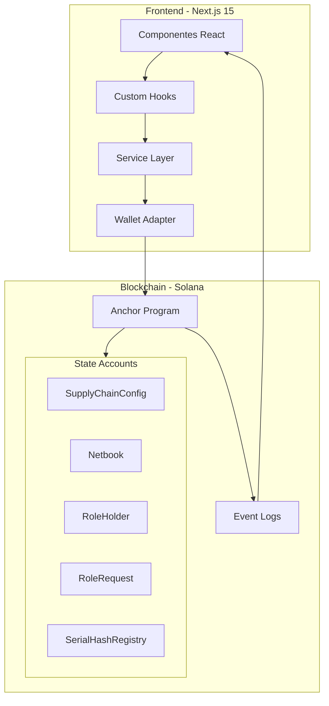
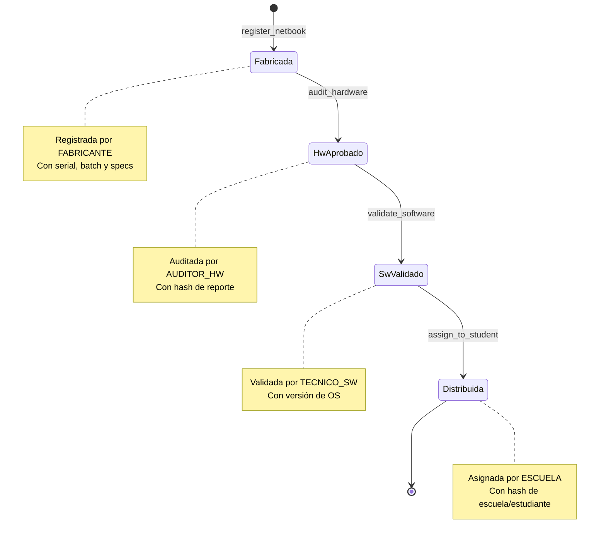
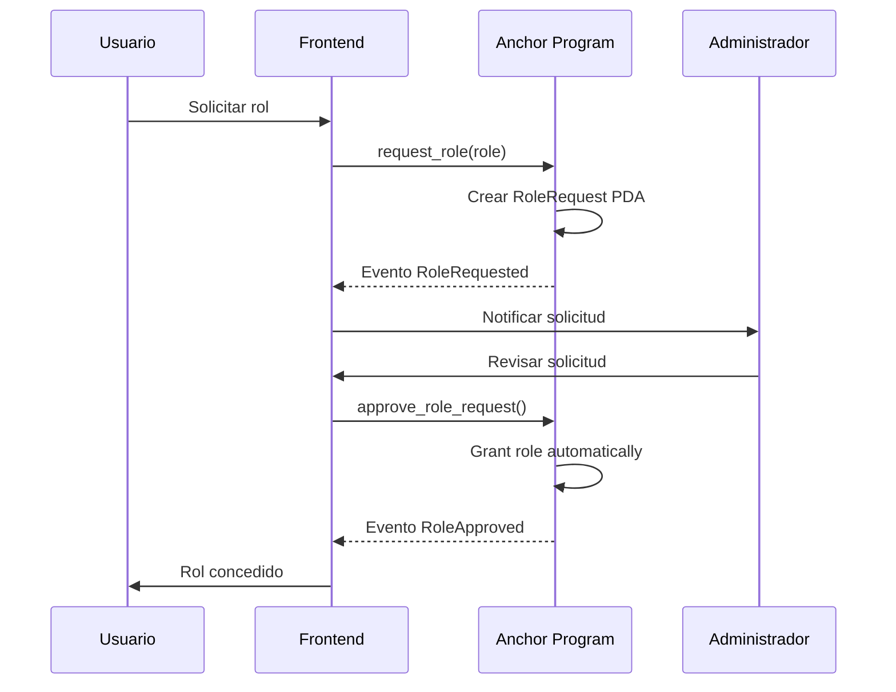
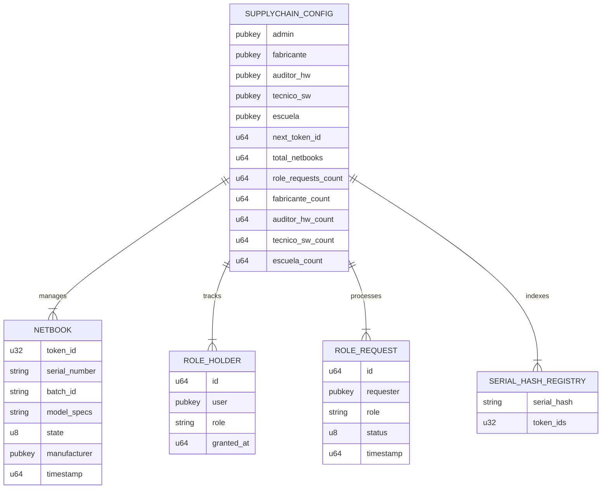

# SupplyChainTracker - Solana DApp

> Plataforma descentralizada para rastrear la cadena de suministro de netbooks en la blockchain Solana, implementada con Anchor (Rust) y Next.js.

[](https://solana.com)
[](https://www.anchor-lang.com/)
[](https://nextjs.org)
[](LICENSE)

## 📋 Tabla de Contenidos

- [Resumen del Proyecto](#resumen-del-proyecto)
- [Funcionalidades](#funcionalidades)
- [Arquitectura del Sistema](#arquitectura-del-sistema)
- [Diagramas](#diagramas)
- [Tecnologías](#tecnologías)
- [Estructura del Proyecto](#estructura-del-proyecto)
- [Instalación](#instalación)
- [Desarrollo](#desarrollo)
- [Despliegue](#despliegue)
- [Testing](#testing)
- [Roles y Permisos](#roles-y-permisos)
- [Ciclo de Vida del Netbook](#ciclo-de-vida-del-netbook)
- [Estado Actual](#current-status)
- [Refactoring Status](#refactoring-status)
- [Changelog](#changelog)

## Resumen del Proyecto

SupplyChainTracker es una aplicación descentralizada (DApp) que permite rastrear el ciclo de vida completo de netbooks desde su fabricación hasta su distribución a escuelas. El sistema utiliza la blockchain Solana para garantizar la inmutabilidad, transparencia y trazabilidad de cada dispositivo.

**Program ID:** `7xX49ydi4Sx6hJQjj26arXhLZgwZXpr5sNJAKb29aPaN`

### Casos de Uso

1. **Fabricantes** registran netbooks con sus especificaciones técnicas
2. **Auditores de Hardware** verifican la calidad física de los dispositivos
3. **Técnicos de Software** validan la instalación del sistema operativo
4. **Escuelas** reciben y asignan netbooks a estudiantes
5. **Administradores** gestionan roles y supervisan el sistema

## Funcionalidades

### Gestión de Roles (RBAC)

- **Administración de roles** con sistema de aprobación
- **Solicitud de roles** por parte de usuarios
- **Aprobación/Rechazo** de solicitudes por administradores
- **Roles disponibles:**
  - `FABRICANTE` - Registro de netbooks
  - `AUDITOR_HW` - Auditoría de hardware
  - `TECNICO_SW` - Validación de software
  - `ESCUELA` - Asignación a estudiantes

### Ciclo de Vida del Netbook

1. **Fabricada** - Registro inicial por fabricante
2. **HwAprobado** - Auditoría de hardware exitosa
3. **SwValidado** - Validación de software completada
4. **Distribuida** - Asignada a escuela/estudiante

### Características Técnicas

- ✅ Registro individual y por lotes de netbooks
- ✅ Máquina de estados con transiciones validadas
- ✅ Sistema de eventos para trazabilidad completa
- ✅ Verificación de roles en cada operación
- ✅ Interfaz web con conexión a wallet Solana
- ✅ Dashboard con métricas en tiempo real
- ✅ Panel de administración para gestión de roles

## Arquitectura del Sistema

### Arquitectura PDA-First (Deployer Pattern)

**Toda la inicialización del sistema utiliza PDAs**, eliminando la necesidad de signers externos para crear cuentas. El patrón Deployer PDA financia la creación de todas las cuentas del sistema:

```
┌─────────────────────────────────────────────────────────────────┐
│                        Frontend (Next.js)                       │
│  ┌───────────┐  ┌───────────┐  ┌───────────┐  ┌─────────────┐ │
│  │  Dashboard │  │  Registro  │  │  Auditoría │  │  Admin Panel│ │
│  └─────┬─────┘  └─────┬─────┘  └─────┬─────┘  └──────┬──────┘ │
│        │               │               │               │         │
│  ┌─────┴───────────────┴───────────────┴───────────────┴─────┐  │
│  │              Service Layer (TypeScript)                    │  │
│  │  ┌─────────────────┐  ┌──────────────────────────────┐   │  │
│  │  │UnifiedSupplyChain│  │       RoleRequestService     │   │  │
│  │  │    Service       │  │                              │   │  │
│  │  └────────┬────────┘  └──────────────┬───────────────┘   │  │
│  └───────────┼──────────────────────────┼───────────────────┘  │
│              │                          │                       │
│  ┌───────────┴──────────────────────────┴───────────────────┐  │
│  │              Wallet Adapter (Solana)                      │  │
│  │  ┌─────────────┐  ┌─────────────┐  ┌──────────────────┐ │  │
│  │  │  Phantom     │  │  Solflare   │  │  Wallet Standard │ │  │
│  │  └─────────────┘  └─────────────┘  └──────────────────┘ │  │
│  └────────────────────────┬─────────────────────────────────┘  │
└───────────────────────────┼─────────────────────────────────────┘
                            │ RPC Calls
                            ▼
┌─────────────────────────────────────────────────────────────────┐
│                     Solana Blockchain                           │
│  ┌───────────────────────────────────────────────────────────┐  │
│  │              Anchor Program (Rust)                        │  │
│  │  ┌─────────────┐  ┌─────────────┐  ┌──────────────────┐  │  │
│  │  │ Instructions │  │   State     │  │     Events       │  │  │
│  │  │  (20 total)  │  │  (6 PDAs)   │  │  (emitted)       │  │  │
│  │  └─────────────┘  └─────────────┘  └──────────────────┘  │  │
│  └───────────────────────────────────────────────────────────┘  │
└─────────────────────────────────────────────────────────────────┘
```

### Flujo de Despliegue PDA-First

```
1. Deploy Program (Anchor)
         │
         ▼
2. fund_deployer(amount)          ← Financia el Deployer PDA
         │                        [seeds: [b"deployer"]]
         ▼
3. initialize()                   ← Deployer PDA paga la creación
         │                        de Config + SerialHashRegistry
         ▼
4. Sistema inicializado           ← Admin PDA derivado
                                    [seeds: [b"admin", config]]
         │
         ▼
5. close_deployer()               ← Recupera fondos restantes
         │
         ▼
6. Sistema operativo              ← Listo para operaciones
```

### Cuentas PDA del Sistema

| Cuenta | Seeds | Propósito |
|--------|-------|-----------|
| `DeployerState` | `[b"deployer"]` | Financia creación de cuentas |
| `SupplyChainConfig` | `[b"config"]` | Configuración principal |
| `SerialHashRegistry` | `[b"serial_hashes", config]` | Registro de hashes |
| `Admin` | `[b"admin", config]` | Cuenta admin derivada |
| `Netbook` | `[b"netbook", config, tokenId]` | Estado de netbook |
| `RoleHolder` | `[b"role_holder", user]` | Roles de usuario |

## Diagramas

### Diagrama de Arquitectura General



### Diagrama de Ciclo de Vida del Netbook



### Diagrama de Flujo de Roles



### Diagrama de Estados del Sistema



## Tecnologías

### Backend (Solana Program)

| Tecnología | Versión | Propósito |
|------------|---------|-----------|
| Rust | 1.75+ | Lenguaje del programa |
| Anchor | 0.32.1 | Framework de desarrollo |
| Solana Web3.js | 1.98.0 | Client RPC |

### Frontend

| Tecnología | Versión | Propósito |
|------------|---------|-----------|
| Next.js | 15 | Framework web |
| React | 19 | UI Library |
| TypeScript | 5 | Type Safety |
| Tailwind CSS | 3 | Styling |
| Radix UI | Latest | Componentes accesibles |
| Solana Wallet Adapter | Latest | Conexión wallets |

## Estructura del Proyecto

```
SupplyChainTracker-solana-/
├── sc-solana/                    # Programa Solana (Anchor)
│   ├── programs/sc-solana/
│   │   └── src/
│   │       ├── lib.rs            # Entry point del programa
│   │       ├── state/            # Definiciones de estado
│   │       │   ├── config.rs     # Configuración global
│   │       │   ├── netbook.rs    # Estado del netbook
│   │       │   ├── role_holder.rs
│   │       │   ├── role_request.rs
│   │       │   └── serial_hash_registry.rs
│   │       ├── instructions/     # Instrucciones del programa
│   │       │   ├── initialize.rs
│   │       │   ├── netbook/      # Instrucciones de netbook
│   │       │   │   ├── register.rs
│   │       │   │   ├── register_batch.rs
│   │       │   │   ├── audit.rs
│   │       │   │   ├── validate.rs
│   │       │   │   └── assign.rs
│   │       │   ├── role/         # Instrucciones de roles
│   │       │   │   ├── grant.rs
│   │       │   │   ├── revoke.rs
│   │       │   │   ├── request.rs
│   │       │   │   ├── holder_add.rs
│   │       │   │   └── holder_remove.rs
│   │       │   └── query/        # Instrucciones de consulta
│   │       │       ├── config.rs
│   │       │       ├── netbook_state.rs
│   │       │       └── role.rs
│   │       ├── events/           # Eventos emitidos
│   │       ├── errors/           # Códigos de error
│   │       └── utils/            # Utilidades
│   ├── tests/                    # Tests del programa
│   └── Anchor.toml               # Configuración Anchor
│
├── web/                          # Frontend Next.js
│   ├── src/
│   │   ├── app/                  # App Router
│   │   │   ├── page.tsx          # Página principal
│   │   │   ├── dashboard/        # Dashboard principal
│   │   │   ├── admin/            # Panel de administración
│   │   │   ├── tokens/           # Gestión de tokens/netbooks
│   │   │   └── transfers/        # Transferencias
│   │   ├── components/           # Componentes React
│   │   │   ├── contracts/        # Formularios de transacciones
│   │   │   ├── layout/           # Componentes de layout
│   │   │   └── ui/               # Componentes UI base
│   │   ├── hooks/                # Custom hooks
│   │   ├── lib/                  # Librerías y utilidades
│   │   │   ├── contracts/        # Interacción con programa
│   │   │   ├── solana/           # Configuración Solana
│   │   │   └── cache/            # Sistema de caché
│   │   └── services/             # Servicios de negocio
│   │       ├── UnifiedSupplyChainService.ts
│   │       └── RoleRequestService.ts
│   ├── public/                   # Assets estáticos
│   └── package.json
│
├── .github/                      # GitHub configuration
├── plans/                        # Planes de desarrollo
├── reports/                      # Reportes técnicos
├── ROADMAP.md                    # Roadmap del proyecto
└── README.md                     # Este archivo
```

## Instalación

### Requisitos Previos

- [Node.js](https://nodejs.org/) 18+
- [Yarn](https://yarnpkg.com/) o npm
- [Rust](https://www.rust-lang.org/tools/install) 1.75+
- [Solana CLI](https://docs.solana.com/cli/install-solana-cli-tools) 1.18+
- [Anchor CLI](https://www.anchor-lang.com/docs/installation) 0.32.1

### Configuración del Programa Solana

```bash
# Clonar el repositorio
git clone https://github.com/87maxi/SupplyChainTracker-solana-.git
cd SupplyChainTracker-solana-

# Construir el programa
cd sc-solana
cargo build-bpf

# Ejecutar tests
anchor test
```

### Configuración del Frontend

```bash
# Instalar dependencias
cd web
yarn install

# Configurar variables de entorno
cp .env.example .env.local
# Editar .env.local con tus valores

# Iniciar servidor de desarrollo
yarn dev
```

### Variables de Entorno Requeridas

| Variable | Descripción | Ejemplo |
|----------|-------------|---------|
| `NEXT_PUBLIC_PROGRAM_ID` | ID del programa desplegado | `7xX49ydi4Sx6hJQjj26arXhLZgwZXpr5sNJAKb29aPaN` |
| `NEXT_PUBLIC_CLUSTER` | Cluster de Solana | `devnet` |
| `NEXT_PUBLIC_DEFAULT_ADMIN_ADDRESS` | Dirección del admin | `7eCTmt5LYSqnjgw8jebHjUzf8X7omxEpxYHbsXsmPtZQ` |
| `NEXT_PUBLIC_RPC_URL` | URL RPC personalizada (opcional) | `https://api.devnet.solana.com` |

## Desarrollo

### Comandos del Programa Solana

```bash
cd sc-solana

# Construir
cargo build-bpf

# Tests
anchor test

# Desplegar a devnet
anchor deploy --provider.cluster devnet

# Ejecutar tests específicos
anchor test --lib pda-derivation
```

### Comandos del Frontend

```bash
cd web

# Desarrollo
yarn dev

# Construcción producción
yarn build

# Tests
yarn test
yarn test:watch
yarn test:coverage

# Tests E2E
yarn test:e2e
yarn test:e2e:ui

# Linting
yarn lint
yarn lint:fix
```

## Despliegue

### Desplegar Programa a Devnet

```bash
cd sc-solana

# Configurar cluster
anchor config set provider.cluster devnet

# Desplegar
anchor deploy

# Inicializar programa
anchor run initialize
```

### Desplegar Frontend

```bash
cd web

# Construir para producción
yarn build

# Iniciar servidor producción
yarn start
```

## Testing

### Guía Completa de Testing

El proyecto cuenta con múltiples capas de testing para garantizar la calidad del código:

#### Tests del Programa Anchor (Rust)

Los tests se ejecutan en `sc-solana/tests/` con validator local:

| Test File | Descripción | Cobertura |
|-----------|-------------|-----------|
| `unit-tests.ts` | Tests unitarios de instrucciones | Register, Grant, Query |
| `integration-full-lifecycle.ts` | Tests de ciclo completo | Register → Audit → Validate → Assign |
| `role-enforcement.ts` | Tests de verificación de roles | RBAC en todas las instrucciones |
| `pda-derivation.ts` | Tests de derivación PDA | PDAs de accounts |
| `batch-registration.ts` | Tests de registro por lotes | RegisterBatch |
| `state-machine.ts` | Tests de máquina de estados | Transiciones válidas/inválidas |
| `lifecycle.ts` | Tests de ciclo de vida | Flujo completo netbook |
| `role-management.ts` | Tests de gestión de roles | Grant/Revoke/Request |
| `test-isolation.ts` | Tests de aislamiento | Contextos independientes |
| `edge-cases.ts` | Tests de casos edge | Overflow, inputs inválidos |
| `overflow-protection.ts` | Tests de protección overflow | Límites de datos |
| `query-instructions.ts` | Tests de instrucciones query | Getters de estado |
| `rbac-consistency.ts` | Tests de consistencia RBAC | Permisos cruzados |
| `deployer-pda.ts` | Tests de Deployer PDA | Patrón Deployer |

**Ejecutar tests Anchor:**
```bash
cd sc-solana
anchor test --local
# O con validator local explícito:
solana-test-validator &
anchor test
```

#### Tests del Frontend (Jest)

Tests unitarios en `web/src/`:

```bash
cd web
yarn test              # Ejecutar todos los tests
yarn test --watch      # Modo watch
yarn test --coverage   # Con cobertura
```

#### Tests E2E (Playwright)

Tests end-to-end en `web/e2e/`:

```bash
cd web
npx playwright test              # Ejecutar E2E tests
npx playwright test --ui         # Con interfaz UI
npx playwright test --headed     # Con browser visible
```

#### CI/CD Pipeline

El pipeline automatiza todos los tests en GitHub Actions:

| Job | Descripción | Trigger |
|-----|-------------|---------|
| `rust-lint` | cargo fmt + clippy -D warnings | Push/PR |
| `type-check` | tsc --noEmit (web) | Push/PR |
| `frontend-lint` | ESLint + Prettier | Push/PR |
| `test-unit` | Jest unit tests | Push/PR |
| `build-frontend` | Next.js build | After tests |
| `test-anchor` | Anchor tests con validator | Push/PR |
| `test-e2e` | Playwright E2E tests | After build |

Ver `.github/workflows/ci.yml` para configuración completa.

### Estado Actual de Tests

| Tipo | Estado | Passing | Total |
|------|--------|---------|-------|
| Unit Tests (Jest) | ✅ | 6 | 6 |
| Anchor Tests | ⚠️ | Requiere validator local | - |
| E2E Tests (Playwright) | ✅ | 46 | 46 |

#### Resultados E2E Tests (2026-05-10)
| Test Suite | Passing | Total |
|------------|---------|-------|
| Homepage E2E Tests | 7 | 7 |
| Dashboard E2E Tests | 6 | 6 |
| Netbook Registration E2E Tests | 6 | 6 |
| Role Management E2E Tests | 6 | 6 |
| Wallet Connection E2E Tests | 5 | 5 |
| Full User Flow Tests | 16 | 16 |

#### Flujos de Usuario E2E
| Flujo | Descripción | Tests |
|-------|-------------|-------|
| Flow 1 | New User Journey con Wallet Connection | 3 |
| Flow 2 | Netbook Registration con Solana | 2 |
| Flow 3 | Role Management Admin | 2 |
| Flow 4 | Integración Blockchain Solana | 3 |
| Flow 5 | Responsive Design & Accessibility | 3 |
| Flow 6 | Error Handling & Edge Cases | 3 |

## Roles y Permisos

| Rol | Permisos | Instrucciones Accesibles |
|-----|----------|-------------------------|
| `ADMIN` | Gestión completa | Todas las instrucciones |
| `FABRICANTE` | Registro de netbooks | `register_netbook`, `register_netbooks_batch` |
| `AUDITOR_HW` | Auditoría hardware | `audit_hardware` |
| `TECNICO_SW` | Validación software | `validate_software` |
| `ESCUELA` | Asignación estudiantes | `assign_to_student` |

## Ciclo de Vida del Netbook

```
┌──────────────┐      ┌──────────────┐      ┌──────────────┐      ┌──────────────┐
│  Fabricada   │ ────▶│ HwAprobado   │ ────▶│  SwValidado  │ ────▶│ Distribuida  │
│              │      │              │      │              │      │              │
│ Registro     │      │ Auditoría    │      │ Validación   │      │ Asignación   │
│ inicial      │      │ hardware     │      │ software     │      │ escuela      │
└──────────────┘      └──────────────┘      └──────────────┘      └──────────────┘
     Fabri-                 Audi-                Téc-                  Es-
     cante                  tor HW               nico SW               cuela
```

## Current Status

| Component | Status | Completion |
|-----------|--------|------------|
| Smart Contract (sc-solana) | Modularized, Core Complete | ~95% |
| Frontend (web/) | Solana Migrated (Partial) | ~90% |
| Testing | Integration Tests Complete | ~60% |
| Documentation | Updated | ~95% |
| Runbooks (txtx) | Consistent with Surfpool | ~90% |
| CI/CD | Pipeline Configured | ✅ Completed |

### Build & Lint Verification (2026-05-10)

| Check | Status | Details |
|-------|--------|---------|
| `cargo build` | ✅ Passed | Build exitoso |
| `cargo fmt --check` | ✅ Passed | Formato correcto |
| `cargo clippy -- -D warnings` | ✅ Passed | Sin warnings |
| `anchor build` | ✅ Passed | IDL regenerada |
| `yarn build` | ✅ Passed | Frontend build exitoso |
| `npx tsc --noEmit` | ✅ Passed | TypeScript type check |
| `npx eslint src/ --max-warnings=0` | ✅ Passed | 0 warnings |
| `yarn test` (Jest) | ✅ Passed | 6/6 passing |

## Refactoring Status

**Active Refactoring:** Completed Phases 0-8

| Phase | Description | Status |
|-------|-------------|--------|
| Phase 0 | Cleanup Documentation | ✅ Completed |
| Phase 1 | Clean Up Obsolete Code and Scripts | ✅ Completed |
| Phase 2 | Fix Program ID Inconsistency | ✅ Completed |
| Phase 3 | Remove Dead Code and Allow Directives | ✅ Completed |
| Phase 4 | Verify Consistency with Surfpool/txtx IAC | ✅ Completed |
| Phase 5 | Update Documentation and Create CHANGELOG | ✅ Completed |
| Phase 6 | Test Execution with Validator | ✅ Completed |
| Phase 7 | Test Error Fixes | ✅ Completed |
| Phase 8 | Quality Verifications | ✅ Completed |

See [`analysis/issues-hierarchical-plan.md`](analysis/issues-hierarchical-plan.md) for details on the refactoring process.

## Changelog

Refer to [`CHANGELOG.md`](CHANGELOG.md) for a complete history of changes to this project.

## Licencia

MIT License - ver [LICENSE](LICENSE) para más detalles.

## Contribuir

1. Fork el repositorio
2. Crear rama de feature (`git checkout -b feature/nueva-funcionalidad`)
3. Commit cambios (`git commit -m 'feat: agregar nueva funcionalidad'`)
4. Push a la rama (`git push origin feature/nueva-funcionalidad`)
5. Abrir Pull Request

## Enlaces

- [Documentación Solana](https://docs.solana.com/)
- [Documentación Anchor](https://www.anchor-lang.com/docs)
- [Solana Explorer (Devnet)](https://explorer.solana.com/?cluster=devnet)
- [Wallet Adapter Docs](https://github.com/solana-labs/wallet-adapter)
