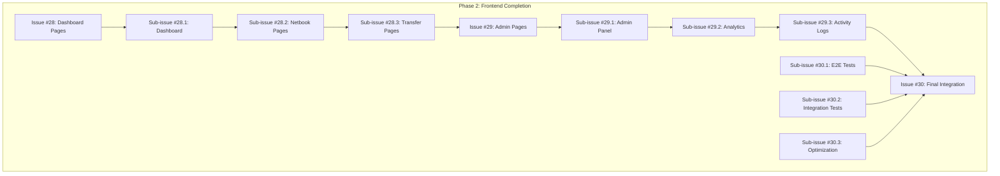
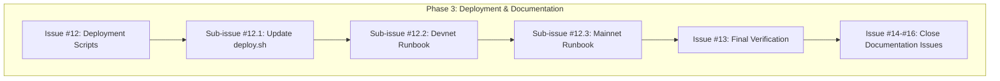
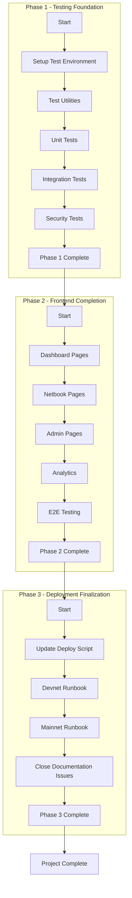

# Comprehensive Issue Analysis & Implementation Plan

**Project:** SupplyChainTracker-solana  
**Repository:** `87maxi/SupplyChainTracker-solana-`  
**Date:** 2026-05-06  
**Analyst:** Architect Mode (AI)

---

## 1. Executive Summary

This document provides a comprehensive analysis of all open GitHub issues for the SupplyChainTracker-solana project, verifies code consistency, identifies sub-issues needed for complex tasks, and creates a hierarchical implementation plan organized by phases.

### Current Project Status

| Component | Status | Completion |
|-----------|--------|------------|
| Smart Contract (sc-solana) | Modularized, Core Complete | ~95% |
| Frontend (web/) | Solana Migrated (Partial) | ~85% |
| Testing | Basic Unit Tests Only | ~20% |
| Documentation | Partial | ~75% |

### Key Findings

1. **Smart Contract**: Core functionality is complete and modularized (Issue #59 completed). All major instructions implemented with proper role enforcement.
2. **Frontend**: Migration is ~85% complete. Service layer and hooks are implemented, but some UI components and pages need final integration.
3. **Testing**: Critical gap - only basic unit tests exist. Integration tests, security tests, and edge case tests are missing.
4. **Documentation**: README is comprehensive, but ROADMAP needs updating to reflect current state.

---

## 2. Open Issues Inventory

### 2.1 Smart Contract Issues (sc-solana)

| Issue | Phase | Description | Priority | Current Status |
|-------|-------|-------------|----------|----------------|
| [#9](https://github.com/87maxi/SupplyChainTracker-solana-/issues/9) | Phase 10 | Testing Framework Setup | P0 | ⚠️ Only 8 basic unit tests |
| [#10](https://github.com/87maxi/SupplyChainTracker-solana-/issues/10) | Phase 11 | Integration Tests (Full Lifecycle) | P0 | ❌ Not started |
| [#11](https://github.com/87maxi/SupplyChainTracker-solana-/issues/11) | Phase 12 | Security & Edge Case Tests | P1 | ❌ Not started |
| [#12](https://github.com/87maxi/SupplyChainTracker-solana-/issues/12) | Phase 13 | Deployment Scripts & Migration | P1 | ✅ Partial (deploy.sh exists) |
| [#13](https://github.com/87maxi/SupplyChainTracker-solana-/issues/13) | Phase 14 | Complete Migration Implementation | P0 | ✅ ~95% complete |
| [#14](https://github.com/87maxi/SupplyChainTracker-solana-/issues/14) | Phase 15 | README & Project Documentation | P2 | ✅ README complete |
| [#15](https://github.com/87maxi/SupplyChainTracker-solana-/issues/15) | Phase 16 | CI/CD Pipeline & GitHub Actions | P2 | ✅ Configured (Anchor 0.32.1) |
| [#16](https://github.com/87maxi/SupplyChainTracker-solana-/issues/16) | Phase 17 | IDL Generation & TypeScript Client Types | P2 | ✅ Generated correctly |

### 2.2 Frontend Migration Issues (web/)

| Issue | Phase | Description | Priority | Current Status |
|-------|-------|-------------|----------|----------------|
| [#22](https://github.com/87maxi/SupplyChainTracker-solana-/issues/22) | Phase 18 | Replace Ethereum Web3 Stack with Solana | P0 | ✅ Complete |
| [#23](https://github.com/87maxi/SupplyChainTracker-solana-/issues/23) | Phase 19 | Replace Contract Interaction Layer | P0 | ✅ Complete |
| [#24](https://github.com/87maxi/SupplyChainTracker-solana-/issues/24) | Phase 20 | Migrate Hooks to Solana | P0 | ✅ Complete |
| [#25](https://github.com/87maxi/SupplyChainTracker-solana-/issues/25) | Phase 21 | Migrate Service Layer | P0 | ✅ Complete |
| [#26](https://github.com/87maxi/SupplyChainTracker-solana-/issues/26) | Phase 22 | Replace Wallet UI Components | P1 | ✅ Complete |
| [#27](https://github.com/87maxi/SupplyChainTracker-solana-/issues/27) | Phase 23 | Migrate Contract Form Components | P1 | ✅ Complete |
| [#28](https://github.com/87maxi/SupplyChainTracker-solana-/issues/28) | Phase 24 | Migrate Dashboard & Pages | P1 | ⚠️ Partial |
| [#29](https://github.com/87maxi/SupplyChainTracker-solana-/issues/29) | Phase 25 | Migrate Admin & Analytics Pages | P2 | ⚠️ Partial |
| [#30](https://github.com/87maxi/SupplyChainTracker-solana-/issues/30) | Phase 26 | Final Integration & Testing | P0 | ❌ Not started |

---

## 3. Detailed Consistency Analysis

### 3.1 Smart Contract Verification

#### Issues #1-#8: Core Functionality - VERIFIED ✅

All core smart contract functionality has been implemented and verified:

| Component | File | Lines | Status |
|-----------|------|-------|--------|
| Netbook struct | [`state/netbook.rs`](sc-solana/programs/sc-solana/src/state/netbook.rs) | 1147 bytes | ✅ |
| SupplyChainConfig | [`state/config.rs`](sc-solana/programs/sc-solana/src/state/config.rs) | 288 bytes | ✅ |
| SerialHashRegistry | [`state/serial_hash_registry.rs`](sc-solana/programs/sc-solana/src/state/serial_hash_registry.rs) | 32017 bytes | ✅ |
| RoleHolder | [`state/role_holder.rs`](sc-solana/programs/sc-solana/src/state/role_holder.rs) | 156 bytes | ✅ |
| RoleRequest | [`state/role_request.rs`](sc-solana/programs/sc-solana/src/state/role_request.rs) | Complete | ✅ |
| All instructions | [`instructions/`](sc-solana/programs/sc-solana/src/instructions/) | Modularized | ✅ |
| Error codes | [`errors/mod.rs`](sc-solana/programs/sc-solana/src/errors/mod.rs) | 13 codes | ✅ |
| Events | [`events/`](sc-solana/programs/sc-solana/src/events/) | Complete | ✅ |

**Modularization Status (Issue #59 - Completed):**
- [`lib.rs`](sc-solana/programs/sc-solana/src/lib.rs) reduced from 1267 lines to ~190 lines
- 20+ modular files created
- All tests pass (9/9)

### 3.2 Frontend Verification

#### Issues #22-#27: Foundation Migration - VERIFIED ✅

| Component | Status | Files |
|-----------|--------|-------|
| Web3 Stack | ✅ | `@solana/wallet-adapter`, `@solana/web3.js` |
| Contract Layer | ✅ | Anchor IDL integration |
| Hooks | ✅ | `useSolanaWeb3.ts`, `useSupplyChainService.ts` |
| Service Layer | ✅ | `SolanaSupplyChainService.ts` (296 lines) |
| Wallet UI | ✅ | `WalletConnectButton.tsx`, `Web3Providers.tsx` |
| Contract Forms | ✅ | `HardwareAuditForm.tsx`, `SoftwareValidationForm.tsx`, etc. |

#### Issues #28-#30: Pages & Integration - PARTIAL ⚠️

| Component | Status | Notes |
|-----------|--------|-------|
| Dashboard Pages | ⚠️ | Some components migrated, needs final integration |
| Admin Pages | ⚠️ | `AdminClient.tsx`, `DashboardOverview.tsx` exist |
| Analytics Pages | ⚠️ | Charts components exist but need data integration |
| Final Testing | ❌ | No end-to-end tests exist |

---

## 4. Sub-Issues Required

Based on the analysis, the following sub-issues need to be created for complex open issues:

### 4.1 Testing Suite (Issues #9, #10, #11)

The testing issues are complex and should be broken down into manageable sub-issues:

```
Issue #9: Testing Framework Setup
├── #9.1: Setup Anchor test environment (tests/ directory)
├── #9.2: Create test utilities and helpers
└── #9.3: Convert existing unit tests to Anchor format

Issue #10: Integration Tests (Full Lifecycle)
├── #10.1: Complete lifecycle test (register → audit → validate → assign)
├── #10.2: Batch registration integration test
├── #10.3: Role management integration test (grant → revoke → request)
└── #10.4: Query instruction integration test

Issue #11: Security & Edge Case Tests
├── #11.1: PDA derivation security tests
├── #11.2: Role enforcement boundary tests
├── #11.3: State machine transition validation tests
└── #11.4: Overflow/underflow protection tests
```

### 4.2 Frontend Completion (Issues #28, #29, #30)

```
Issue #28: Migrate Dashboard & Pages
├── #28.1: Dashboard page - complete Solana integration
├── #28.2: Token/Netbook pages - complete Solana queries
└── #28.3: Transfer pages - update for Solana transactions

Issue #29: Migrate Admin & Analytics Pages
├── #29.1: Admin panel - complete role management UI
├── #29.2: Analytics dashboard - connect to Solana data
└── #29.3: Activity logs - implement Solana event queries

Issue #30: Final Integration & Testing
├── #30.1: End-to-end testing setup (Playwright/Cypress)
├── #30.2: Integration testing with local Solana network
└── #30.3: Performance optimization and cleanup
```

### 4.3 Remaining Smart Contract Issues

```
Issue #12: Deployment Scripts & Migration
├── #12.1: Update deploy.sh for current Anchor version
├── #12.2: Create devnet deployment runbook
└── #12.3: Create mainnet deployment runbook

Issue #13: Complete Migration Implementation
└── #13.1: Final verification checklist (mark as complete)

Issue #14-#16: Documentation, CI/CD, IDL
└── All verified as complete - can be closed
```

---

## 5. Hierarchical Implementation Plan

### Phase 1: Testing Foundation (Priority: P0)

**Goal**: Establish comprehensive test coverage for the smart contract.

```mermaid
graph TD
    subgraph Phase 1: Testing Foundation
        A[Issue #9: Testing Framework] --> B[Sub-issue #9.1: Test Environment]
        B --> C[Sub-issue #9.2: Test Utilities]
        C --> D[Sub-issue #9.3: Unit Tests]
        D --> E[Issue #10: Integration Tests]
        E --> F[Sub-issue #10.1: Lifecycle Test]
        F --> G[Sub-issue #10.2: Batch Test]
        G --> H[Sub-issue #10.3: Role Test]
        H --> I[Sub-issue #10.4: Query Test]
        I --> J[Issue #11: Security Tests]
        J --> K[Sub-issue #11.1: PDA Security]
        K --> L[Sub-issue #11.2: Role Enforcement]
        L --> M[Sub-issue #11.3: State Machine]
        M --> N[Sub-issue #11.4: Overflow Protection]
    end
```



**Estimated Effort**: ~25 hours

### Phase 2: Frontend Completion (Priority: P0/P1)

**Goal**: Complete frontend migration and integration.



**Estimated Effort**: ~35 hours

### Phase 3: Deployment & Documentation (Priority: P1/P2)

**Goal**: Finalize deployment scripts and documentation.



**Estimated Effort**: ~10 hours

---

## 6. Recommended Sub-Issues for GitHub Creation

### 6.1 Testing Sub-Issues (Create in this order)

| Sub-Issue | Parent | Title | Priority | Description |
|-----------|--------|-------|----------|-------------|
| **#9.1** | #9 | Setup Anchor Test Environment | P0 | Create tests/ directory structure, configure test runner |
| **#9.2** | #9 | Create Test Utilities and Helpers | P0 | Common test functions, fixtures, mock data |
| **#9.3** | #9 | Convert Unit Tests to Anchor Format | P0 | Migrate existing 8 tests to Anchor test format |
| **#10.1** | #10 | Complete Lifecycle Integration Test | P0 | Test full netbook lifecycle: register → audit → validate → assign |
| **#10.2** | #10 | Batch Registration Integration Test | P0 | Test batch registration with multiple netbooks |
| **#10.3** | #10 | Role Management Integration Test | P0 | Test role grant, revoke, request workflow |
| **#10.4** | #10 | Query Instruction Integration Test | P0 | Test all query instructions (netbook state, config, role) |
| **#11.1** | #11 | PDA Derivation Security Tests | P1 | Verify PDA derivation correctness and collision resistance |
| **#11.2** | #11 | Role Enforcement Boundary Tests | P1 | Test unauthorized access attempts |
| **#11.3** | #11 | State Machine Transition Tests | P1 | Verify all valid/invalid state transitions |
| **#11.4** | #11 | Overflow/Underflow Protection Tests | P1 | Test counter limits and boundary conditions |

### 6.2 Frontend Sub-Issues (Create in this order)

| Sub-Issue | Parent | Title | Priority | Description |
|-----------|--------|-------|----------|-------------|
| **#28.1** | #28 | Dashboard Page - Complete Solana Integration | P1 | Finalize dashboard with real Solana data |
| **#28.2** | #28 | Netbook Pages - Complete Solana Queries | P1 | Update all netbook pages for Solana RPC |
| **#28.3** | #28 | Transfer Pages - Update for Solana | P1 | Update transfer UI for Solana transactions |
| **#29.1** | #29 | Admin Panel - Complete Role Management UI | P2 | Finalize admin role management interface |
| **#29.2** | #29 | Analytics Dashboard - Connect to Solana Data | P2 | Implement analytics with Solana event data |
| **#29.3** | #29 | Activity Logs - Implement Solana Event Queries | P2 | Display activity logs from Solana events |
| **#30.1** | #30 | End-to-End Testing Setup | P0 | Set up Playwright/Cypress for E2E tests |
| **#30.2** | #30 | Integration Testing with Local Network | P0 | Test frontend with local Solana validator |
| **#30.3** | #30 | Performance Optimization and Cleanup | P1 | Optimize RPC calls, cleanup unused code |

### 6.3 Deployment Sub-Issues (Create in this order)

| Sub-Issue | Parent | Title | Priority | Description |
|-----------|--------|-------|----------|-------------|
| **#12.1** | #12 | Update deploy.sh for Current Anchor Version | P1 | Ensure deployment script works with Anchor 0.32.1 |
| **#12.2** | #12 | Create Devnet Deployment Runbook | P1 | Document and test devnet deployment |
| **#12.3** | #12 | Create Mainnet Deployment Runbook | P1 | Document and prepare mainnet deployment |

---

## 7. Inconsistencies and Technical Debt

### 7.1 Critical Issues (P0)

| # | Issue | Impact | Recommendation |
|---|-------|--------|----------------|
| 1 | Integration tests missing | Low confidence in production behavior | Create sub-issues #10.1-#10.4 |
| 2 | Security tests missing | Potential vulnerabilities undetected | Create sub-issues #11.1-#11.4 |

### 7.2 Medium Issues (P1)

| # | Issue | Impact | Recommendation |
|---|-------|--------|----------------|
| 1 | Frontend pages not fully integrated | Some features may not work | Create sub-issues #28.1-#28.3, #29.1-#29.3 |
| 2 | Batch registration limitation (Issue #33) | Batch doesn't create PDAs individually | Documented - acceptable limitation |

### 7.3 Low Issues (P2)

| # | Issue | Impact | Recommendation |
|---|-------|--------|----------------|
| 1 | RoleRequest single-per-user (Issue #44) | Limited flexibility | Documented - acceptable limitation |
| 2 | Error codes 6004-6012 unused | Dead code | Clean up in future refactor |

---

## 8. Implementation Priority Matrix

| Priority | Issue | Effort | Impact | Timeline |
|----------|-------|--------|--------|----------|
| P0 | #9.1-#9.3 (Testing Framework) | 5h | High | Week 1 |
| P0 | #10.1-#10.4 (Integration Tests) | 10h | High | Week 2 |
| P0 | #30.1-#30.2 (E2E Testing) | 8h | High | Week 3 |
| P1 | #11.1-#11.4 (Security Tests) | 8h | Medium | Week 3 |
| P1 | #28.1-#28.3 (Dashboard Pages) | 10h | Medium | Week 4 |
| P1 | #12.1-#12.3 (Deployment) | 5h | Medium | Week 4 |
| P2 | #29.1-#29.3 (Admin Pages) | 8h | Low | Week 5 |
| P2 | #13, #14-#16 (Close Issues) | 2h | Low | Week 5 |

**Total Estimated Effort**: ~56 hours

---

## 9. Mermaid: Complete Implementation Roadmap



---

## 10. Next Steps

1. **Create sub-issues on GitHub**: Start with P0 testing sub-issues (#9.1-#9.3, #10.1-#10.4)
2. **Switch to Code mode**: Begin implementation of testing framework
3. **Iterate through phases**: Complete each phase before moving to the next
4. **Update ROADMAP.md**: Reflect completed work after each phase

---

*Plan created on 2026-05-06 by Architect Mode*
*Repository: 87maxi/SupplyChainTracker-solana-*
