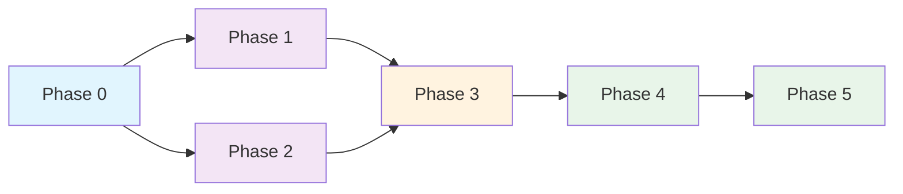

# Plan de Refactorización - SupplyChainTracker-solana

**Fecha:** 2026-05-07  
**Repositorio:** `maxi/SupplyChainTracker-solana-`  
**Analista:** Architect Mode (AI)

---

## 1. Resumen Ejecutivo

Este plan detalla la refactorización necesaria para el proyecto SupplyChainTracker-solana, cubriendo: limpieza de código obsoleto, consolidación de documentación, corrección de inconsistencias, y alineación con las herramientas Surfpool y txtx.

### Estado Actual del Proyecto

| Componente | Estado | Completado |
|------------|--------|------------|
| Smart Contract (sc-solana) | Modularizado, Core Completo | ~95% |
| Frontend (web/) | Migrado a Solana (Parcial) | ~85% |
| Testing | Tests Unitarios Básicos | ~20% |
| Documentación | Parcial | ~60% |
| Runbooks (txtx) | Parcialmente Consistentes | ~70% |

---

## 2. Problemas Identificados

### 2.1 Inconsistencias Críticas

| # | Problema | Impacto | Prioridad |
|---|----------|---------|-----------|
| 1 | **Program ID inconsistente** - `deploy.sh` usa `CMirNs1A8FfyWcb1TsbUHtxNzAfAUmwaUPmp8VCz2hS` vs `lib.rs` usa `7xX49ydi4Sx6hJQjj26arXhLZgwZXpr5sNJAKb29aPaN` | Despliegue fallido | P0 |
| 2 | **`#![allow(dead_code)]` en lib.rs** - Indica código muerto no eliminado | Código obsoleto persistente | P1 |
| 3 | **Múltiples archivos markdown duplicados** en `runbooks/` - `CHANGES-123-SUMMARY.md`, `ISSUE-124-FIXES-SUMMARY.md`, `DEPLOYMENT-GUIDE.md`, `devnet-deployment.md`, `mainnet-deployment.md`, `PDA-CONSISTENCY-GUIDE.md`, `SURFPOLL-CI-ANALYSIS.md` | Confusión y deuda documental | P1 |
| 4 | **Scripts obsoletos** en `sc-solana/scripts/` - `setup-keypairs.sh` y `init-config/` con código Python/Cargo no integrado | Código sin mantenimiento | P2 |
| 5 | **`utils/` y `tests/` vacíos** en `sc-solana/programs/sc-solana/src/` | Estructura incompleta | P2 |

### 2.2 Código Obsoleto Detectado

#### En [`lib.rs`](sc-solana/programs/sc-solana/src/lib.rs):
```rust
#![allow(dead_code)]        // Línea 6 - cubre código muerto
#![allow(unused_imports)]   // Línea 7 - imports no usados
#![allow(ambiguous_glob_reexports)]  // Línea 8 - re-exports ambiguos
```
Estos `allow` directives sugieren que hay código que no se está usando pero se mantiene por compatibilidad.

#### En [`state/config.rs`](sc-solana/programs/sc-solana/src/state/config.rs):
- Campos legacy `auditor_hw_single` y `tecnico_sw_single` mantenidos por compatibilidad backward
- Deberían ser marcados como deprecated o eliminados si ya no se usan

### 2.3 Inconsistencias en Runbooks (txtx)

Basado en el análisis de [`CHANGES-123-SUMMARY.md`](sc-solana/runbooks/CHANGES-123-SUMMARY.md) y [`ISSUE-124-FIXES-SUMMARY.md`](sc-solana/runbooks/ISSUE-124-FIXES-SUMMARY.md):

| Problema | Archivo | Estado |
|----------|---------|--------|
| `svm::send_token` no documentado | `setup-test-env.tx` | ✅ Corregido (usar system program transfer) |
| `input.*` variables no resueltas | `transfer-admin.tx` | ✅ Corregido (usar `env.*`) |
| Signatures en queries | `query-config.tx`, `query-role.tx` | ✅ Corregido (usar `first()`) |

### 2.4 Funciones SVM Confirmadas Disponibles (Surfpool)

| Función | Estado |
|---------|--------|
| `svm::find_pda(program_id, seeds)` | ✅ Disponible |
| `svm::get_program_from_anchor_project(name)` | ✅ Disponible |
| `svm::system_program_id()` | ✅ Disponible |
| `svm::sol_to_lamports(sol)` | ✅ Disponible |
| `svm::lamports_to_sol(lamports)` | ✅ Disponible |
| `svm::u64(value)` | ✅ Disponible |
| `svm::i64(value)` | ✅ Disponible |
| `svm::default_pubkey()` | ✅ Disponible |
| `svm::get_associated_token_account()` | ✅ Disponible |
| `svm::create_token_account_instruction()` | ✅ Disponible |
| `svm::get_instruction_data_from_idl_path()` | ✅ Disponible |
| `svm::send_token` | ❌ NO documentada |

---

## 3. Plan de Limpieza de Documentación

### 3.1 Archivos Markdown a Eliminar (Irrelevantes/Duplicados)

| Archivo | Razón |
|---------|-------|
| `runbooks/CHANGES-123-SUMMARY.md` | Resumen de issue específico, no documentación permanente |
| `runbooks/ISSUE-124-FIXES-SUMMARY.md` | Resumen de issue específico, no documentación permanente |
| `runbooks/SURFPOLL-CI-ANALYSIS.md` | Análisis temporal, no referencia permanente |
| `runbooks/PDA-CONSISTENCY-GUIDE.md` | Información ya integrada en README.md |
| `runbooks/devnet-deployment.md` | Duplicado de información en runbooks y txtx.yml |
| `runbooks/mainnet-deployment.md` | Duplicado de información en runbooks y txtx.yml |
| `runbooks/DEPLOYMENT-GUIDE.md` | Duplicado de README.md |

### 3.2 Archivos Markdown a Mantener

| Archivo | Razón |
|---------|-------|
| `runbooks/README.md` | Documentación principal de runbooks |
| `ROADMAP.md` | Hoja de ruta del proyecto |
| `AGENTS.md` | Instrucciones para agentes AI |
| `README.md` (raíz) | Documentación principal del proyecto |
| `sc-solana/README.md` | Documentación del programa Anchor |
| `sc-solana/tests/README.md` | Documentación de tests |

### 3.3 Archivos a Consolidar

La información de `CHANGES-123-SUMMARY.md`, `ISSUE-124-FIXES-SUMMARY.md`, y `SURFPOLL-CI-ANALYSIS.md` debe consolidarse en una sección de "Changelog" o "Known Issues" en el README principal.

---

## 4. Plan de Limpieza de Código

### 4.1 Scripts a Evaluar

| Script | Ubicación | Estado | Recomendación |
|--------|-----------|--------|---------------|
| `setup-keypairs.sh` | `sc-solana/scripts/` | Obsoleto | Eliminar si keypairs están en `config/keypairs/` |
| `init_config.py` | `sc-solana/scripts/init-config/` | No integrado | Eliminar o integrar en workflow |
| `Cargo.toml` | `sc-solana/scripts/init-config/` | Dependencia huérfana | Eliminar con el script |

### 4.2 Directorios Vacíos/Incompletos

| Directorio | Contenido | Recomendación |
|------------|-----------|---------------|
| `sc-solana/programs/sc-solana/src/utils/` | Solo `mod.rs` | Eliminar si no hay utilidades |
| `sc-solana/programs/sc-solana/src/tests/` | Vacío | Eliminar (tests están en `sc-solana/tests/`) |

### 4.3 Código Dead Code en Rust

Ejecutar `cargo clippy` para identificar:
- Funciones no usadas marcadas por `#![allow(dead_code)]`
- Imports no utilizados
- Constantes dead

---

## 5. Plan de Corrección de Inconsistencias

### 5.1 Program ID - P0

**Problema:** `deploy.sh` usa Program ID diferente al de `lib.rs`

**Solución:**
1. Actualizar `deploy.sh` para usar `7xX49ydi4Sx6hJQjj26arXhLZgwZXpr5sNJAKb29aPaN`
2. O mejor: derivar el Program ID automáticamente del IDL o de `Cargo.toml`
3. Actualizar `ROADMAP.md` que también tiene el ID incorrecto

### 5.2 Remove Allow Directives - P1

**Problema:** `#![allow(dead_code)]`, `#![allow(unused_imports)]`, `#![allow(ambiguous_glob_reexports)]`

**Solución:**
1. Ejecutar `cargo clippy -- -W dead_code` para identificar código muerto real
2. Eliminar código realmente no usado
3. Remover los `allow` directives
4. Mantener solo si hay razones válidas (ej. funciones usadas vía reflection)

### 5.3 Backward Compatibility Fields - P2

**Problema:** Campos legacy en `SupplyChainConfig`

**Solución:**
1. Marcar con `#[deprecated]` si aún se usan
2. Documentar en comentarios
3. Planificar eliminación en próxima breaking change

---

## 6. Estructura de Tests Recomendada

### 6.1 Estado Actual

| Archivo | Líneas | Issue | Estado |
|---------|--------|-------|--------|
| `test-helpers.ts` | 590 | #65 | ✅ |
| `unit-tests.ts` | 449 | #66 | ✅ |
| `lifecycle.ts` | 891 | #67 | ✅ |
| `integration-full-lifecycle.ts` | 836 | #81 | ✅ |
| `batch-registration.ts` | 1015 | #68 | ✅ |
| `role-management.ts` | 981 | #69 | ✅ |
| `query-instructions.ts` | 1210 | - | ✅ |
| `pda-derivation.ts` | 697 | - | ✅ |
| `role-enforcement.ts` | 1133 | #72 | ✅ |
| `state-machine.ts` | 1409 | #73 | ✅ |
| `overflow-protection.ts` | 1156 | #74 | ✅ |

### 6.2 Tests Adicionales Necesarios

| Test | Prioridad | Descripción |
|------|-----------|-------------|
| PDA derivation consistency | P1 | Verificar PDAs entre Anchor y txtx |
| Runbook integration | P1 | Probar runbooks con surfpool |
| Error path coverage | P1 | Tests para todos los errores 6000-6014 |
| Concurrent operations | P2 | Tests de operaciones concurrentes |

---

## 7. Diagrama de Flujo de Refactorización

```mermaid
graph TD
    subgraph Phase 0: Preparación
        A[Análisis Completo] --> B[Backup del Repositorio]
        B --> C[Crear Branch Refactorización]
    end

    subgraph Phase 1: Limpieza Documentación
        C --> D[Eliminar MDs Irrelevantes]
        D --> E[Consolidar Changelog en README]
        E --> F[Actualizar ROADMAP.md]
    end

    subgraph Phase 2: Limpieza Código
        F --> G[Eliminar Scripts Obsoletos]
        G --> H[Eliminar Directorios Vacíos]
        H --> I[Ejecutar cargo clippy]
        I --> J[Eliminar Dead Code Real]
        J --> K[Remover Allow Directives]
    end

    subgraph Phase 3: Corrección Inconsistencias
        K --> L[Corregir Program ID en deploy.sh]
        L --> M[Actualizar ROADMAP.md Program ID]
        M --> N[Marcar Deprecated Legacy Fields]
    end

    subgraph Phase 4: Verificación
        N --> O[cargo build]
        O --> P[cargo test]
        P --> Q[Probar Runbooks con Surfpool]
        Q --> R[Verificar Frontend]
    end

    subgraph Phase 5: Documentación Final
        R --> S[Crear CHANGELOG.md]
        S --> T[Actualizar README.md]
        T --> U[Crear Issue de Resumen]
    end

    Phase 0 --> Phase 1
    Phase 1 --> Phase 2
    Phase 2 --> Phase 3
    Phase 3 --> Phase 4
    Phase 4 --> Phase 5
```

---

## 8. Checklist de Ejecución

### Phase 0: Preparación
- [ ] Crear branch `refactorization-2026`
- [ ] Verificar que todo el código actual está commiteado
- [ ] Confirmar build actual funciona

### Phase 1: Limpieza de Documentación
- [ ] Eliminar `runbooks/CHANGES-123-SUMMARY.md`
- [ ] Eliminar `runbooks/ISSUE-124-FIXES-SUMMARY.md`
- [ ] Eliminar `runbooks/SURFPOLL-CI-ANALYSIS.md`
- [ ] Eliminar `runbooks/PDA-CONSISTENCY-GUIDE.md`
- [ ] Eliminar `runbooks/devnet-deployment.md`
- [ ] Eliminar `runbooks/mainnet-deployment.md`
- [ ] Eliminar `runbooks/DEPLOYMENT-GUIDE.md`
- [ ] Consolidar información relevante en `runbooks/README.md`
- [ ] Crear `CHANGELOG.md` con resúmenes de issues

### Phase 2: Limpieza de Código
- [ ] Evaluar `sc-solana/scripts/setup-keypairs.sh` - eliminar si obsoleto
- [ ] Eliminar `sc-solana/scripts/init-config/` completo
- [ ] Eliminar `sc-solana/programs/sc-solana/src/utils/` si vacío
- [ ] Eliminar `sc-solana/programs/sc-solana/src/tests/` si vacío
- [ ] Ejecutar `cargo clippy` y analizar warnings
- [ ] Eliminar dead code real identificado por clippy
- [ ] Remover `#![allow(dead_code)]` si ya no es necesario
- [ ] Remover `#![allow(unused_imports)]` si ya no es necesario

### Phase 3: Corrección de Inconsistencias
- [ ] Actualizar Program ID en `deploy.sh`
- [ ] Actualizar Program ID en `ROADMAP.md`
- [ ] Verificar Program ID en `web/.env.local`
- [ ] Marcar campos legacy como deprecated en `config.rs`
- [ ] Documentar deprecations en comentarios

### Phase 4: Verificación
- [ ] `cd sc-solana && cargo build` - éxito
- [ ] `cd sc-solana && cargo test` - todos pasan
- [ ] `cd sc-solana && anchor build` - éxito
- [ ] Probar runbooks con `surfpool run`
- [ ] `cd web && yarn build` - éxito
- [ ] `cd web && yarn test` - todos pasan

### Phase 5: Documentación Final
- [ ] Actualizar `README.md` con estado actual
- [ ] Actualizar `ROADMAP.md` con issues cerrados
- [ ] Actualizar `runbooks/README.md` con funciones SVM
- [ ] Crear issue de resumen de refactorización

---

## 9. Dependencias y Orden de Ejecución



**Fases paralelizables:** Phase 1 y Phase 2 pueden ejecutarse en paralelo.

---

## 10. Consistencia con Surfpool y txtx

### 10.1 Verificación de Runbooks

Los runbooks existentes han sido corregidos para Issue #123 e #124:

| Runbook | Problema | Solución Aplicada |
|---------|----------|-------------------|
| `setup-test-env.tx` | `svm::send_token` no documentado | System program transfer |
| `transfer-admin.tx` | `input.*` no resuelto | `env.*` variables |
| `query-config.tx` | `signatures[0]` en query | `signatures | first()` |
| `query-role.tx` | `signatures[0]` en query | `signatures | first()` |

### 10.2 Funciones SVM Usadas vs Disponibles

| Función Usada en Runbooks | Disponible en Surfpool |
|---------------------------|------------------------|
| `svm::find_pda` | ✅ |
| `svm::get_program_from_anchor_project` | ✅ |
| `svm::system_program_id` | ✅ |
| `svm::sol_to_lamports` | ✅ |
| `svm::u64` | ✅ |
| `svm::process_instructions` | ✅ (standard) |

### 10.3 Recomendaciones para Runbooks

1. **Unificar PDA derivation** - Usar siempre `svm::find_pda` en runbooks para consistencia con Anchor
2. **Documentar seeds exactas** - Cada runbook debe documentar las seeds usadas para PDAs
3. **Validar IDL paths** - Asegurar que los paths a IDL son relativos a `txtx.yml`
4. **Usar `env.*` en lugar de `input.*`** - Para variables de configuración

---

## 11. Estimación de Esfuerzo

| Fase | Esfuerzo | Dependencias |
|------|----------|--------------|
| Phase 0: Preparación | 30 min | Ninguna |
| Phase 1: Limpieza Documentación | 1 hora | Phase 0 |
| Phase 2: Limpieza Código | 2 horas | Phase 0 |
| Phase 3: Corrección Inconsistencias | 1 hora | Phase 1, 2 |
| Phase 4: Verificación | 2 horas | Phase 3 |
| Phase 5: Documentación Final | 1 hora | Phase 4 |
| **Total** | **~7.5 horas** | - |

---

## 12. Riesgos y Mitigación

| Riesgo | Probabilidad | Impacto | Mitigación |
|--------|--------------|---------|------------|
| Build falla después de eliminar dead code | Media | Alto | Mantener branch original como backup |
| Runbooks dejan de funcionar | Baja | Medio | Probar con surfpool antes de merge |
| Incompatibilidad backward | Baja | Alto | Verificar keypairs existentes |
| Program ID confusion | Alta | Alto | Unificar fuente de verdad |

---

## 13. Criterios de Aceptación

- [ ] `cargo build` pasa sin warnings
- [ ] `cargo test` pasa todos los tests
- [ ] `cargo clippy` no tiene warnings de dead_code
- [ ] Program ID consistente en todos los archivos
- [ ] No hay archivos markdown duplicados o irrelevantes
- [ ] Scripts obsoletos eliminados
- [ ] Runbooks probados con surfpool
- [ ] README.md actualizado con estado correcto
- [ ] CHANGELOG.md creado con cambios relevantes

---

## 14. Próximos Pasos

1. **Revisar este plan** con el equipo/owner
2. **Aprobar branch strategy** para la refactorización
3. **Ejecutar Phase 0** inmediatamente
4. **Parallelizar Phase 1 y Phase 2** para eficiencia
5. **Verificar incrementalmente** después de cada fase
6. **Crear PR** con todos los cambios
7. **Crear issue de resumen** documentando todos los cambios

---

*Plan creado el 2026-05-07 por Architect Mode*  
*Basado en análisis de: código fuente, issues, documentación Surfpool/txtx, runbooks existentes*
