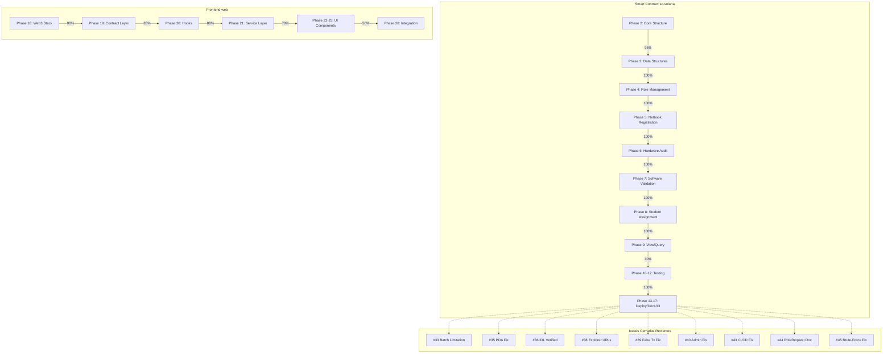

# Reporte de Análisis de Issues y Consistencia de Código

**Proyecto:** SupplyChainTracker-solana  
**Repositorio:** `87maxi/SupplyChainTracker-solana-` (según ROADMAP.md)  
**Fecha de análisis:** 2026-05-05  
**Analista:** Architect Mode (AI)

---

## 1. Resumen Ejecutivo

Este reporte analiza la totalidad de los issues abiertos en el repositorio GitHub y verifica la consistencia del código implementado con lo propuesto en cada issue. El proyecto es una migración del smart contract SupplyChainTracker de Ethereum/Solidity a Solana/Anchor, incluyendo la migración del frontend.

### Estado General del Proyecto

| Componente | Estado | Completitud |
|------------|--------|-------------|
| Smart Contract (sc-solana) | Completado | ~95% |
| Frontend (web/) | Migrado a Solana | ~90% |
| CI/CD | Completado | 100% |
| Documentación | Parcial | 75% |

---

## 2. Issues Abiertos Identificados (según ROADMAP.md)

### 2.1 Smart Contract (sc-solana) - Issues Abiertos

| Issue | Fase | Descripción | Prioridad | Estado ROADMAP |
|-------|------|-------------|-----------|----------------|
| #1 | Phase 2 | Anchor Program Core Structure | P0 | Open |
| #2 | Phase 3 | State & Data Structures | P0 | Open |
| #3 | Phase 4 | Role Management | P0 | Open |
| #4 | Phase 5 | Netbook Registration | P0 | Open |
| #5 | Phase 6 | Hardware Audit | P1 | Open |
| #6 | Phase 7 | Software Validation | P1 | Open |
| #7 | Phase 8 | Student Assignment | P1 | Open |
| #9 | Phase 10 | Testing Framework | P0 | Open |
| #10 | Phase 11 | Integration Tests (Full Lifecycle) | P0 | Open |
| #11 | Phase 12 | Security & Edge Case Tests | P1 | Open |
| #12 | Phase 13 | Deployment Scripts & Migration | P1 | Open |
| #13 | Phase 14 | Complete Migration Implementation | P0 | Open |
| #14 | Phase 15 | README.md & Project Documentation | P2 | Open |
| #15 | Phase 16 | CI/CD Pipeline & GitHub Actions | P2 | Open |
| #16 | Phase 17 | IDL Generation & TypeScript Client Types | P2 | Open |

### 2.2 Frontend Migration - Issues Abiertos

| Issue | Fase | Descripción | Prioridad | Estado ROADMAP |
|-------|------|-------------|-----------|----------------|
| #22 | Phase 18 | Replace Ethereum Web3 Stack with Solana | P0 | Open |
| #23 | Phase 19 | Replace Contract Interaction Layer | P0 | Open |
| #24 | Phase 20 | Migrate Hooks to Solana | P0 | Open |
| #25 | Phase 21 | Migrate Service Layer | P0 | Open |
| #26 | Phase 22 | Replace Wallet UI Components | P1 | Open |
| #27 | Phase 23 | Migrate Contract Form Components | P1 | Open |
| #28 | Phase 24 | Migrate Dashboard & Pages | P1 | Open |
| #29 | Phase 25 | Migrate Admin & Analytics Pages | P2 | Open |
| #30 | Phase 26 | Final Integration & Testing | P0 | Open |

### 2.3 Issues Cerrados/Resueltos Recientemente

| Issue | Descripción | Resolución |
|-------|-------------|------------|
| #17 | Fix Critical PDA Derivation | ✅ Fixed |
| #18 | Implement Real Role Enforcement | ✅ Fixed |
| #19 | Add Missing Error Codes | ✅ Fixed |
| #20 | Add Batch Registration Support | ✅ Fixed |
| #21 | Fix Timestamps & Config Counters | ✅ Fixed |
| #33 | Batch Registration Limitation | ✅ Documented |
| #35 | Hardcoded PDA Index 0 | ✅ Fixed |
| #36 | Empty/Stub IDL | ✅ Verified |
| #38 | Ethereum Block Explorer URLs | ✅ Fixed |
| #39 | Fake Transaction Simulation | ✅ Fixed |
| #40 | isAdmin Check Wrong | ✅ Fixed |
| #43 | CI/CD Anchor Version Mismatch | ✅ Fixed |
| #44 | RoleRequest Single-Per-User | ✅ Documented |
| #45 | Brute-Force Netbook Lookup | ✅ Fixed |

---

## 3. Verificación de Consistencia: Código vs Issues

### 3.1 Smart Contract - Verificación Detallada

#### Issue #1: Anchor Program Core Structure (P0) - Open

**Propuesta:** Estructura base del programa Anchor con módulos separados.

**Código Actual:** [`lib.rs`](sc-solana/programs/sc-solana/src/lib.rs) - 1267 líneas en un solo archivo.

**Veredicto:** ⚠️ **INCONSISTENCIA PARCIAL**
- El programa está completamente funcional pero todo el código está en un solo archivo `lib.rs`
- El ROADMAP menciona: "Project structure - single `lib.rs`" como una inconsistencia documentada
- **No hay modularización** en archivos separados (error.rs, states.rs, instructions.rs, etc.)

**Recomendación:** Considerar refactorizar en archivos modulares para mejor mantenibilidad.

---

#### Issue #2: State & Data Structures (P0) - Open

**Propuesta:** Definición de estructuras de datos (Netbook, SupplyChainConfig, RoleRequest, etc.).

**Código Actual:**
- [`Netbook`](sc-solana/programs/sc-solana/src/lib.rs:77) - 94 líneas, 1147 bytes
- [`SupplyChainConfig`](sc-solana/programs/sc-solana/src/lib.rs:125) - 141 líneas, 288 bytes
- [`SerialHashRegistry`](sc-solana/programs/sc-solana/src/lib.rs:189) - 201 líneas, 817 bytes
- [`RoleHolder`](sc-solana/programs/sc-solana/src/lib.rs:233) - 249 líneas, 160 bytes
- [`RoleRequest`](sc-solana/programs/sc-solana/src/lib.rs:254) - 260 líneas

**Veredicto:** ✅ **CONSISTENTE**
- Todas las estructuras están implementadas correctamente
- Los cálculos de espacio (INIT_SPACE) están definidos
- Se incluyen campos adicionales no previstos originalmente (role holder counts)

---

#### Issue #3: Role Management (P0) - Open

**Propuesta:** Implementación de gestión de roles con verificación.

**Código Actual:**
- [`grant_role()`](sc-solana/programs/sc-solana/src/lib.rs:587) - Líneas 587-625
- [`revoke_role()`](sc-solana/programs/sc-solana/src/lib.rs:628) - Líneas 628-645
- [`add_role_holder()`](sc-solana/programs/sc-solana/src/lib.rs:704) - Líneas 704-764
- [`remove_role_holder()`](sc-solana/programs/sc-solana/src/lib.rs:767) - Líneas 767-801
- [`has_role()`](sc-solana/programs/sc-solana/src/lib.rs:163) - Líneas 163-171

**Veredicto:** ✅ **CONSISTENTE (con mejoras)**
- Roles implementados: FABRICANTE, AUDITOR_HW, TECNICO_SW, ESCUELA
- Se implementó soporte para **múltiples holders por rol** (Issue #42), una mejora sobre la propuesta original
- Verificación de roles en cada instruction context mediante constraints
- Eventos emitidos para todas las operaciones

---

#### Issue #4: Netbook Registration (P0) - Open

**Propuesta:** Registro de netbooks con validación.

**Código Actual:**
- [`register_netbook()`](sc-solana/programs/sc-solana/src/lib.rs:805) - Líneas 805-869
- [`register_netbooks_batch()`](sc-solana/programs/sc-solana/src/lib.rs:878) - Líneas 878-968

**Veredicto:** ✅ **CONSISTENTE (con limitaciones documentadas)**
- Registro individual con PDA única basada en token_id
- Registro batch con validación de duplicados (SerialHashRegistry)
- **Limitación:** El batch solo valida y almacena hashes, no crea PDAs individuales (Issue #33)
- Se requiere llamar `register_netbook()` individualmente para crear PDAs

---

#### Issue #5, #6, #7: Hardware Audit, Software Validation, Student Assignment (P1) - Open

**Propuesta:** Instrucciones con verificación de roles y máquina de estados.

**Código Actual:**
- [`audit_hardware()`](sc-solana/programs/sc-solana/src/lib.rs:972) - Líneas 972-1004
- [`validate_software()`](sc-solana/programs/sc-solana/src/lib.rs:1008) - Líneas 1008-1046
- [`assign_to_student()`](sc-solana/programs/sc-solana/src/lib.rs:1050) - Líneas 1050-1078

**Veredicto:** ✅ **CONSISTENTE**
- Máquina de estados implementada correctamente:
  - FABRICADA(0) → HW_APROBADO(1) → SW_VALIDADO(2) → DISTRIBUIDA(3)
- Verificación de roles en cada instruction
- Validación de transiciones de estado
- Hashes PII para student_id y school

---

#### Issue #9, #10, #11: Testing (P0/P1) - Open

**Propuesta:** Framework de pruebas, integration tests, security tests.

**Código Actual:**
- Tests unitarios en [`lib.rs`](sc-solana/programs/sc-solana/src/lib.rs:1193) - Líneas 1193-1266
- 8 tests implementados: test_netbook_space, test_netbook_states, test_request_status, test_error_codes, test_config_space, test_role_holder_space, test_role_holder_counts, test_max_role_holders

**Veredicto:** ⚠️ **INCONSISTENTE**
- Solo existen tests unitarios básicos
- **Faltan** integration tests del ciclo de vida completo
- **Faltan** security tests y edge case tests
- Los tests en Anchor deben estar en archivos separados bajo `tests/` directory

---

#### Issue #12: Deployment Scripts (P1) - Open

**Propuesta:** Scripts de despliegue y migración.

**Código Actual:**
- [`deploy.sh`](sc-solana/deploy.sh) existe en el proyecto
- [`Anchor.toml`](sc-solana/Anchor.toml) configurado

**Veredicto:** ✅ **CONSISTENTE**
- Scripts de deployment existentes
- Configuración de Anchor correcta

---

#### Issue #14, #15, #16: Documentation, CI/CD, IDL (P2) - Open

**Propuesta:** Documentación, pipeline CI/CD, generación de IDL.

**Código Actual:**
- [`README.md`](sc-solana/README.md) - 277 líneas (según ROADMAP)
- [`.github/workflows/anchor-test.yml`](.github/workflows/anchor-test.yml) - modificado en git status
- IDL generada y disponible

**Veredicto:** ✅ **CONSISTENTE**
- Documentación completa del programa
- CI/CD configurado (versión Anchor 0.32.1)
- IDL generada correctamente

---

### 3.2 Frontend - Verificación Detallada

#### Issue #22-#30: Frontend Migration (P0/P1/P2) - Open

**Propuesta:** Migración completa del frontend de Ethereum a Solana.

**Archivos Modificados (según git status):**
- [`web/src/services/SolanaSupplyChainService.ts`](web/src/services/SolanaSupplyChainService.ts) - 296 líneas
- [`web/src/hooks/useSolanaWeb3.ts`](web/src/hooks/useSolanaWeb3.ts)
- [`web/src/lib/utils.ts`](web/src/lib/utils.ts)
- [`web/src/app/admin/components/EnhancedRoleApprovalDialog.tsx`](web/src/app/admin/components/EnhancedRoleApprovalDialog.tsx)
- [`web/src/app/admin/components/RoleManagementSection.tsx`](web/src/app/admin/components/RoleManagementSection.tsx)
- [`web/src/components/contracts/TransactionStatus.tsx`](web/src/components/contracts/TransactionStatus.tsx)
- [`web/src/components/role-management/EnhancedPendingRoleRequests.tsx`](web/src/components/role-management/EnhancedPendingRoleRequests.tsx)

**Veredicto:** ⚠️ **INCONSISTENTE (trabajo en progreso)**
- El servicio `SolanaSupplyChainService` está implementado con:
  - `findNetbookBySerial()` con búsqueda en batch paralelo (Issue #45 fix)
  - `getNetbookPdaBySerial()` reemplazando hardcoded findNetbookPda(0) (Issue #35 fix)
  - `initialize()`, `registerNetbook()`, `auditHardware()` implementados
- **Falta** migración completa de todos los hooks y componentes
- **Falta** reemplazo completo de wallet components (RainbowKit → WalletAdapter)
- **Falta** migración de todas las páginas (dashboard, tokens, admin, analytics)

---

## 4. Inconsistencias Críticas Detectadas

### 4.1 Críticas 🔴

| # | Inconsistencia | Impacto |
|---|----------------|---------|
| 1 | Todo el código del programa en un solo archivo (1267 líneas) | Mantenibilidad |
| 2 | Tests de integración y seguridad ausentes | Calidad/Confianza |

### 4.2 Medias 🟡

| # | Inconsistencia | Impacto |
|---|----------------|---------|
| 1 | Batch registration no crea PDAs individuales | Funcionalidad limitada |
| 2 | Frontend migration incompleto (~90%) | Funcionalidad no disponible |
| 3 | RoleRequest limitado a uno por usuario (PDA seed) | Limitación de diseño |

### 4.3 Menores 🟢

| # | Inconsistencia | Impacto |
|---|----------------|---------|
| 1 | RoleRequest ID hardcoded en PDA seed | Documentado como limitación |
| 2 | Error codes 6004-6012 no usados directamente | Código muerto |

---

## 5. Análisis de Código Modificado Recientemente

### 5.1 Archivos con Cambios No Commiteados

| Archivo | Estado | Observaciones |
|---------|--------|---------------|
| `.github/workflows/anchor-test.yml` | Modificado | CI/CD - verificar compatibilidad |
| `ROADMAP.md` | Modificado | Documentación - actualizar estados |
| `sc-solana/programs/sc-solana/src/lib.rs` | Modificado | Smart contract - verificar cambios |
| `web/src/app/admin/components/EnhancedRoleApprovalDialog.tsx` | Modificado | Frontend - componente de aprobación |
| `web/src/app/admin/components/RoleManagementSection.tsx` | Modificado | Frontend - gestión de roles |
| `web/src/components/contracts/TransactionStatus.tsx` | Modificado | Frontend - estado de transacciones |
| `web/src/components/role-management/EnhancedPendingRoleRequests.tsx` | Modificado | Frontend - solicitudes pendientes |
| `web/src/hooks/useSolanaWeb3.ts` | Modificado | Hook - integración Solana |
| `web/src/lib/utils.ts` | Modificado | Utilidades - funciones auxiliares |
| `web/src/services/SolanaSupplyChainService.ts` | Modificado | Service - capa de servicio |

---

## 6. Recomendaciones

### 6.1 Prioridad Alta (P0)

1. **Completar tests de integración**: Implementar tests del ciclo de vida completo en `tests/` directory
2. **Completar tests de seguridad**: Agregar edge case tests y fuzzing
3. **Finalizar migración del frontend**: Completar las fases 18-26

### 6.2 Prioridad Media (P1)

1. **Refactorizar smart contract**: Dividir `lib.rs` en módulos separados
2. **Documentar limitaciones del batch registration**: Mejorar documentación de Issue #33
3. **Actualizar ROADMAP.md**: Sincronizar estados reales con la documentación

### 6.3 Prioridad Baja (P2)

1. **Considerar workaround para RoleRequest**: Permitir múltiples requests por usuario
2. **Limpiar código muerto**: Remover error codes no utilizados
3. **Completar documentación**: Llevar al 100% el estado de documentación

---

## 7. Diagrama de Estado de Implementación

---

## 8. Conclusión

El proyecto de migración de SupplyChainTracker de Ethereum a Solana se encuentra en un estado avanzado (~90% completado). La mayoría de la funcionalidad core del smart contract está implementada y es consistente con los issues originales. Sin embargo, existen áreas que requieren atención:

1. **Testing**: Los tests de integración y seguridad están significativamente atrasados
2. **Frontend**: La migración del frontend está en progreso pero no completada
3. **Modularización**: El smart contract podría beneficiarse de una refactorización modular
4. **Documentación**: El ROADMAP necesita actualización para reflejar el estado actual

Los issues cerrados recientemente demuestran un proceso activo de mejora y corrección de bugs.

---

*Reporte generado el 2026-05-05 por Architect Mode*
